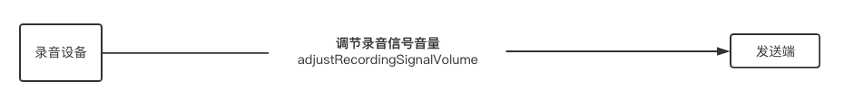

# 设置采集音量

**采集**是指音频信号由录音设备采集后传输到发送端的过程。

你可以通过 `adjustRecordingSignalVolume` 方法直接调节录制声音的信号幅度，由此实现调节录音的音量。

该方法中 `volume` 参数表示录音信号的音量，取值范围为 [0,400]：
- 0: 静音。
- 100: （默认值）原始音量，即不对信号做缩放。
- 400: 原始音量的 4 倍（把信号放大到原始信号的 4 倍）。

## 示例代码

<pre props="android"><code class="language-java">int volume = 200;
// 将录音音量设置为原始音量的 200%。
rtcEngine.adjustRecordingSignalVolume(volume);
</code>
</pre>

<pre props="ios">
<code class="language-swift">// 将录音音量设置为原始音量的 50%。
agoraKit.adjustRecordingSignalVolume(50)
</code>
</pre>

<pre props="ios">
<code class="language-oc">
// 将录音音量设置为原始音量的 50%。
[agoraKit adjustRecordingSignalVolume: 50];
</code>
</pre>

## API 参考

<a props="android" href="https://docs.agora.io/cn/Video/API%20Reference/java/classio_1_1agora_1_1rtc_1_1_rtc_engine.html#af3747f72256eb683feadbca2b742bd05"><code>adjustRecordingSignalVolume</code></a>

<a props="ios" href="https://docs.agora.io/cn/Video/API%20Reference/oc/Classes/AgoraRtcEngineKit.html#//api/name/adjustRecordingSignalVolume:"><code>adjustRecordingSignalVolume</code></a>

