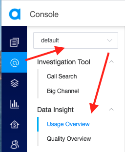

The **Data Insight** function of Agora Analytics provides periodic call-usage and -quality statistics. It is designed to help you understand the usage and quality of calls in your app. You can view their distribution in multiple dimensions, with daily and hourly data breakdown.

<b>Data Insight</b> only provides usage and quality statistics for the period after July 1, 2021 for the Agora RTC SDK.

## Getting started

1. Purchase the <a href="https://console.agora.io/support/plan">support package</a > or contact support@agora.io to enable the **Data Insight** function for your project.

2. Login to [Agora Console](https://console.agora.io) and click **Agora Analytics** on the left navigation bar.

3. Select a project in the top-left corner.
   

4. Click **Usage Overview** to view the usage statistics or **Quality Overview** to view the quality statistics.

5. Configure the data filter:
   <li>**Usage Overview**: Select the timezone, data granularity, and time frame in the upper-right corner.</li>
   
   <li>**Quality Overview**: Select the product type in the upper-left corner, and the timezone, data granularity, and time frame in the upper-right corner.</li>
   
   
   
   

## Usage Overview

The **Usage Overview** page presents **Overall Trend** and **Metric Analysis** for usage metrics, which can help you locate the dates with abnormalities and understand how usage is distributed in different dimensions.

The usage data provided in the Usage Overview page is for reference only and is not used for billing calculation.

### Overall Trend

The **Overall Trend** panel has three sections: **Peak traffic**, **Channel and user count**, and **Service minutes**. In each section, the summary boxes in the upper-left corner highlight the aggregate or peak value of each usage metric, and the line chart in the bottom area shows the daily values of each usage metric. You can click **All data** in the top-right corner of each section to download the data or view it in table form.

The usage metrics are described in [Usage metrics](#usagemetrics).

Each line chart provides the following features:

- Hide and display: To hide or display the line for a usage metric, click on the corresponding summary box.
- Jump to Metric Analysis: To jump to the Metric Analysis panel of a usage metric for a specific day, click the corresponding data point on the line, and select **Metric Analysis**. If you want to use the previously selected time frame, click **Reapply filter** in the upper-left area of the panel.

Jump to Metric Analysis is not supported for the following usage metrics: Peak channel traffic, Peak user traffic, and Total number of channels.

### Metric Analysis

The **Metric Analysis** panel has six sections: **Geography**, **Network type**, **Operating system**, **SDK version**, **Device type**, and **Channel size**. Each section presents the top six values for that dimension in bar-chart form.

In the top-right corner of the panel, you can select the usage metric you want to view. In the top-right corner of each section, you can click **All data** to download the data or view it in table form.

The six dimensions are described in [Dimensions](#dimensions).

<li>By default, the <b>Geography</b> section presents the region bar chart for the country ranked first in the country bar chart. To see the region bar chart for another country, click the corresponding bubble in the map.</li><li>Items with no usage are not displayed.</li>

## Quality Overview

The **Quality Overview** page presents **Overall Trend** and **Metric Analysis** for quality metrics, which can help you locate the dates and hours with abnormalities and understand how quality is related to usage in different dimensions.

### Overall Trend

The **Overall Trend** panel has two sections: **User experience** and **Success at joining channels**. In each section, the summary boxes in the upper-left corner highlight the peak or bottom value of each quality metric, and the line chart in the bottom area shows the daily or hourly values of each quality metric. You can click **All data** in the top-right corner of the section to download the data or view it in table form.

The quality metrics are described in [Quality metrics](#qualitymetrics).

Audio freeze rate is not included in the quality metrics of the Agora RTC SDK for Web. That is, if you select <b>Web RTC</b> for product type in the data filter, the summary box for audio freeze rate does not display in the <b>User experience</b> section.

Each line chart provides the following features:

- Hide and display: To hide or display the line for a quality metric, click on the corresponding summary box.
- Change time selection: When data granularity is set to **Daily** in the data filter, you can click a data point and select **Hourly data**, which changes the data granularity to **Hourly** and the time frame to the hour corresponding to the data point. If you want to switch back to the original filter setting, click **Restore filter** in the upper-center area of the panel.
- Jump to Metric Analysis: To jump to the Metric Analysis panel of a quality metric for a specific day or hour, click the corresponding data point on the line, and select **Metric Analysis**. If you want to use the previously selected time frame, click **Restore** in the upper-left area of the panel.

### Metric Analysis

The **Metric Analysis** panel has six sections: **Geography**, **Network type**, **Operating system**, **SDK version**, **Device type**, and **Channel size**. Each section presents the connection between quality and usage in bubble-chart form.

In the top-right corner of the panel, you can select the quality metric you want to view. In the top-right corner of each section, you can click **All data** to download the data or view it in table form.

The six dimensions are described in [Dimensions](#dimensions).

<li>By default, the Geography section presents the region bubble chart for the country ranked first in the country bubble chart. To see the region bubble chart for another country, click the corresponding bubble in the map.</li><li>Items with no usage are not displayed.</li>

## Key terms

This section describes the key terms used in **Data Insight**. See [Agora Key Terms](https://docs.agora.io/en/Agora%20Platform/terms) for more key terms.

### Channel

Every audio or video call happens in a channel. If an app is a building, a channel is a room in the building.

**Data Insight** does not count a channel by name, but by lifecycle. A channel is counted once for each period of time between when the first user joins it until the last user leaves it. That is, it is not counted when there are no users.

### User

Each user in a channel is identified by a unique [user ID](https://docs.agora.io/en/Agora%20Platform/terms?platform=All%20Platforms#a-nameusernameausername). There can never be two identical user IDs in a channel.

**Data Insight** counts each instance of a unique user ID. If a real-life user joins one channel using multiple user IDs, or joins multiple channels using one user ID, **Data Insight** counts the user in both situations as multiple users.

### Usage metrics

| Usage metric                | Description                                                  |
| ---------------------------- | ------------------------------------------------------------ |
| Peak channel traffic         | The maximum number of channels in use.                       |
| Peak user traffic            | The maximum number of in-call users across all channels.         |
| Total number of channels     | A channel is counted once for each period of time between when the first user joins it until the last user leaves it. |
| Total number of users        | The number of users across all channels. A user joining one channel using multiple user IDs or joining multiple channels using one user ID is counted multiple times. |
| Total count of users joining channels | Each time any user ID joins any channel is counted.                 |
| Total minutes                | The total duration of video and audio-only calls calculated by the number of users. |
| Video minutes                | The total duration of video calls calculated by the number of users.       |
| Audio minutes                | The total duration of audio-only calls calculated by the number of users   |

The usage data provided in the Usage Overview page is for reference only and is not used for billing calculation.

For more information about "calculated by the number of users", see <a href="calculation">this term</a>. 

### Quality metrics

| Quality metric                               | Description                                                  |
| --------------------------------------------- | ------------------------------------------------------------ |
| Video freeze rate                             | The rate at which video freezing occurs, which equals Total video freeze time ÷ Total video minutes calculated by the number of streams. Only video freezes longer than 600 milliseconds are counted. |
| Audio freeze rate                             | The rate at which audio freezing occurs, which equals Total audio freeze time ÷ Total audio minutes calculated by the number of streams. Only audio freezes longer than 200 milliseconds are counted. |
| Network delay rate                            | The rate at which network delay occurs, which equals Total end-to-end network delay ÷ Total audio and video minutes calculated by the number of streams. Only end-to-end network delays longer than 400 milliseconds are counted. |
| Success rate of users joining channels        | The rate at which users attempting to join any channel succeed, which equals Number of users who have joined ÷ Number of attempts to join |
| Success rate of users joining channels within 5 seconds | The rate at which users attempting to join any channel succeed within 5 seconds, which equals Number of users who have joined within 5 seconds ÷ Number of attempts to join |

For more information about "calculated by the number of streams", see <a href="calculation">this term</a>. 

### Dimensions
| Dimension        | Description                                             |
| ---------------- | ------------------------------------------------------- |
| Geography        | The country and region from which the user connects.               |
| Network type     | The user's network type, such as Wi-Fi or 4G.          |
| Operating system | The user's operating system, such as Windows or iOS.   |
| SDK version      | The version number of the SDK that implements the call. |
| Device type      | The user's device type.                                 |
| Channel size     | The number of users in the channel.                     |

### Calculating usage by the number of users vs. by the number of streams

There are two different approaches to calculating RTC service minutes for a channel: by the number of users in the channel, and by the number of streams each user is subscribed to in the channel. Their difference is described in [How does Agora calculate service minutes](https://docs.agora.io/en/Interactive%20Broadcast/faq/billing_basis).

