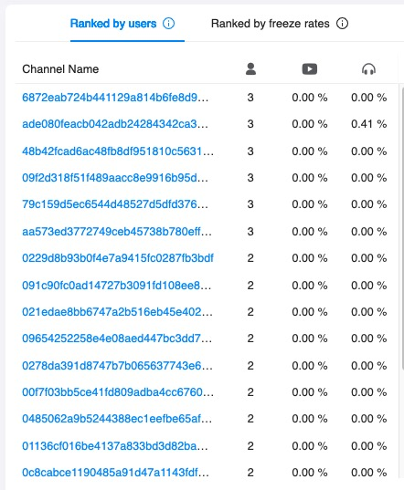

## Overview

Real-time Monitoring provides visualized data for multiple call metrics in real time, so that you can track the status of your Agora RTC projects and discover when a problem occurs.

Agora stops providing the Realtime (Beta) service starting from October 12, 2021. Please upgrade to the Real-time Monitoring service.

Real-time Monitoring provides the following features:

- Automatic collection, processing, and storage of metrics data, which refreshes every 20 seconds.
- Intuitive diagrams that help you grasp data in multiple dimensions, such as line charts, heat maps, bubble charts, and ranking lists.
- Data synchronization with [Call Search](./aa_call_search) and [Data Insight](./aa_data_insight), so that you can easily dive into problem analysis.

## Getting started

To access the Real-time Monitoring page, do the following:

1. Purchase the [support package](https://console.agora.io/support/plan) or contact [support@agora.io](mailto:support@agora.io) to enable the **Real-time Monitoring** service.
2. Login to [Agora Console](https://console.agora.io/) and click **Agora Analytics** > **Real-time Monitoring** on the left navigation bar.

This section walks you through the Real-time Monitoring page and its basic features.

### Global settings

All data on the page refreshes every 20 seconds.

You can apply the following global settings to the page:

[screenshot placeholder]

- Timezone: On the top of the page, select your timezone as **Local** or **UTC**.
- Project: In the upper-left corner of the left navigation bar, select a project.
- Product type: In the upper-right corner of the page, select **Native** or **Web RTC** from the dropdown menu.
- Auto update: In the upper-right corner of the page, uncheck the box for **Auto Update** to stop the data from automatic refreshing. Agora recommends you do this when investigating the metrics data at a specific moment. To resume automatic refreshing, check the box again.

### Real-time scale

The line charts of **Concurrent users** and **Concurrent channels** show how the two metrics develop in the last 30 minutes, respectively. The two metrics are explained in [Scale metrics](#scalemetrics).

[screenshot placeholder]

The latest value of each metric is displayed above the line chart and refreshes every 20 seconds.

Each line chart refreshes every 20 seconds. To see the metric value at a specific moment, hover your mouse on a data point.

### Real-time quality

The heat map charts for **Average login time**, **Audio Freeze Rate**, **Video Freeze Rate**, and **Network delay rate** show how the four metrics develop in the last 30 minutes, respectively. The four metrics are explained in [Quality metrics](#qualitymetrics).

[screenshot placeholder]

The latest value of each metric is displayed above the heat map chart, and the tag next to the value shows the diagnosis result of the value. Both the value and tag refresh every 20 seconds.

Each heat map chart refreshes every one minute (60 seconds). The color of each cell represents the number of users or channels. The darker the color, the higher the number. To see the metric value at a specific moment, hover your mouse on a cell.

### Alert notification

If you have enabled the [Alert Notification](./aa_alarm) service, the **Alert Notification** panel displays up to three latest notifications.

[screenshot placeholder]

In this panel, you can do the following:

- Jump to Alert Notification: The upper-right corner shows the number of notifications in the last three hours. Click it to jump to the **Alert Notification** page.
- Jump to Call Search: For each of the displayed alert notification, click **Call details** to analyze the call using the [Call Search](./aa_call_search) service.

To enable and configure the Alert Notification service, see [Alert Notification](./aa_alarm)。

### Channel ranking

The channel ranking panel includes the following ranking lists:

- **Ranked by users**: The list of channels that have the most concurrent users.
- **Ranked by freeze rates**: The list of key channels that have relatively high freeze rates.

[screenshot placeholder]

Data in the two ranking lists is aggregated at the channel level. Whether you choose <b>Native</b> or <b>Web RTC</b> in the global settings, the two ranking lists have the same results.

### Geography

The **Geography** heat map shows the geographical distribution of **Video Freeze Rate** and **Audio Freeze Rate**. The color represents the number of users, and the bubble size represents the metric value.

[screenshot placeholder]

You can do the following to the heat map:

- Select a metric: In the upper-right corner, click to select **Video Freeze Rate** or **Audio Freeze Rate**.
- Select a map: In the upper-right corner, choose **World map**, **China map**, or **US map** from the dropdown menu.
- To see the metric value in a country or region, hover your mouse on the map .

### Multidimensional analysis

The bubble charts of **Video Freeze Rate** and **Audio Freeze Rate** show distributions of the two metrics from the perspective of network type, SDK version, and device type.

[screenshot placeholder]

In each bubble chart, the X coordinate is the number of concurrent users, and the Y coordinate is the metric value. The bubble color represents whether the metric value is normal. If the video freeze rate exceeds 5%, or the audio freeze rate exceeds 3%, the bubble turns red.

To see the specific data, hover your mouse on a bubble.

## Key terms

### Scale metrics

| Metric              | Description                                                  |
| ------------------- | ------------------------------------------------------------ |
| Concurrent users    | The total number of users across all in-use channels. A user joining multiple channels is counted multiple times. |
| Concurrent channels | The total number of in-use channels, calculated by channel names. |

### Quality metrics

| Metric             | Description                                                  |
| ------------------ | ------------------------------------------------------------ |
| Average login time | The average time it takes for a user to join a channel.      |
| Audio Freeze Rate  | The rate at which audio freezing occurs, which equals Total audio freeze time ÷ Total audio duration. Only audio freezes longer than 200 milliseconds are counted. Audio freeze rate is not included in the quality metrics of the Agora RTC SDK for Web. That is, if you select **Web RTC** for product type in the global settings, the heat map chart for audio freeze rate does not display in the real-time scale panel. |
| Video Freeze Rate  | The rate at which video freezing occurs, which equals Total video freeze time ÷ Total video duration. Video freeze is counted as follows:<li>Native: Video freezes longer than 600 milliseconds.</li><li>Web RTC: Video freezes longer than 500 milliseconds.</li> |
| Network delay rate | The rate at which network delay occurs, which equals Total end-to-end network delay ÷ Total audio and video duration. Only end-to-end network delays longer than 400 milliseconds are counted. |

Both the audio duration and video duration in the table above are calculated by the number of streams.

### Calculating duration by the number of streams

See [How does Agora calculate service minutes](https://docs.agora.io/en/Interactive Broadcast/faq/billing_basis).
