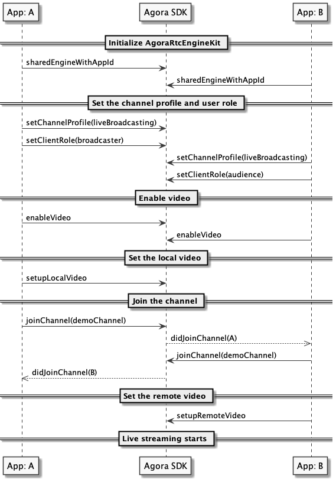

The Agora SDK enables you to develop rapidly to enhance your social, work, education, and IoT apps with real-time engagements.

This page shows the minimum code you need to add interactive live streaming into your app by using the Agora Video SDK for iOS.

## Understand the tech

The following figure shows the workflow to integrate Interactive Live Streaming Premium into your app.


To start Interactive Live Streaming Premium, you implement the following steps in your app:

**1. Set the role**
Users in an Interactive Live Streaming Premium channel are either a host or an audience member. The host publishes streams to the channel, and the audience subscribes to the streams. 

**2. Retrieve a token**
The token is a credential for authenticating the identity of the user when your app client joins a channel. The app client requests a token from your app server. This token authenticates the user when the app client joins a channel.

**3. Join a channel**
Call `joinChannel` to create and join a channel. App clients that pass the same channel name join the same channel.

**4. Publish and subscribe to audio and video in the channel**
After joining a channel, app clients with the role of the host can publish audio and video. For an auidence memeber to send audio and video, you can call `setClientRole` to switch the client role. 

For an app client to join a channel, you need the following information:
- The App ID: A randomly generated string provided by Agora for identifying your app. You can get the App ID from [Agora Console](https://console.agora.io).
- The user ID: The unique identifier of a user. You need to specify the user ID yourself, and ensure that it is unique in the channel.
- A token: In a test or production environment, your app client retrieves tokens from your server. For rapid testing, you can use a temporary token with a validity period of 24 hours.
- The channel name: A string that identifies the channel for live streaming. 

## Prerequisites

Before proceeding, ensure that your development environment meets the following requirements:

- Xcode 9.0 or later.
- An iOS device running iOS 8.0 or later.
- A valid [Agora account](https://console.agora.io/).
- A valid Agora project with an App ID and a temporary token. For details, see [Get Started with Agora](https://docs.agora.io/en/Agora%20Platform/get_appid_token?platform=All%20Platforms).
- A computer with access to the internet. If your network has a firewall, follow the instructions in [Firewall Requirements](https://docs.agora.io/en/Agora%20Platform/firewall?platform=All%20Platforms).

## Project setup

In Xcode, follow the steps to create the environment necessary to add live streaming into your app.

1. [Create a new project](https://help.apple.com/xcode/mac/current/#/dev07db0e578) for iOS using the **Single View App** template. Make sure you select **Swift** as the language and **Storyboard** as the user interface.
   
   <div class="alert note">If you have not added any team information, you can see an **Add account...** button. Click it, input your Apple ID, and click **Next** to add your team.</div>
   
2. Integrate the Video SDK into your project.

   Go to **File** > **Swift Packages** > **Add Package Dependencies...**, and paste the following link:

   `https://github.com/AgoraIO/AgoraRtcEngine_iOS`

<div class="alert note"><li>This method applies to v3.4.3 or later. For more integration methods, see <a href="#othermethods">Other approaches to integrating the SDK</a></li><li>If you have issues installing this Swift Package, try going to <b>File</b> > <b>Swift Packages</b> > <b>Reset Package Caches</b>.</li></div>

3. [Enable automatic signing](https://help.apple.com/xcode/mac/current/#/dev23aab79b4) for your project.
4. [Set the target devices](https://help.apple.com/xcode/mac/current/#/deve69552ee5) to deploy your iOS app.
5. Add permissions for microphone and camera usage.
   Open the `info.plist` file in the left navigation panel, and [edit the property list](https://help.apple.com/xcode/mac/current/#/dev3f399a2a6) to add the following properties:
   - Privacy - Microphone Usage Description
   - Privacy - Camera Usage Description

## Implement a client for Interactive Live Streaming Premium

This section shows how to use the Agora Video SDK to implement live streaming in your app step by step.

### Create the UI

In the interface, you should have one frame for local video and another for remote video. In `ViewController.swift`, replace any existing content with the following:

```swift
// Swift
import UIKit
class ViewController: UIViewController {
    var localView: UIView!
    var remoteView: UIView!
    
    override func viewDidLoad() {
        super.viewDidLoad()
        initView()
     }
  
    override func viewDidLayoutSubviews() {
        super.viewDidLayoutSubviews()
        remoteView.frame = self.view.bounds
        localView.frame = CGRect(x: self.view.bounds.width - 90, y: 0, width: 90, height: 160)
    }
  
    func initView() {
        remoteView = UIView()
        self.view.addSubview(remoteView)
        localView = UIView()
        self.view.addSubview(localView)
    }
}
```

### Implement the Interactive Live Streaming Premium logic

When your app opens, you create an `RtcEngine` instance, enable the video, join a channel, and if the local user is a host, publish the local video to the lower frame layout in the UI. When another host joins the channel, your app catches the join event and adds the remote video to the top frame layout in the UI.

The following figure shows the API call sequence of implementing Interactive Live Streaming Premium. 



To implement this logic, take the following steps:

1. Import the Agora kit.

   In `ViewController.swift`, add the following line after `import UIKit`:

   ```swift
    import AgoraRtcKit
   ```

   And add the `agoraKit` variable in the `ViewController` class:

   ```swift
   class ViewController: UIViewController {
       var localView: UIView!
       var remoteView: UIView!
       // Add agoraKit here
       var agoraKit: AgoraRtcEngineKit?
   }
   ```

2. Initialize the app and join the channel.

   Call the core methods for initializing the app and joining a channel. In the following sample code, we use an `initializeAndJoinChannel` function to encapsulate these core methods.

   In `ViewController.swift`, add the following lines after the `initView` function:

   ```swift
    func initializeAndJoinChannel() {
      agoraKit = AgoraRtcEngineKit.sharedEngine(withAppId: "Your App ID", delegate: self)
      // For a live streaming scenario, set the channel profile as liveBroadcasting.
      agoraKit?.setChannelProfile(.liveBroadcasting)
      // Set the client role as broadcaster or audience.
      agoraKit?.setClientRole(.broadcaster)
      // Video is disabled by default. You need to call enableVideo to start a video stream.
      agoraKit?.enableVideo()
           // Create a videoCanvas to render the local video
           let videoCanvas = AgoraRtcVideoCanvas()
           videoCanvas.uid = 0
           videoCanvas.renderMode = .hidden
           videoCanvas.view = localView
           agoraKit?.setupLocalVideo(videoCanvas)
      
      // Join the channel with a token.
      agoraKit?.joinChannel(byToken: "Your token", channelId: "Channel name", info: nil, uid: 0, joinSuccess: { (channel, uid, elapsed) in
           })
       }
   ```

3. Add the remote interface when a remote host joins the channel.

   In `ViewController.swift`, add the following lines after the `ViewController` class:

    ```swift
    extension ViewController: AgoraRtcEngineDelegate {
        // This callback is triggered when a remote host joins the channel
        func rtcEngine(_ engine: AgoraRtcEngineKit, didJoinedOfUid uid: UInt, elapsed: Int) {
            let videoCanvas = AgoraRtcVideoCanvas()
            videoCanvas.uid = uid
            videoCanvas.renderMode = .hidden
            videoCanvas.view = remoteView
            agoraKit?.setupRemoteVideo(videoCanvas)
        }
    }
    ```

### Start and stop your app

Now you have created the Interactive Live Streaming Premium functionality, start and stop the app. In this implementation, a live stream starts when the user opens your app. The live stream ends when the user closes your app.

1. When the view is loaded, call `initializeAndJoinChannel` to join a live streaming channel.

   In `ViewController.swift`, add the `initializeAndJoinChannel` function inside the `viewDidLoad` function:.

    ```swift
   override func viewDidLoad() {
           super.viewDidLoad()
           initView()
           // Add this line
           initializeAndJoinChannel()
        }
    ```
   
2. When the user closes this app, clean up all the resources used by your app.

   In `ViewController.swift`, add `applicationWillTerminate` after the `initializeAndJoinChannel` function.

    ```swift
   func applicationWillTerminate(notification: NSNotification) {
           agoraKit?.leaveChannel(nil)
           AgoraRtcEngineKit.destroy()
       }
    ```

## Test your app

Connect an iOS device to your computer, and click the Run button on your Xcode to [build and run your app](https://help.apple.com/xcode/mac/current/#/dev5a825a1ca) on the device. A moment later you will see the project installed on your device. Take the following steps to test the live streaming app:

1. Grant microphone and camera access to your app.
2. When the app launches, you should be able to see yourself on the local view if you set the client role as `broadcaster`.
3. Ask a friend to join the live streaming with you on the [demo app](https://webdemo.agora.io/agora-websdk-api-example-4.x/basicLive/index.html). Enter the same App ID and channel name.
4. If your friend joins as a host, you should be able to see and hear each other; if as an audience member, you should only be able to see yourself while your friend can see and hear you.

## Next steps

Generating a token by hand is not helpful in a production context. [Authenticate Your Users with Tokens](https://docs.agora.io/en/Interactive%20Broadcast/token_server?platform=All%20Platforms) shows you how to start live streaming with a token that you retrieve from your server.

## See also

This section provides additional information for your reference: 

### Sample project

Agora provides an open source sample project [OpenLive-iOS-Swift](https://github.com/AgoraIO/Basic-Video-Broadcasting/tree/master/OpenLive-iOS) on GitHub that implements interactive live video streaming for your reference.

<a name="othermethods"></a>

### Other approaches to integrate the SDK

In addition to integrating the Agora Video SDK for iOS through Swift Package, you can also import the SDK into your project through CocoaPods or by manually copying the SDK files.

**Automatically integrate the SDK with CocoaPods**

1. Install CocoaPods if you have not. See [Getting Started with CocoaPods](https://guides.cocoapods.org/using/getting-started.html#getting-started).
2. In Terminal, navigate to the root of your project folder, and run the `pod init` command to create a `Podfile` in the project folder.
3. Open the `Podfile`, and replace all contents with the following code. Remember to replace `Your App` with the target name of your project.
4. In Terminal, run the `pod install` command to install the Agora Video SDK for iOS. When the SDK is installed successfully, you can see  `Pod installation complete!` in Terminal and an `xcworkspace` file in the project folder.
5. Open the `xcworkspace` file for any further steps.

**Manually copy the SDK files**

1. Go to [SDK Downloads](https://docs.agora.io/en/Video/downloads?platform=iOS), download the latest version of the Agora Video SDK, and extract the files from the downloaded SDK package.

2. From the `libs` folder of the downloaded SDK package, copy the files or subfolders you need to the root of your project folder.
   
   <div class="alert note">Certain files and subfolders under the <code>libs</code> folder are optional. See <a href="https://docs.agora.io/en/Video/faq/reduce_app_size_rtc?platform=iOS#extension_libraries">extension libraries</a> for details.</div>
   
3. In Xcode, [link your target to the frameworks or libraries](https://help.apple.com/xcode/mac/current/#/dev51a648b07) you have copied. Be sure to choose **Embed & Sign **from the pop-up menu in the Embed column.

   <div class="alert note"><ul><li>Apple does not allow an app extension to contain any dynamic library. If you are integrating the Agora SDK to an app extension, choose <b>Do Not Embed</b> in the Embed column.</li><li>The Agora SDK uses libc++ (LLVM) by default. Contact support@agora.io if you want to use libstdc++ (GNU). The SDK provides FAT image libraries with multi-architecture support for both 32/64-bit audio emulators and 32/64-bit audio/video real devices.</li></ul></div>

### Listening for audience events

The Agora Video SDK does not report events of an audience member in a live streaming channel. Refer to [How can I listen for an audience joining or leaving an interactive live streaming channel](https://docs.agora.io/en/Interactive%20Broadcast/faq/audience_event) if your scenario requires so.

