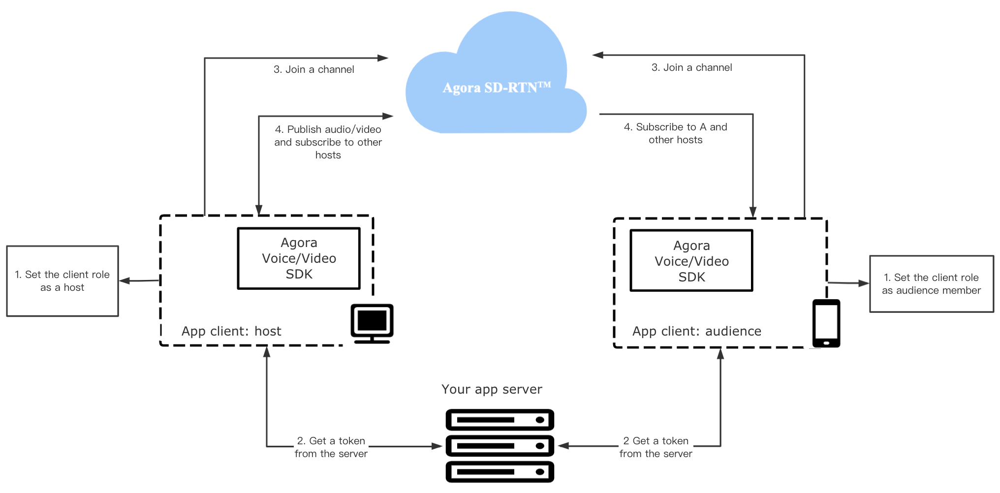
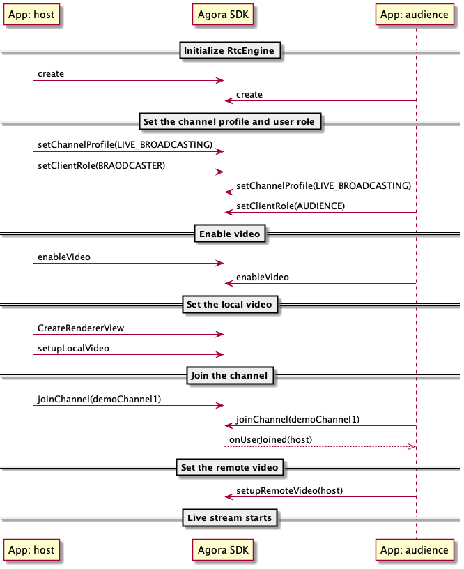

# Get Started with Interactive Live Streaming Premium

The Interactive Live Streaming SDK enables you to develop reapidly to enhance your social, work, education and IoT apps with real-time engagement.

This page shows the minimum code you need to add interactive live stream into your app by using the Agora Interactive Live Streaming SDK for Android.

## Understand the tech

The following figure shows the workflow you need to implement to integrate Interactive Live Streaming Premium into your app.



To start Interactive Live Streaming Premium, you implement the following steps in your app: 

1. **Set the role**
   Users in an Interactive Live Streaming Premium channel are either the `BROADCASTER` or the `AUDIENCE`. The `BROADCASTER` publishes streams to the channel, the `AUDIENCE` subscribes to them. 
   Only app clients with the role of `BROADCASTER` can publish streams in the channel. Those with the role of `AUDIENCE` can only susbcribe to streams.

2. **Retrieve a token**
   The token is a credential for authenticating the identity of the user when your app client joins an RTC channel. The app client requests a token from your app server. This token authenticates the user when the app client joins a channel.

3. **Join a channel**
   Call `joinChannel` to connect to Agora and create a channel. Apps that pass the same channel name join the same channel.

4. **Publish and subscribe to audio and video in the channel**
   After joining a channel, only app clients with the role of `BROADCASTER` can publish audio and video. For an auidence memeber to send audio and video, you can call the API to switch the client role. 

For an app client to join a channel, you need the following information:

- The App ID: A randomly generated string provided by Agora for identifying your app. You can get the App ID from [Agora Console](https://console.agora.io).
- The user ID: The unique identifier of a user. You need to specify the user ID yourself, and ensure that it is unique in the channel.
- A token: In a test or production environment, your app client retrieves tokend your server in your security infrastructure. For rapid testing, you can use a temporary token with a validity period of 24 hours in Agora Console.
- The channel name: A string that identifies the channel for the live stream.

## Prerequisites

Before proceeding, ensure that you have the following:

- Android Studio 3.0 or later.
- Android SDK API Level 16 or higher.
- A valid [Agora account](https://console.agora.io/).
- A valid Agora project with an App ID and a temporary token. For details, see [Get started with Agora](https://docs.agora.io/en/Agora%20Platform/get_appid_token?platform=All%20Platforms).
- A computer that meets the following requirements:
  - Access to the internet. If your network has a firewall, follow the instructions in [Firewall Requirements](https://docs.agora.io/en/Agora%20Platform/firewall?platform=All%20Platforms).
  - An Intel 2.2GHz Core i3/i5/i7 processor (2nd generation) or equivalent.
- A mobile device that runs Android 4.1 or later.

## Project setup

Follow the steps to create the environment necessary to add live stream into your app.

1. For new projects, in **Android Studio**, create a *Phone and Tablet* [Android project](https://developer.android.com/studio/projects/create-project) with an *Empty Activity*.

2. Integrate the Interactive Live Streaming SDK into your project.

   a. In `/Grale Scripts/build.gradle(Project: <projectname>)`, add the following lines to add the JitPack dependency.

    ```xml
    all projects {
    repositories {
        ...
        maven { url 'https://www.jitpack.io' }
    }
    }
    ```

    b. In `/Gradle Scripts/build.gradle(Module: <projectname>)`, add the following line to integrate the Agora Interactive Live Streaming SDK into your Android project.

    ```xml
    ...
    dependencies {
    ...
    // For x.y.z, fill in a specific SDK version number. For example, 3.4.0
    implementation 'com.github.agorabuilder:native-full-sdk:x.y.z'
    }
    ```

3. Enable your app to connect to networks and use video and audio material on a mobile device.

   In `/app/Manifests/AndroidManifest.xml`, add the following permissions:

    ```xml
    <manifest xmlns:android="http://schemas.android.com/apk/res/android"
    package="io.agora.livestreaming">

    <uses-permission android:name="android.permission.INTERNET" />
    <uses-permission android:name="android.permission.CAMERA" />
    <uses-permission android:name="android.permission.RECORD_AUDIO" />
    <uses-permission android:name="android.permission.MODIFY_AUDIO_SETTINGS" />
    <uses-permission android:name="android.permission.ACCESS_WIFI_STATE" />
    <uses-permission android:name="android.permission.ACCESS_NETWORK_STATE" />
    <uses-permission android:name="android.permission.BLUETOOTH" />
    ...
    </manifest>
    ```

4. Prevent code obfuscation.

   In `/Gradle Scripts/proguard-rules.pro`, add the following line to prevent obfuscating the code of the SDK:

    ```
    -keep class io.agora.**{*;}
    ```

## Implement a client for Interactive Live Streaming Premium

This section shows how to use the Agora Interactive Live Streaming SDK to implement live stream into your app step-by-step.

When a user opens this app on their mobile device, it automatically joins the channel. When another host joins the channel, their video and audio is rendered in the app.

### Create the UI

This UI is functional rather than beautiful. In the interface, you have one frame for local video and another for remote video. In `/app/res/layout/activity_main.xml`, replace the content with the following:

```xml
<?xml version="1.0" encoding="UTF-8"?>
<RelativeLayout xmlns:android="http://schemas.android.com/apk/res/android"
    xmlns:tools="http://schemas.android.com/tools"
    android:id="@+id/activity_main"
    android:layout_width="match_parent"
    android:layout_height="match_parent"
    tools:context=".MainActivity">
 
    <FrameLayout
        android:id="@+id/remote_video_view_container"
        android:layout_width="match_parent"
        android:layout_height="match_parent"
        android:background="@android:color/white" />
 
    <FrameLayout
        android:id="@+id/local_video_view_container"
        android:layout_width="160dp"
        android:layout_height="160dp"
        android:layout_alignParentEnd="true"
        android:layout_alignParentRight="true"
        android:layout_alignParentTop="true"
        android:layout_marginEnd="16dp"
        android:layout_marginRight="16dp"
        android:layout_marginTop="16dp"
        android:background="@android:color/darker_gray" />
 
</RelativeLayout>
```

### Create the Android system logic

When your app launches, check if the permissions necessary to insert Live Streaming functionality into the app are granted. If the permissions are not granted, use the built-in Android functionality to request them. And if they are, return `true`.

```java
private static final int PERMISSION_REQ_ID = 22;

private static final String[] REQUESTED_PERMISSIONS = {
        Manifest.permission.RECORD_AUDIO,
        Manifest.permission.CAMERA
};

private boolean checkSelfPermission(String permission, int requestCode) {
    if (ContextCompat.checkSelfPermission(this, permission) !=
            PackageManager.PERMISSION_GRANTED) {
        ActivityCompat.requestPermissions(this, REQUESTED_PERMISSIONS, requestCode);
        return false;
    }
    return true;
}
```

### Implement the Interactive Live Streaming Premium logic

When your app opens, you create an `RtcEngine` instance, enable the video, join a channel, and if the local user is a host, publish the local video to the lower frame in the UI. When another host joins the channel, you app catches the join event and adds the remote video to the top frame in the UI.

The following figure shows the API call sequence of implementing interactive live stream. 



To implement this logic, take the following steps:

1. Import the Agora classes.

   In `/app/java/com.example.<projectname>/MainActivity`, add the following lines:

    ```java
    import io.agora.rtc.Constants;
    import io.agora.rtc.IRtcEngineEventHandler;
    import io.agora.rtc.RtcEngine;
    import io.agora.rtc.video.VideoCanvas;
    ```

2. Create the variables you use to create or join a live streaming channel.

   In `/app/java/com.example.<projectname>/MainActivity`, add the following lines:

    ```java
    // Fill the App ID of your project generated on Agora Console
    private String appId = "";
    // Fill the channel name
    private String channelName = "";  
    // Fill the temp token generated on Agora Console
    private String token = "";

    private RtcEngine mRtcEngine;

    private final IRtcEngineEventHandler mRtcEventHandler = new IRtcEngineEventHandler() {
        @Override
        // Listen for the remote host joining the channel to get the uid of the host
        public void onUserJoined(int uid, int elapsed) {
            runOnUniThread(new Runnable() {
                @Override
                public void run() {
                    // Call setupRemoteVideo to set the remote video view after getting uid from the onUserJoined callback
                    setupRemoteVideo(uid);
                }
            });
        }
    };
    ```

3. Initialize the app and join the channel.

   In `/app/java/com.example.<projectname>/MainActivity`, add `initializeAndJoinChannel` to the `MainActivity` class.

    ```java
    private void initializeAndJoinChannel() {
        try {
            mRtcEngine = RtcEngine.create(getBaseContext(), appId, mRtcEventHandler);
        } catch (Exception e) {
            throw new RuntimeException("Check the error.");
        }

        // For a live streaming scenario, set the channel profile as BROADCASTING.
        mRtcEngine.setChannelProfile(Constants.CHANNEL_PROFILE_LIVE_BROADCASTING);
        // Set the client role as BORADCASTER or AUDIENCE according to the scenario.
        mRtcEngine.setClientRole(Constants.CLIENT_ROLE_BROADCASTER);

        // By default, video is disabled, and you need to call enableVideo to start a video stream.
        mRtcEngine.enableVideo();


        FrameLayout container = (FrameLayout) findViewById(R.id.local_video_view_container);
        // Call CreateRendererView to create a SurfaceView pbject and add it as a child to the FrameLayout
        SurfaceView surfaceView = RtcEngine.CreateRendererView(getBaseContext());
        container.addView(surfaceView);
        // Pass the SurfaceView object to Agora so that it renders the local video
        mRtcEngine.setupLocalVideo(new VideoCanvas(surfaceView, VideoCanvas.RENDER_MODE_FIT, 0));

        // Join the channel with a token
        mRtcEngine.joinChannel(token, channelName, "", 0);
    }
    ```

4. Add the remote interface when a remote host joins the channel.

   In `/app/java/com.example.<projectname>/MainActivity`, add `setupRemoteVideo` to the `MainActivity` class.

    ```java
    private void setupRemoteVideo(int uid) {
        FrameLayout container = (FrameLayout) findViewById(R.id.remote_video_view_container);
        SurfaceView surfaceView = RtcEngine.CreateRendererView(getBaseContext());
        surfaceView.setZOrderMediaOverlay(true);
        container.addView(surfaceView);
        mRtcEngine.setupRemoteVideo(new VideoCanvas(surfaceView, VideoCanvas.RENDER_MODE_FIT, uid));
    }
    ```

### Start and stop your app

Now you have created the Live Streaming Premium and Android system functionality, start and stop the app. In this implementation, the live stream starts when the user opens your app. The live stream ends when the user closes your app.

1. Check that the app has the correct permissions. When permissions are granted, call `initializeAndJoinChannel` to join a live streming channel.

   In `/app/java/com.example.<projectname>/MainActivity`, replace `onCreate` with the following code in the `MainActivity` class.

    ```java
    @Override
    protected void onCreate(Bundle savedInstanceState) {
        super.onCreate(savedInstanceState);
        setContentView(R.layout.activity_video_chat_view);

        // If all the permissions are granted, initialize the RtcEngine object and join a channel.
        if (checkSelfPermission(REQUESTED_PERMISSIONS[0], PERMISSION_REQ_ID) &&
                checkSelfPermission(REQUESTED_PERMISSIONS[1], PERMISSION_REQ_ID)) {
            initializeAndJoinChannel();
        }
    }
    ```

2. When the user closes this app, elegantly clean up all the resources you created in `initializeAndJoinChannel`.

   In `/app/java/com.example.<projectname>/MainActivity`, add `onDestroy` to the `MainActivity` class.

    ```java
    protected void onDestroy() {
        super.onDestroy();

        mRtcEngine.leaveChannel();
        mRtcEngine.destroy();
        mRtcEngine = null;
    }
    ```

## Test your app

Connect an Android device to your computer, and click `Run 'app'` on your Android Studio. A moment later you will see the project installed on your device. Take the following steps to test the live streaming app:

1. Grant microphone and camera access to your app.
2. When the app launches, you should be able to see yourself on the local view if you set the client role as `BROADCASTER`.
3. Ask a friend to join the live stream with you on the [demo app](https://webdemo.agora.io/agora-websdk-api-example-4.x/basicLive/index.html). Enter the same App ID and channel name.
4. If your friend joins as host, you should be able to see and hear each other; If as audience, you should only be able to see yourself while your friend can see and hear you.

## Next steps

Generating a token by hand is not helpful in a production context. [Authenticate Your Users with Tokens]() shows you how to start live streaming with a token that you retrieve from your server.

## See also

- Agora provides an open source sample project [OpenLive-Android](https://github.com/AgoraIO/Basic-Video-Broadcasting/tree/master/OpenLive-Android) on GitHub that implements interactive live video stream for your reference.
- In addition to integrating the Agora Video SDK for Android through JitPack, you can also import the SDK into your project manually by [downloading the SDK](https://docs.agora.io/en/Interactive%20Broadcast/downloads?platform=Android), extracting it, and copying the following files of the downloaded SDK package to the path of your project:

    | File or subfolder | Path of your project |
    |-------|----------|
    | `agora-rtc-sdk.jar` file | `/app/libs/` |
    | `arm-v8a` folder | `/app/src/main/jniLibs/` |
    | `armeabi-v7a` folder | `/app/src/main/jniLibs/` |
    | `x86` folder | `/app/src/main/jniLibs/` |
    | `x86_64` folder | `/app/src/main/jniLibs/` |
    | `include` folder | `/app/src/main/jniLibs/` |

    > - If you use the armeabi architecture, copy files from the `armeabi-v7a` folder to the `armeabi` file of your project. Contact support@agora.io if you encounter any incompability issue.
    > - Not all libraries in the SDK package are necessary. Refer to [How can I reduce the app size after integrating the RTC Native SDK](https://docs.agora.io/en/Video/faq/reduce_app_size_rtc) for details.
    
- The Agora Video SDK does not report events of an audience member in a live streaming channel. Refer to [How can I listen for an audience joining or leaving an interactive live streaming channel](https://docs.agora.io/en/Interactive%20Broadcast/faq/audience_event) if your scenario requires so.
