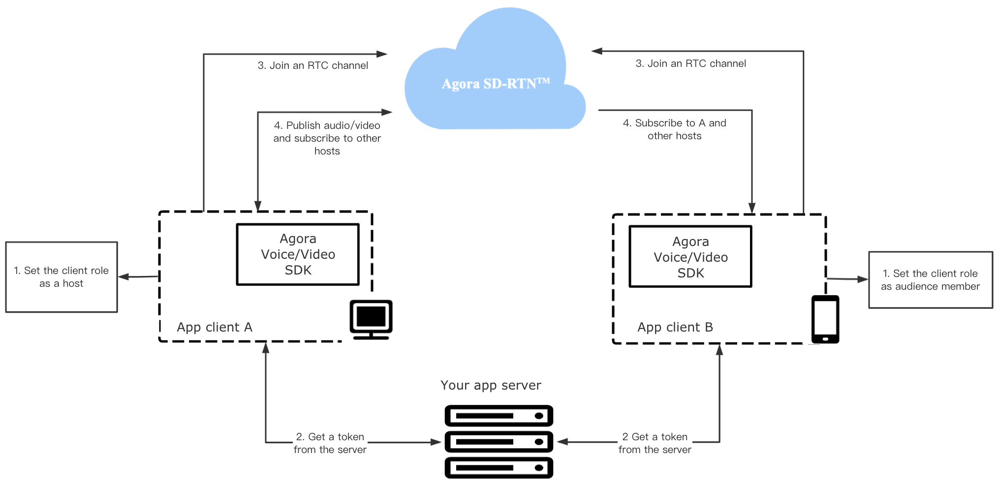

# Start Interactive Live Video Streaming

The Agora Video SDK for Android makes it easy to embed interactive live streaming into Android apps. It enables you to develop reapidly to enhance your social, work, education and IoT apps with real-time engagement.

This page shows the minimum code you need to add interactive live streaming into your Android app by using the Agora Video SDK for Android.

## Understand the tech

The following figure shows the workflow of interactive live streaming implemented by the Agora SDK.



To start interactive live streaming, your app client has the following steps to take: 

**1. Set the client role**
An interactive live streaming session differs from a voice or video call in that users in a live streaming channel have different roles: host (`BROADCASTER`) and audience (`AUDIENCE`). 
Only app clients with the role of `BROADCASTER` can publish streams in the channel. Those with the role of `AUDIENCE` can only susbcribe to streams.

**2. Get a token**
The app client requests a token from your app server. This token authenticates the user when the app client joins a channel.

**3. Join an Agora RTC channel**
The client joins an RTC (Real-time Communication) channel by calling the APIs provided by Agora. When that happens, Agora automatically creates an RTC channel. App clients that pass the same channel name join the same channel.

**4. Publish and subscribe to audio and video in the channel**
After joining a channel, only app clients with the role of `BROADCASTER` can publish audio and video. For an auidence memeber to send audio and video, you can call the API to switch the client role. 

For an app client to join an RTC channel, you need the following information:

- The App ID: A randomly generated string provided by Agora for identifying your app. You can get the App ID from [Agora Console](https://console.agora.io).
- The user ID: The unique identifier of a user. You need to specify the user ID yourself, and ensure that it is unique in the channel.
- A token: A credential for authenticating the identity of the user when your app client joins an RTC channel.
- The channel name: A string that identifies the RTC channel for the live stream.

## Prerequisites

Before proceeding, ensure that you have the following:

- Android Studio 3.0 or later
- Android SDK API Level 16 or higher
- A valid [Agora account](https://console.agora.io/)
- A valid Agora project with an App ID and a temporary token. For details, see [Get started with Agora](https://docs.agora.io/en/Agora%20Platform/get_appid_token?platform=All%20Platforms).
- A mobile device that meets the following requirements:
  - Running Android 4.1 or later.
  - Having access to the internet. open the specified ports in [Firewall Requirements](https://docs.agora.io/en/Agora%20Platform/firewall?platform=All%20Platforms) if your network has a firewall.

## Project setup

In this section, we will create an Android projet, integrate the Android Video SDK, and add the Android device permission to set up the project.

### Create an Android project

Follow the steps to create an empty Android project. Skip to [integrate the SDK](#integrate) if a project already exists.

1. Open **Android Studio** and click **Start a new Android Studio project**.

2. On the **Select a Project Template** panel, choose **Phone and Tablet** > **Empty Activity**, and click **Next**.

3. On the **Configure Your Project** panel, fill in the following:

    - **Name**: The name of your project, for example, HelloAgora
    - **Package name**: The name of the project package, for example, io.agora.helloagora
    - **Save location**: The path to save the project
    - **Language**: The programming language of the project, for example, Java
    - **Minimum API level**: The minimum API level of the project

Click **Finish**. Follow the on-screen instructions, if any, to install the plug-ins.

> The steps above take Android Studio 3.6.2 as an example. To create a project, you can also refer to the official Android user guide [Build your first app](https://developer.android.com/training/basics/firstapp).

### Integrate the SDK

This section shows how to integrate the Agora Video SDK into your Android project.

1. Downloads the latest Video SDK for Android, and extract files from the downloaded SDK package.
2. Copy the following files or subfolders of the SDK package to the path of your project.

    | File or subfolder | Path of your project |
    |-------|----------|
    | `agora-rtc-sdk.jar` file | `/app/libs/` |
    | `arm-v8a` folder | `/app/src/main/jniLibs/` |
    | `armeabi-v7a` folder | `/app/src/main/jniLibs/` |
    | `x86` folder | `/app/src/main/jniLibs/` |
    | `x86_64` folder | `/app/src/main/jniLibs` |

    > If you use the armeabi architecture, copy files from the `armeabi-v7a` folder to the `armeabi` file of your project. Contact support@agora.io if you encounter any incompability issue.

### Add project permissions

Add the following permissions in the `/app/src/main/AndroidManifest.xml` file:

```xml
<manifest xmlns:android="http://schemas.android.com/apk/res/android"
   package="io.agora.tutorials1v1acall">

   <uses-permission android:name="android.permission.INTERNET" />
   <uses-permission android:name="android.permission.RECORD_AUDIO" />
   <uses-permission android:name="android.permission.MODIFY_AUDIO_SETTINGS" />
   <uses-permission android:name="android.permission.ACCESS_WIFI_STATE" />
   <uses-permission android:name="android.permission.ACCESS_NETWORK_STATE" />
   <uses-permission android:name="android.permission.BLUETOOTH" />
...
</manifest>
```

### Prevent code obfuscation

Add the following line in the `/app/proguard-rules.pro` file to prevent obfuscating the code of the SDK:

```
-keep class io.agora.**{*;}
```


