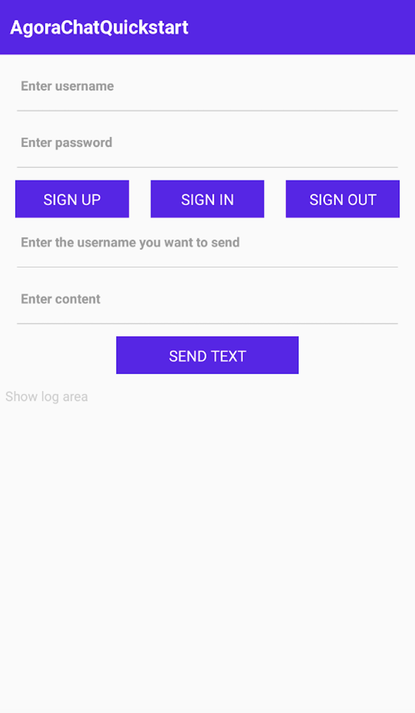

Instant messaging connects people wherever they are and allows them to communicate with others in real time. The Agora Chat SDK enables you to embed real-time messaging in any app, on any device, anywhere.

This page shows a sample code to add peer-to-peer messaging into a Windows project by using the Agora Chat SDK.

## Understand the tech

~338e0e30-e568-11ec-8e95-1b7dfd4b7cb0~

## Prerequisites

Before proceeding, ensure that your development environment meets the following requirements.

If your target platform is iOS:

- React Native 0.63.4 or later
- macOS 10.15.7 or later
- Node 10 or later
- Xcode 12.4 or later
- CocoaPods
- Yarn
- A physical or virtual mobile device running iOS 9.0 or later

If your target platform is Android:

- React Native 0.63.4 or later
- macOS, Windows, or Linux. 
- Shell installed if your operating system is Windows.
- Node 10 or later
- Yarn
- Java Development Kit (JDK) 8 or later
- Android Studio (latest version recommended)
- A physical or virtual mobile device running Android 5.0 or later

<div class="alert info">For more information, see <a href="https://reactnative.dev/docs/environment-setup">Setting up the development environment.</a>

## Project setup

Follow the steps to create a React Native project and add Agora Chat into your app.

1. Make sure you have set up the development environment based on your operating system and target platform.
2. In your terminal, run the following command to create a React Native project.

   ```bash
   npx react-native init simple_demo
   cd simple_demo
   yarn
   ```

   A successful execution of this command generates a project named `simple_demo` in the directory that you run the command.

3. Run the following command to import the Chat SDK using yarn:

   ```bash
   yarn add react-native-chat-sdk
   ```

4. Execute the scripts or tools according to your target platform.

   If your target platform is Android:

    ```bash
    cd node_modules/react-native-chat-sdk/native_src/cpp
    sh generate.sh --type rn
    cd ../../../..
    ```

   If your target platform is iOS:

    ```bash
    cd ios
    pod install
    cd ..
    ```

5. Add TypeScript

   The sample code on this page is written in TypeScript. If you want to use this sample code directly, you need to add support for TypeScript to your project.

   a. Run one of the following commands in the root of your project to add TypeScript dependencies:

   ```bash
   # Add Typescript using npm
   npm install --save-dev typescript @types/jest @types/react @types/react-native @types/react-test-renderer

   # Add Typescript using yarn
   yarn add --dev typescript @types/jest @types/react @types/react-native @types/react-test-renderer
   ```

   b. Create a `tsconfig.json` file in the root of your project, and copy the following code to the file:

   ```json
   {
       "compilerOptions": {
           "allowJs": true,
           "allowSyntheticDefaultImports": true,
           "esModuleInterop": true,
           "isolatedModules": true,
           "jsx": "react",
           "lib": ["es6"],
           "moduleResolution": "node",
           "noEmit": true,
           "strict": true,
           "target": "esnext"
       },
       "exclude": [
           "node_modules",
           "babel.config.js",
           "metro.config.js",
           "jest.config.js"
       ]
   }
   ```

   c. Create a `jest.config.js` file in the root of your project, and copy the following code to the file:

   ```bash
   module.exports = {
       preset: 'react-native',
       moduleFileExtensions: ['ts', 'tsx', 'js', 'jsx', 'json', 'node']
   };
   ```

   d. Rename `App.js` to `App.tsx`.

## Implemtation

This section introduces the codes you need to add to your project to start one-to-one messaging.

### Implement one-to-one messaging

To send a one-to-one message, chat users should register a Chat account, log into Agora Chat, and send a text message.

Open `simple_demo/App.tsx`, and replace the code with the following:

```typescript
import React from "react";
import {
  SafeAreaView,
  ScrollView,
  StyleSheet,
  Text,
  TextInput,
  View,
} from "react-native";
import {
  ChatClient,
  ChatOptions,
  ChatMessageChatType,
  ChatMessage,
} from "react-native-chat-sdk";
const App = () => {
  const title = "AgoraChatQuickstart";
  const [username, setUsername] = React.useState("");
  const [password, setPassword] = React.useState("");
  const [userId, setUserId] = React.useState("");
  const [content, setContent] = React.useState("");
  const [logText, setWarnText] = React.useState("Show log area");
  const setListener = () => {
    let msgListener = {
      onMessagesReceived(messages) {
        console.log("onMessagesReceived: ", messages);
        setWarnText("onMessagesReceived: " + JSON.stringify(messages));
      },
      onCmdMessagesReceived: (messages) => {
        console.log("onCmdMessagesReceived: ", messages);
      },
      onMessagesRead: (messages) => {
        console.log("onMessagesRead: ", messages);
      },
      onGroupMessageRead: (groupMessageAcks) => {
        console.log("onGroupMessageRead: ", groupMessageAcks);
      },
      onMessagesDelivered: (messages) => {
        console.log(`onMessagesDelivered: ${messages.length}: `, messages);
      },
      onMessagesRecalled: (messages) => {
        console.log("onMessagesRecalled: ", messages);
      },
      onConversationsUpdate: () => {
        console.log("onConversationsUpdate: ");
      },
      onConversationRead: (from, to) => {
        console.log("onConversationRead: ", from, to);
      },
    };
    ChatClient.getInstance().chatManager.removeAllMessageListener();
    ChatClient.getInstance().chatManager.addMessageListener(msgListener);
  };
  // Register a Chat account
  const registerAccount = () => {
    ChatClient.getInstance()
      .createAccount(username, password)
      .then(() => {
        console.log("register: success");
        setWarnText("register: success");
      })
      .catch((reason) => {
        console.log("register: fail", reason);
        setWarnText("register: fail" + reason);
      });
  };
  // Log into Chat
  const login = () => {
    setWarnText(`username:${username},password:${password}`);
    let listener = {
      onTokenWillExpire() {
        console.log("onTokenWillExpire");
        setWarnText("onTokenWillExpire");
      },
      onTokenDidExpire() {
        console.log("onTokenDidExpire");
        setWarnText("onTokenDidExpire");
      },
      onConnected() {
        console.log("onConnected");
        setWarnText("onConnected");
        setListener();
      },
      onDisconnected(errorCode) {
        console.log("onDisconnected: ", errorCode);
        setWarnText("onDisconnected" + errorCode);
      },
    };
    ChatClient.getInstance().removeAllConnectionListener();
    ChatClient.getInstance().addConnectionListener(listener);
    ChatClient.getInstance()
      .login("asteriskhx1", "qwer")
      .then(() => {
        console.log("login: success");
        setWarnText("login: success");
      })
      .catch((reason) => {
        console.log("login: fail", reason);
        setWarnText("login: fail" + JSON.stringify(reason));
      });
  };
  // Log out of Chat
  const logout = () => {
    ChatClient.getInstance()
      .logout()
      .then(() => {
        console.log("logout: success");
        setWarnText("logout: success");
      })
      .catch((reason) => {
        console.log("logout: fail", reason);
        setWarnText("logout: fail" + reason);
      });
  };
  // Send a one-to-one text message
  const sendmsg = () => {
    let msg = ChatMessage.createTextMessage(
      userId,
      content,
      ChatMessageChatType.PeerChat
    );
    const callback = new (class {
      onProgress(locaMsgId, progress) {
        console.log("onProgress ", locaMsgId, progress);
        setWarnText("onProgress: " + locaMsgId + progress);
      }
      onError(locaMsgId, error) {
        console.log("onError ", locaMsgId, error);
        setWarnText("onError: " + locaMsgId + error);
      }
      onSuccess(message) {
        console.log("onSuccess", message.localMsgId);
        setWarnText("onSuccess: " + message.localMsgId);
      }
    })();
    ChatClient.getInstance()
      .chatManager.sendMessage(msg, callback)
      .then(() => {
        console.log("send success");
        setWarnText("send success: " + msg.localMsgId);
      })
      .catch((reason) => {
        console.log("send failed");
        setWarnText("send fail: " + reason);
      });
  };
  return (
    <SafeAreaView>
      <View style={styles.titleContainer}>
        <Text style={styles.title}>{title}</Text>
      </View>
      <ScrollView>
        <View style={styles.inputCon}>
          <TextInput
            multiline
            style={styles.inputBox}
            placeholder="Enter username"
            onChangeText={(text) => setUsername(text)}
            value={username}
          />
        </View>
        <View style={styles.inputCon}>
          <TextInput
            multiline
            style={styles.inputBox}
            placeholder="Enter password"
            onChangeText={(text) => setPassword(text)}
            value={password}
          />
        </View>
        <View style={styles.buttonCon}>
          <Text style={styles.eachBtn} onPress={registerAccount}>
            SIGN UP
          </Text>
          <Text style={styles.eachBtn} onPress={login}>
            SIGN IN
          </Text>
          <Text style={styles.eachBtn} onPress={logout}>
            SIGN OUT
          </Text>
        </View>
        <View style={styles.inputCon}>
          <TextInput
            multiline
            style={styles.inputBox}
            placeholder="Enter the username you want to send"
            onChangeText={(text) => setUserId(text)}
            value={userId}
          />
        </View>
        <View style={styles.inputCon}>
          <TextInput
            multiline
            style={styles.inputBox}
            placeholder="Enter content"
            onChangeText={(text) => setContent(text)}
            value={content}
          />
        </View>
        <View style={styles.buttonCon}>
          <Text style={styles.btn2} onPress={sendmsg}>
            SEND TEXT
          </Text>
        </View>
        <View>
          <Text style={styles.logText}>{logText}</Text>
        </View>
      </ScrollView>
    </SafeAreaView>
  );
};
const styles = StyleSheet.create({
  titleContainer: {
    height: 60,
    backgroundColor: "#6200ED",
  },
  title: {
    lineHeight: 60,
    paddingLeft: 15,
    color: "#fff",
    fontSize: 20,
    fontWeight: "700",
  },
  inputCon: {
    marginLeft: "5%",
    width: "90%",
    height: 60,
    paddingBottom: 6,
    borderBottomWidth: 1,
    borderBottomColor: "#ccc",
  },
  inputBox: {
    marginTop: 15,
    width: "100%",
    fontSize: 14,
    fontWeight: "bold",
  },
  buttonCon: {
    marginLeft: "2%",
    width: "96%",
    flexDirection: "row",
    marginTop: 20,
    height: 26,
    justifyContent: "space-around",
    alignItems: "center",
  },
  eachBtn: {
    height: 40,
    width: "28%",
    lineHeight: 40,
    textAlign: "center",
    color: "#fff",
    fontSize: 16,
    backgroundColor: "#6200ED",
  },
  btn2: {
    height: 40,
    width: "45%",
    lineHeight: 40,
    textAlign: "center",
    color: "#fff",
    fontSize: 16,
    backgroundColor: "#6200ED",
  },
  logText: {
    padding: 10,
    marginTop: 10,
    color: "#ccc",
    fontSize: 14,
    lineHeight: 20,
  },
});
(function init() {
  let o = new ChatOptions({
    autoLogin: false,
    appKey: "easemob-demo#easeim",
  });
  ChatClient.getInstance()
    .init(o)
    .then(() => {
      console.log("success");
    })
    .catch(() => {
      console.log("error");
    });
})();
export default App;
```

### Build and run your project

You are now ready to build and run the project your built!

To build and run the project on an iOS device, take the following steps:

1. Connect an iPhone device to your computer and set the device to Developer mode.
2. Open `simple_demo/ios` and open `simple_demo.xcworkspace` with Xcode.
3. In **Targets** > **simple_demo** > **Signing & Capabilities**, set the signing of the project.
4. Click `Build` in Xcode to build the project. When the build succeeds, Xcode runs the project and installs it on your device. You see the app user interface.

To build and run the project on an iOS silumator, take the following steps:

1. Open `simple_demo/ios` and open `simple_demo.xcworkspace` with Xcode.
2. In Xcode, set `iPhone 13` as the iOS simulator.
3. Click `Build` in Xcode to build the project. When the build succeeds, Xcode runs the project and installs it on the simulater. You see the app user interface.

To build and run the project on an Android device, take the following steps:

1. Open `simple_demo/android` in Android Studio.
2. Connect an Android device to your computer and set the device to USB debugging mode.
3. In terminal, type in `adb reverse tcp:8081 tcp:8081` to set up data forwarding.
4. Run the following command to execute `"start": "react-native start"` in `package.json`:

   ```bash
   yarn start
   ```

5. Click `Build` in Android Studio to build the project. When the build succeeds, Android Studio runs the project and installs it on the device. You see the app interface.



## Test your app

Refer to the following steps to register a Chat account, log into Agora Chat and send and receive a message.

1. On one device or simulator, enter a username and password, click **SIGN UP** to register a Chat account.
2. Click **SIGN IN** to log into Agora Chat.
3. On a second device or simulator, repeat the above steps to create another account and log into Agora Chat. Ensure that you use a different user ID (username) on this device or simulator.
4. From the first device or simulator, enter the username you set in step 3, type in the text message you want to send, and click **SEND TEXT**. You can receive the text message from the other device or simulator.

You can also read from the logs below to see whether you have successfully signed up, signed in, and sent a text message.

## Next steps

For demonstration purposes, the sample code on this page uses `username + password` to register a new user. In production environment, to enhance communication security, we recommend you using `username + password + token` to register a user. Tokens need to be generated on your app server and retrieved from your app client; when a token expires, you need to generate a new token and renew it in the client. For details, refer to [Implement an Agora user token server for Agora Chat](./generate_user_tokens?platform=React%20Native).
