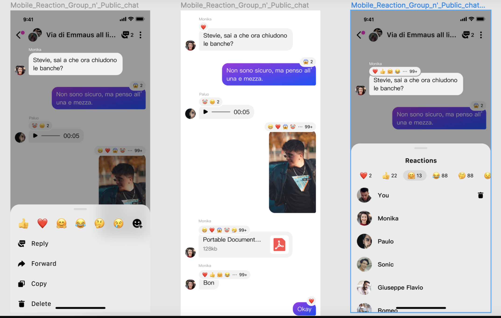

In real-time chats, emojis are widely used because they are more direct and vivid when expressing feelings. In Agora Chat, this is known as reaction, which enables chat users to respond to a message using emojis in one-to-one chats and chat groups. In group chats, reactions can also be used to cast a vote, for example, by calculating the number of different emojis attached to the message. 

The following illustration shows the implementation of adding a reaction to a message, how a conversation looks with reactions, and retrieving the list and information of the reactions.



This page shows how to use the Agora Chat SDK to implement reactions in your project.

## Understand the tech

The SDK provides the following APIs to implement reaction functionalities.

- `asyncAddReaction`: Adds a reaction to the specified message.
- `asyncRemoveReaction`: Removes the reaction from the specified message.
- `asyncGetReactionList`: Retrieves a list of reactions from the server.
- `asyncGetReactionDetail`: Retrieves the details of the reaction from the server.
- `ChatMessage.getMessageReaction`: Retrieves a list of reactions from the `ChatMessage` objects in the local database.

## Prerequisites

Before proceeding, ensure that your environment has the following:

- A project that integrates the Agora Chat SDK later than v1.0.3 and has implemented the [basic real-time chat functionalities](./agora_chat_get_started_android?platform=Android).
- Understand the API call frequency limit as described in [Limitations](./agora_chat_limitation?platform=Android).
- Reaction is not enabled by default. To use this feature, contact support@agora.io to enable it first.

## Implementation

This section introduces how to implement reaction functionalities in your project.

### Add a reaction

Call `asyncAddReaction` to add a reaction to the specified message. You can use `onReactionChanged` to listen for the state of adding the reaction.

```java
// Add a reaction
ChatClient.getInstance().chatManager().asyncAddReaction(message.getMsgId(), reaction, new CallBack() {
            @Override
            public void onSuccess() {
                
            }
            @Override
            public void onError(int error, String errorMsg) {
              
            }
            @Override
            public void onProgress(int i, String s) {
            }
        });
// Listen for the state of the reaction.
public class MyClass implements MessageListener {
    private void init() {
        ChatClient.getInstance().chatManager().addMessageListener(this);
    }
    @Override
    public void onReactionChanged(List<MessageReactionChange> list) {
       
    }
}
```

### Remove a reaction

Call `asyncRemoveReaction` to remove the specified reaction. You can also listen for the reaction change in `onReactionChanged`.

```java
// Remove the reaction.
ChatClient.getInstance().chatManager().asyncRemoveReaction(message.getMsgId(), reaction, new CallBack() {
            @Override
            public void onSuccess() {
               
            }
            @Override
            public void onError(int error, String errorMsg) {
                
            }
            @Override
            public void onProgress(int i, String s) {
            }
        });
// Listen for reaction state change.
public class MyClass implements MessageListener {
    private void init() {
        ChatClient.getInstance().chatManager().addMessageListener(this);
    }
    @Override
    public void onReactionChanged(List<MessageReactionChange> list) {
      
    }
}
```

### Retrieve a list of reactions

Call `asyncGetReactionList` to retrieve a list of reactions from the server. This method also returns the basic information of the reactions, including the content of the reaction, the number of users that added or removed the reaction, and a list of the first three user IDs that added or removed the reaction.

```java
ChatClient.getInstance().chatManager().asyncGetReactionList(msgIdList, ChatMessage.ChatType.Chat, groupId, new ValueCallBack<Map<String, List<MessageReaction>>>() {
            @Override
            public void onSuccess(Map<String, List<MessageReaction>> stringListMap) {
            
            }
            @Override
            public void onError(int i, String s) {
               
            }
   });
```

### Retrieve the details of the reaction

Call `asyncGetReactionDetail` to get the detailed information of the reaction from the server. The detailed information includes the reaction content, the number of users that added or removed the reaction, and the complete list of user IDs that added or removed the reaction.

```java
ChatClient.getInstance().chatManager().asyncGetReactionDetail(mMsgId, emojiconId, pageCurosr, 30, new ValueCallBack<CursorResult<MessageReaction>>() {
                    @Override
                    public void onSuccess(CursorResult<MessageReaction> messageReactionCursorResult) {
                        
                    }
                    @Override
                    public void onError(int i, String s) {
			
                    }
                });
```

## Next steps

Reactions are also supported in the [Chat UIKit](https://github.com/AgoraIO-Usecase/AgoraChat-UIKit-ios), which contains more enriched and diversified emojis. You can also with the UIKit to implement reactions in your project.