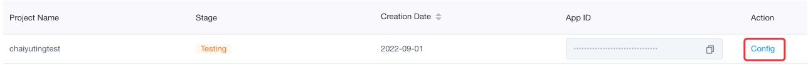
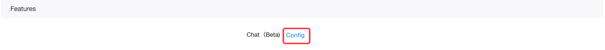
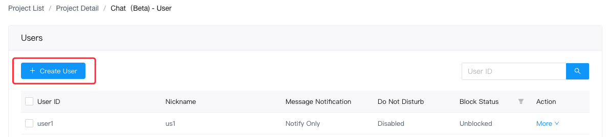
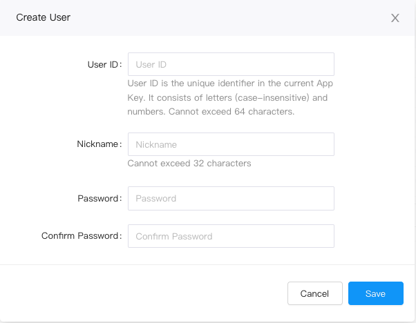
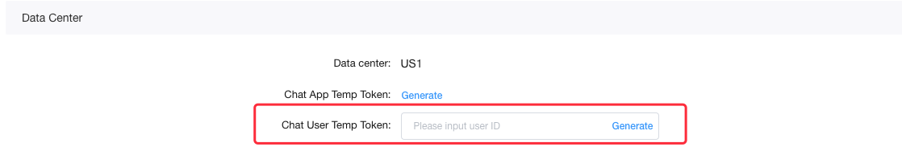
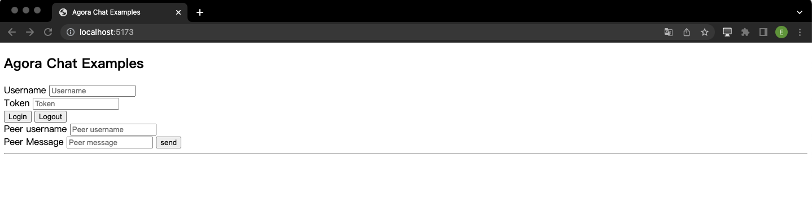
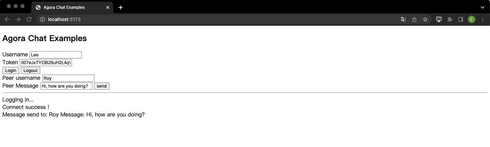
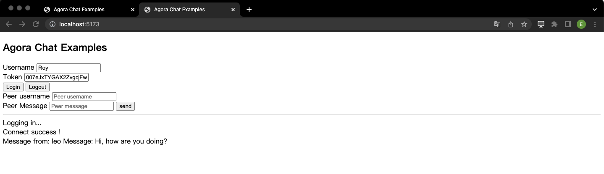

Instant messaging connects people wherever they are and allows them to communicate with others in real time. The Agora Chat SDK enables you to embed peer-to-peer messaging in any app, on any device, anywhere.

This page shows the sample code to add peer-to-peer messaging into your app by using the Agora Chat SDK for Web.

## Understand the tech

The following figure shows the workflow of how clients send and receive peer-to-peer messages.


As shown in the figure, the workflow of peer-to-peer messaging is as follows:

1. The clients retrieve a token from your app server.
2. Client A and Client B sign in to Agora Chat.
3. Client A sends a message to Client B.
4. The message is sent to the Agora Chat server and the server delivers the message to Client B.
5. When Client B receives the message, the SDK triggers an event. Client B listens for the event and gets the message.

## Prerequisites

In order to follow the procedure in this page, you must have:

- A valid [Agora account](https://docs.agora.io/en/AgoraPlatform/get_appid_token?platform=AllPlatforms#create-an-agora-account).
- An Agora project that has [enabled the Chat service](./enable_agora_chat?platform=Web#enable-the-agora-chat-service).
- An [App key](./enable_agora_chat?platform=Web#get-the-information-of-the-agora-chat-project).
- An Agora project with an App Key and a temporary token.
- A Windows or macOS computer that meets the following requirements:
  - A browser supported by the Agora Chat SDK: 
    - Internet Explorer 9 or later
    - FireFox 10 or later
    - Chrome 54 or later
    - Safari 6 or later
  - Access to the Internet. If your network has a firewall, follow the instructions in [Firewall Requirements](https://docs.agora.io/en/Agora%20Platform/firewall?platform=Web) to access Agora services.
- [Node.js and npm](https://docs.npmjs.com/downloading-and-installing-node-js-and-npm)


## Token generation

This section describes how to register a user at Agora Console and generate a temporary token.

### Register a user

To generate a user ID, do the following:

1. On the **Project Management** page, click **Config** for the project you want to use.



2. Click **Config** for **Chat(Beta)** under **Features**.
	


3. Click **Create User** on the **User** page under **Operation Management**.



4. Fill in the user information and click **Save** to create a user.



### Generate a user token

To ensure communication security, Agora recommends using tokens to authenticate users logging in to an Agora Chat system.

For testing purposes, Agora Console supports generating Agora chat tokens. To generate an Agora chat token, do the following:

1. On the **Project Management** page, click **Config** for the project you want to use.

2. Click **Config** for **Chat(Beta)** under **Features** to open the **Application Information** page.

3. Under **Data Center**, enter the user ID in the **Chat User Temp Token** text box and click `Generate` to generate a token with user privileges.


## Project setup

To create the environment necessary to add peer-to-peer messaging into your app, do the following:

1. For a new web project, create a new directory and name it `agora_quickstart`. Navigate to this directory in terminal and run `npm init`. This creates a `package.json` file. Then, create the following files:
  - `index.html`, which sets the user interface of the Web app
  - `main.js`, which contains the code for implementing the messaging logic

 The project directory now has the following structure:

  ```text
  agora_quickstart
  ├─ index.html
  ├─ main.js
  └─ package.json
  ```

2. Integrate the Agora Chat SDK into your project through npm. 
   Add 'agora-chat' and 'vite' to the 'package.json' file.

   ```json
    {
        "name": "agora_quickstart",
        "private": true,
        "version": "0.0.0",
        "type": "module",
        "scripts": {
            "dev": "vite",
            "build": "vite build",
            "preview": "vite preview"
        },
        "dependencies":{
            "agora-chat": "latest"
        },
        "devDependencies": {
            "vite": "^3.0.7"
        }
    }
   ```

## Implement peer-to-peer messaging

This section shows how to use the Agora Chat SDK to implement peer-to-peer messaging in your app step by step.

### Create the UI

Copy the following code to the `index.html` file to implement the UI. 

`<script type="module" src="/main.js"></script>` is used to refer to the `main.js` file.

```html
<!DOCTYPE html>
<html lang="en">

<head>
  <meta charset="UTF-8">
  <title>Agora Chat Examples</title>
  <script type="module" src="/main.js"></script>
  <!-- <link rel="stylesheet" href="style.css" type="text/css" /> -->
</head>

<body>
  <h2>Agora Chat Examples</h2>
  <form id="loginForm">
    <div class="input-field">
      <label>Username</label>
      <input type="text" placeholder="Username" id="userID">
    </div>
    <div class="input-field">
      <label>Token</label>
      <input type="text" placeholder="Token" id="token">
    </div>
    <div>
      <button type="button" id="login">Login</button>
      <button type="button" id="logout">Logout</button>
    </div>
    <div class="input-field">
      <label>Peer username</label>
      <input type="text" placeholder="Peer username" id="peerId">
    </div>
    <div class="input-field">
      <label>Peer Message</label>
      <input type="text" placeholder="Peer message" id="peerMessage">
      <button type="button" id="send_peer_message">send</button>
    </div>
  </form>
  <hr/>
  <div id="log"></div>
</body>

</html>
```

### Implement the sending and receiving of messages

To enable your app to send and receive messages between individual users, do the following:

1. Import the Agora Chat SDK. Copy the following code to the `main.js` file:

	```javascript
	// Javascript
	// Note that to avoid browser-compatibility issues, this sample uses the import command to import the SDK and the vite to package the JS file.
	import AC from 'agora-chat'
	```
	
    If you use typescript, use the following code:
	
	```typescript
	// Typescript
	import AC, { AgoraChat } from 'agora-chat'
	```
	
2. Implement peer-to-peer messaging with the core methods provided by the Agora Chat SDK. Copy the following code and add them after the import function in the `main.js` file.

	```javascript
	const appKey = "<Your app key>";
	// Initializes the Web client.
	const conn = new AC.connection({
		appKey: appKey,
	});
	// Adds the event handler.
	conn.addEventHandler("connection&message", {
		// Occurs when the app is connected to Agora Chat.
		onConnected: () => {
			document
				.getElementById("log")
				.appendChild(document.createElement("div"))
				.append("Connect success !");
		},
		// Occurs when the app is disconnected from Agora Chat.
		onDisconnected: () => {
			document
				.getElementById("log")
				.appendChild(document.createElement("div"))
				.append("Logout success !");
		},
		// Occurs when a text message is received.
		onTextMessage: (message) => {
			console.log(message);
			document
				.getElementById("log")
				.appendChild(document.createElement("div"))
				.append("Message from: " + message.from + " Message: " + message.msg);
		},
		// Occurs when the token is about to expire.
		onTokenWillExpire: (params) => {
			document
				.getElementById("log")
				.appendChild(document.createElement("div"))
				.append("Token is about to expire");
		},
		// Occurs when the token has expired. 
		onTokenExpired: (params) => {
			document
				.getElementById("log")
				.appendChild(document.createElement("div"))
				.append("The token has expired");
		},
		onError: (error) => {
			console.log("on error", error);
		},
	});

	// Defines the functions of the buttons.
	window.onload = function () {
		// Logs into Agora Chat.
		document.getElementById("login").onclick = function () {
			document
				.getElementById("log")
				.appendChild(document.createElement("div"))
				.append("Logging in...");
			const username = document.getElementById("userID").value.toString();
			const token = document.getElementById("token").value.toString();
			conn.open({
				user: username,
				agoraToken: token,
			});
		};

		// Logs out.
		document.getElementById("logout").onclick = function () {
			conn.close();
			document
				.getElementById("log")
				.appendChild(document.createElement("div"))
				.append("logout");
		};

		// Sends a peer-to-peer message.
		document.getElementById("send_peer_message").onclick = function () {
			let peerId = document.getElementById("peerId").value.toString();
			let peerMessage = document.getElementById("peerMessage").value.toString();
			let option = {
				chatType: "singleChat", // Sets the chat type as single chat.
				type: "txt", // Sets the message type.
				to: peerId, // Sets the recipient of the message with user ID.
				msg: peerMessage, // Sets the message content.
			};
			let msg = AC.message.create(option);
			conn
				.send(msg)
				.then((res) => {
					console.log("send private text success");
					document
						.getElementById("log")
						.appendChild(document.createElement("div"))
						.append("Message send to: " + peerId + " Message: " + peerMessage);
				})
				.catch(() => {
					console.log("send private text fail");
				});
		};
	};
	```

##  Test your app

Use vite to build the project. You can run below commands to run the project.

```bash
$ npm install
```
```bash
$ npm run dev
```

The following page opens in your browser.



To validate the peer-to-peer messaging you have just integrated into your Web app using Agora Chat:

1. Create a user and generate a temporary token at Agora Console.

2. Log in to the app with the user ID and token you just created and send a message.

   

3. Open the same page in a new window and create another user account. Ensure that the user IDs you created are unique.

4. Send messages between the users.

   

## Next steps

In a production context, the best practice is for your app to retrieve the token used to log in to Agora. To see how to implement a server that generates and serves tokens on request, see [Generate a User Token](./generate_user_tokens).

## See also

In addition to integrating the Agora Chat SDK into your project through npm, you can also manually download the [Agora Chat SDK for Web](https://www.npmjs.com/package/agora-chat). 

a. In the SDK folder, find the JS file `Agora-chat.js` and save it to your project directory.

b. Open the HTML file in your project directory and add the following code to refer to the JS file:

```javascript
<script src="path to the JS file"></script>
```

## Reference

For details, see the [sample code](https://github.com/AgoraIO/Agora-Chat-API-Examples/blob/main/Chat-Web/src/index.js) for getting started with Agora Chat.