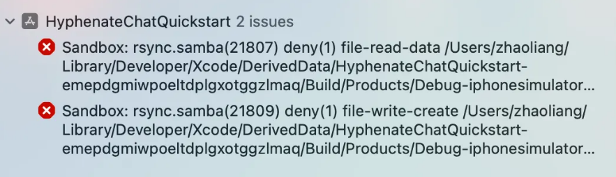
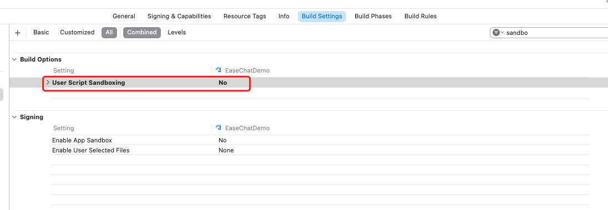

# Agora Chat 1.4.0 iOS

## 1. 发送和接收 GIF 图片消息

### 发送 GIF 图片消息

- 自 iOS SDK 1.4.0 开始，支持发送 GIF 图片消息。
- GIF 图片消息是一种特殊的图片消息，与普通图片消息不同，**GIF 图片发送时不能压缩**。
- 图片缩略图的生成与普通图片消息相同，详见 [发送图片消息](#发送图片消息)。

发送 GIF 图片消息的过程如下：

1. 构造 `AgoraChatImageMessageBody` 后，设置 `isGif` 为 `true`。
2. 使用 `AgoraChatImageMessageBody#initWithGifFilePath:displayName` 方法构造图片消息体。
3. 调用 `AgoraChatManager#sendMessage` 方法发送消息。

```Objective-C
//使用 AgoraChatImageMessageBody
// imageData 为图片本地资源，displayName 为附件的显示名称。
AgoraChatImageMessageBody *body = [[AgoraChatImageMessageBody alloc] initWithData:imageData displayName:displayName];
body.isGif = YES;

// 使用 initWithGifFilePath:displayName
AgoraChatImageMessageBody *body = [[AgoraChatImageMessageBody alloc] initWithGifFilePath:@"localGifFilePath" displayName:displayName];

AgoraChatMessage *message = [[AgoraChatMessage alloc] initWithConversationID:toChatUsername from:fromChatUsername to:toChatUsername body:body ext:messageExt];

// 发送消息。
[[AgoraChatClient sharedClient].chatManager sendMessage:message progress:nil completion:nil];
```

### 接收 GIF 图片消息

自 iOS SDK 1.4.0 开始，支持接收 GIF 图片消息。

图片缩略图的下载与普通图片消息相同，详见 [接收图片消息](#接收图片消息)。

与普通消息相同，接收 GIF 图片消息时，接收方会收到 `messagesDidReceive` 回调方法。接收方判断为图片消息后，读取消息体的 `isGif` 属性，若值是 `YES`，则为 GIF 图片消息。

```Objective-C
- (void)messagesDidReceive:(NSArray<AgoraChatMessage*> *)aMessages
{
  // 收到消息，遍历消息列表。
  for (AgoraChatMessage *message in aMessages) {
    // 消息解析和展示。
    if (message.body.type == AgoraChatMessageBodyTypeImage) {
        AgoraChatImageMessageBody *body = (AgoraChatImageMessageBody *)message.body;
        if (body.isGif) {
            // 是 GIF 图片消息
        }
      }
   }
}
```

## 2. 管理群组头像

自 iOS SDK 1.4.0 开始，支持群组头像功能。

### 设置群组头像

- 创建群组时，可设置群组头像：

```Objective-C
AgoraChatGroupOptions *options = [[AgoraChatGroupOptions alloc] init];
    NSString *groupAvatar = @"group avatar";
    [AgoraChatClient.sharedClient.groupManager createGroupWithSubject:@"group name" avatar:groupAvatar description:@"group description" invitees:@[@"user1", @"user2"] message:@"group message" setting:options completion:^(AgoraChatGroup * _Nullable group, AgoraChatError * _Nullable error) {
    }];
```

- 创建群组后，若设置群组头像，可调用 [修改群组头像](#修改群组头像) API 设置头像。

### 修改群组头像

创建群组完成后，群主或管理员可调用 `AgoraChatGroupManager#updateGroupAvatar` 设置或修改群组头像：

```Objective-C
[AgoraChatClient.sharedClient.groupManager updateGroupAvatar:@"new group avatar" groupId:@"groupId" completion:^(AgoraChatGroup * _Nullable group, AgoraChatError * _Nullable error) {
    if(error == nil) {
        // 更新成功
    } else {
        // 更新失败
    }
}];
```

群头像被修改后，其他群成员会收到 `AgoraChatGroupManagerDelegate#groupSpecificationDidUpdate` 回调：

```Objective-C
- (void)groupSpecificationDidUpdate:(AgoraChatGroup *)aGroup
{
    // 群组信息更新
    NSString *groupId = aGroup.groupId;
    // 群组头像
    NSString *groupAvatar = aGroup.groupAvatar;
}
```

### 获取群组头像

群成员可以通过获取群详情的方法，获取群组头像：

```Objective-C
[AgoraChatClient.sharedClient.groupManager getGroupSpecificationFromServerWithId:@"groupId" completion:^(AgoraChatGroup * _Nullable aGroup, AgoraChatError * _Nullable aError) {
    if (aError == nil) {
        // 获取成功,群头像为
        NSString *groupAvatar = aGroup.groupAvatar;
    } else {
        // 获取失败
    }
}];
```

## 3. 聊天室成员加入禁言列表事件

请在 iOS 端的 [Manage chat rooms 文档中的 Listen for chat room events 一节中](https://docs.agora.io/en/agora-chat/client-api/chat-room/manage-chatrooms?platform=ios#listen-for-chat-room-events) 更新 `chatroomMuteListDidUpdate` 事件：

```Objective-C
// 有成员被加入禁言列表。被禁言的成员会收到该事件。
- (void)chatroomMuteListDidUpdate:(AgoraChatroom *)aChatroom
                addedMutedMembers:(NSDictionary<NSString *,NSNumber*> *)aMutes {
}
```

## 4. 从服务器获取指定群成员发送的消息

自 iOS SDK 1.4.0 开始，对于单个群组会话，你可以从服务器获取指定成员（而非全部成员）发送的消息。

```Objective-C
AgoraChatFetchServerMessagesOption* option = [[AgoraChatFetchServerMessagesOption alloc] init];
    option.fromIds = @[@"user1", @"user2"];
    [AgoraChatClient.sharedClient.chatManager fetchMessagesFromServerBy:@"conversationId" conversationType:AgoraChatConversationTypeGroupChat cursor:@"" pageSize:20 option:option completion:^(AgoraChatCursorResult<AgoraChatMessage *> * _Nullable result, AgoraChatError * _Nullable aError) {
    // 当拉取到最后一页时，nextCursor 为空字符串
    NSString* nextCursor = result.cursor;        
}];
```

## 5. 从本地获取指定群成员发送的消息

自 iOS SDK 1.4.0 开始，对于单个群组会话，你可以从本地获取指定成员（而非全部成员）发送的消息。

```Objective-C
AgoraChatConversation *conversation = [AgoraChatClient.sharedClient.chatManager getConversationWithConvId:@"conversationId"];
    if (conversation) {
        [conversation loadMessagesWithKeyword:nil timestamp:-1 count:20 fromUsers:@[@"user1",@"user2"] searchDirection:AgoraChatMessageSearchDirectionUp scope:AgoraChatMessageSearchScopeAll completion:^(NSArray<AgoraChatMessage *> * _Nullable aMessages, AgoraChatError * _Nullable aError) {
            if (aError == nil) {
                // 加载成功
            }
        }];
    }
```

## 8. 根据关键字获取本地会话中的消息

自 SDK 1.4.0 版本开始，你可以通过设置关键词获取本地会话中的某些消息。SDK 返回会话 ID 及消息 ID 列表，消息 ID 根据你设置的 `aDirection` 参数按照消息时间戳的正序或倒序列明。

```objective-c
[AgoraChatClient.sharedClient.chatManager loadConversationMessagesWithKeyword:@"keyword" timestamp:-1 fromUser:@"" searchDirection:AgoraChatMessageSearchDirectionUp scope:AgoraChatMessageSearchScopeAll completion:^(NSDictionary<NSString *,NSArray<NSString *> *> * _Nullable aConversationMessages, AgoraChatError * _Nullable aError) {
        if (aError) {
            NSLog(@"Error loading messages: %@", aError.errorDescription);
        } else {
            // aConversationMessages is the retrieved message
        }
    }];
```

## 9. 根据消息 ID 获取本地消息

自 SDK 1.4.0 开始，你可以传入单个或多个消息 ID 获取单个本地会话中的消息。

```objective-c
// messageIds：消息 ID 列表。每次最多可传入 20 个消息 ID。
[AgoraChatClient.sharedClient.chatManager getMessages:@[@"messageId1", @"messageId2"] withConversationId:@"conversationId" completion:^(NSArray<AgoraChatMessage *> * _Nullable aMessages, AgoraChatError * _Nullable aError) {
        if (aError) {
            NSLog(@"Error getting messages: %@", aError.errorDescription);
        } else {
            // aMessages is the retrieved message
        }
    }];
```

## 7. 批量通知群成员进出群

1. 请在 Chat Android 端的 [Manage chat group 页面](https://docs.agora.io/en/agora-chat/client-api/chat-group/manage-chat-groups?platform=ios#listen-for-chat-group-events)  的 "Listen for chat group events" 中添加进出群组的新事件，并移掉旧事件。

```Objective-C
// 有新成员（单个或多个）加入群组。除新成员外，其他群成员会收到该回调。
- (void)userDidJoinGroup:(AgoraChatGroup *_Nonnull)group
                   users:(NSArray<NSString*> *_Nonnull)userIds
{
    
} 

// 有成员（单个或多个）退群。除退群成员外，其他群成员会收到该回调。
- (void)userDidLeaveGroup:(AgoraChatGroup *_Nonnull)group
                    users:(NSArray<NSString *>* _Nonnull)userIds
{
    
}
```
2. 此外，请在 Chat iOS 端的 [Manage chat group 页面](https://docs.agora.io/en/agora-chat/client-api/chat-group/manage-chat-groups?platform=ios) 中搜索所有的旧事件，用新事件进行替换。

## 13. 修改消息

对于单聊、群组和聊天室聊天会话中已经发送成功的消息，SDK 支持对这些消息的内容进行修改。

- SDK 1.4.0 之前的版本仅支持对单聊和群组会话中发送后的文本消息进行修改。
- SDK 1.4.0 及之后版本中支持对单聊、群组和聊天室会话中各类消息进行修改：
  - 文本/自定义消息：支持修改消息内容（body）和扩展字段 `ext`。
  - 文件/视频/音频/图片/位置/合并转发消息：只支持修改消息扩展字段 `ext`。
  - 命令消息：不支持修改。

// 注意：描述中也需要体现支持修改聊天室会话中的消息。

```objectivec
    // 文本消息：可同时修改消息体和消息扩展属性
    AgoraChatTextMessageBody* newMessageBody = [[AgoraChatTextMessageBody alloc] initWithText:@"new  content"];
    NSDictionary* newExt = @{@"newKey": @"newValue"};
    // textBody 和 ext 不能同时为 nil
    [AgoraChatClient.sharedClient.chatManager modifyMessage:@"messageId" body:newMessageBody ext:newExt completion:^(AgoraChatError * _Nullable error, AgoraChatMessage * _Nullable message) {
            
    }];
    
    // 自定义消息：可同时修改消息体和消息扩展属性
    AgoraChatCustomMessageBody* newCustomMessageBody = [[AgoraChatCustomMessageBody alloc] initWithEvent:@"event" customExt:@{@"key": @"value"}];
    NSDictionary* newExt1 = @{@"newKey": @"newValue"};
    // customBody 和 ext 不能同时为 nil
    [AgoraChatClient.sharedClient.chatManager modifyMessage:@"messageId" body:newCustomMessageBody ext:newExt1 completion:^(AgoraChatError * _Nullable error, AgoraChatMessage * _Nullable message) {
            
    }];
    
    // 文件/视频/音频/图片/位置/合并转发消息：只能修改消息扩展属性
    NSDictionary* newExt2 = @{@"newKey": @"newValue"};
    // ext 不能为 nil，body 必须为 nil
    [AgoraChatClient.sharedClient.chatManager modifyMessage:@"messageId" body:nil ext:newExt2 completion:^(AgoraChatError * _Nullable error, AgoraChatMessage * _Nullable message) {
            
    }];
```

## 6. 撤回消息

- 对于单聊会话，只支持发送方撤回发送成功的消息。若消息过期，撤回失败。
- 对于群组/聊天室会话，普通成员只能撤回自己发送的消息，若消息过期，撤回失败。自 SDK 1.4.0 开始，群主/聊天室所有者和管理员可撤回其他用户发送的消息，即使消息过期也能撤回。


## 10. Token 即将过期回调触发时机变化

```swift

    // 自 1.4.0 版本，SDK 会在 Token 有效期达到 80% 时回调即将过期通知。
    func tokenWillExpire(_ aErrorCode: AgoraChatErrorCode) {
        // 通过 App Server 获取新的 token,然后调用 sdk 的 renewToken 方法更新 token
        AgoraChatClient.shared().renewToken("newToken") { e in
            
        }
    }
    
```
## 5. 获取群成员列表

自 1.4.0 版本开始，获取全部群成员（包括群主和群管理员）的信息，包括群成员的用户 ID、群成员角色和入群时间。

```Objective-C
// limit：每页期望返回的群成员数量，上限取决于服务端，详见 https://doc.easemob.com/document/server-side/group_member_list_obtain.html#请求-url。
NSString* cursor = nil;
[AgoraChatClient.sharedClient.groupManager fetchGroupMemberInfoListFromServerWithGroupId:@"groupId" cursor:cursor limit:20 completion:^(AgoraChatCursorResult<AgoraChatGroupMemberInfo *> * _Nullable cursorResult, AgoraChatError * _Nullable error) {
        for (AgoraChatGroupMemberInfo * memberInfo in cursorResult.list) {
            NSString* userId = memberInfo.userId;// 成员的用户 ID
            NSUInteger joinedTs = memberInfo.joinedTimestamp; // 成员入群时间
            AgoraChatGroupPermissionType role = memberInfo.role; //成员角色
        }
    }];
```

## 13. SDK 依赖的 Crash 上报库冲突

由于 Crash 上报使用了 `aosl.xcframework` 库，如果同时集成了 `AgoraChat 1.4.0` 和 `AgoraRtcEngine_iOS 4.6.0` 及以下版本，会有 AOSL 库冲突的问题，执行 `pod install` 时会出现如下报错：

```
[!] The 'Pods-EaseChatDemo' target has frameworks with conflicting names: aosl.xcframework.
```

要修复该问题，需要修改 `Podfile` 文件，添加如下脚本：

```ruby
pre_install do |installer|
  # 定义 AgoraRtcEngine_iOS framework 的路径
  rtc_pod_path = File.join(installer.sandbox.root, 'AgoraRtcEngine_iOS')

  # aosl.xcframework 的完整路径
  aosl_xcframework_path = File.join(rtc_pod_path, 'aosl.xcframework')

  # 检查文件是否存在，如果存在则删除
  if File.exist?(aosl_xcframework_path)
    puts "Deleting aosl.xcframework from #{aosl_xcframework_path}"
    FileUtils.rm_rf(aosl_xcframework_path)
  else
    puts "aosl.xcframework not found, skipping deletion."
  end
end
```

然后重新执行 `pod install`。

如欲了解详情，请参见 [Agora 官方文档](https://docs.agora.io/en/help/integration-issues/rtm2_rtc_integration_issue)。

### 模拟器运行报错

当你使用 Xcode 15 创建新工程时，编译时若出现 **Sandbox: rsync.samba(47334) deny(1) file-write-create...** 报错，你需要在 **Target > Build Settings** 中查找 **User Script Sandboxing** 选项，设置为 **NO**。





