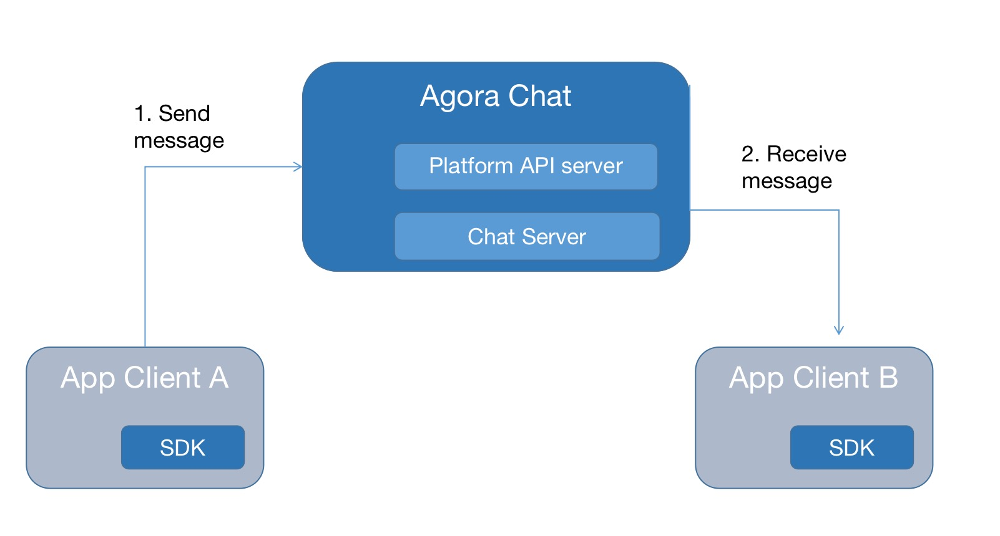

The Agora Chat SDK supports sending and receiving various types of messages:
- Text messages, including hyperlinks and emojis.
- Attachment messages, including the following types:
  - Image.
  - Audio.
  - Video.
  - File.
- Location messages.
- Pass-through messages.
- Extended messages.
- Custom messages.

This pages shows how to implement the funcionality of sending and receiving messages.

## Understand the tech

The Agora Chat SDK provides the `ChatManager` and `ChatMessage` classes to send and receive messages. The following are the main methods:

- `createTxtSendMessage`: Creates a text message.
- `createVoiceSendMessage`: Creates an audio message.
- `createImageSendMessage`: Creates an image message.
- `createFileSendMessage`: Creates a file message.
- `createLocationSendMessage`: Creates a location message.
- `createSendMessage`: Creates a message and specifies the message type.
- `sendMessage`: Sends a message to a speicfied user, group, or chat room.
- `recallMessage`: Recalls a sent message.
- `addMessageListener`: Listens for received messages.

The process of sending and receiving a message is as follows:

1. User A sends a message to the Agora Chat server.
2. The server delivers the message to user B, and user B received the message.



## Prerequisites

Before proceeding, ensure that you meet the following requirements:

- You have integrated and initialized the Agora Chat SDK.
- You understand the API call frequency limits.

## Implementation

This section introduces how to send different types of messages, receive and recall messages.

### Send a text message

Use the `ChatMessage` class to construct a text message, and send it through the `ChatManager` class.

```java
// Create a text message. Set content as the message content, and toChatUsername as the ID of the message receiver.
ChatMessage message = ChatMessage.createTxtSendMessage(content, toChatUsername); 
// Set the chat type as group chat. 
message.setChatType(ChatType.GroupChat); 
// Send the message 
ChatClient.getInstance().chatManager().sendMessage(message);
```

### Send attachment messages

When you send an attachment message (image, audio, video or file), the attachment is uploaded to the Agora Chat server. 

- For audio, image and video messages, the SDK automatically downloads the audio and the image or video thumbnail when they arrives.
- For file messages, the SDK does not automatically download the attachment. You need to call APIs to download the file on the receiver's client.

#### Send an audio message

To send an audio message, you need to implement the recording function in the app, and specify the URI and duration of the audio file in `createVoiceSendMessage`.

```java
// Set voiceUri as the URI of the local audio file，and duration as the duration of the audio (in seconds).
ChatMessage message = ChatMessage.createVoiceSendMessage(voiceUri, duration, toChatUsername); 
// If the chat is a group chat, set the chat type.
if (chatType == CHATTYPE_GROUP) 
    message.setChatType(ChatType.GroupChat); 
ChatClient.getInstance().chatManager().sendMessage(message);
```

After the message is sent, get the audio file on the receiver's client:

```java
VoiceMessageBody voiceBody = (VoiceMessageBody) msg.getBody();
// Get the URL of the audio file on the server.
String voiceRemoteUrl = voiceBody.getRemoteUrl();
// Get the URI of the local audio file.
Uri voiceLocalUri = voiceBody.getLocalUri();
```

#### Send an image message

To send an image message, you need to specify the URI of the image file in `createImageSendMessage`.

```java
// Set imageUri as the URI of the local iamge. To send the orginal image file, set the second parameter as true.
ChatMessage.createImageSendMessage(imageUri, false, toChatUsername); 
// If the chat is a group chat, set the chat type.
if (chatType == CHATTYPE_GROUP) 
    message.setChatType(ChatType.GroupChat); 
ChatClient.getInstance().chatManager().sendMessage(message);
```

After the message is sent, get the image file on the receiver's client:

```java
ImageMessageBody imgBody = (ImageMessageBody) message.getBody();
// Get the URL of the image file on the server.
String imgRemoteUrl = imgBody.getRemoteUrl();
// Get the URL of the thumbnail on the server.
String thumbnailUrl = imgBody.getThumbnailUrl();
// Download the image
ChatClient.getInstance().chatManager().downloadAttachment(message);
// Get the URI of the local image file.
Uri imgLocalUri = imgBody.getLocalUri();
// If the auto-download of the thumbnail is disabled or fails
ChatClient.getInstance().chatManager().downloadThumbnail(message);
// Get the URI of the local thumbnail.
Uri thumbnailLocalUri = imgBody.thumbnailLocalUri();
```

#### Send a file message

To send a file message, you need to specify the URI of the file in `createFileSendMessage`.

```java
// Set fileLocalUri as the URI of the local file
ChatMessage message = ChatMessage.createFileSendMessage(fileLocalUri, toChatUsername);
// If the chat is a group chat, set the chat type.
if (chatType == CHATTYPE_GROUP)    message.setChatType(ChatType.GroupChat);

ChatClient.getInstance().chatManager().sendMessage(message);
```

After the message is sent, get the file on the receiver's client:

```java
NormalFileMessageBody fileMessageBody = (NormalFileMessageBody) message.getBody();
// Get the URL of the file on the server.
String fileRemoteUrl = fileMessageBody.getRemoteUrl();
// Download the file
ChatClient.getInstance().chatManager().downloadAttachment(message);
// Get the URI of the local file.
Uri fileLocalUri = fileMessageBody.getLocalUri();
```

### Send a location message

A location message contains the information that locates a specific point on the surface of the earth. It can also include the address information.

To retrieve the latitude and longitude of a specific point, you integrate a third-party map service. 

```java
// Set locationAddress as the address of the location.
ChatMessage message = ChatMessage.createLocationSendMessage(latitude, longitude, locationAddress, toChatUsername);
// If the chat is a group chat, set the chat type.
if (chatType == CHATTYPE_GROUP)    message.setChatType(ChatType.GroupChat);
ChatClient.getInstance().chatManager().sendMessage(message);
```

### Send a pass-through message

The pass-through messages are applicable to scenarios like updating the avatar and nickname.

You can use the pass-through message as a command. Send the command and specify an action for the receiver. 

```java
ChatMessage cmdMsg = ChatMessage.createSendMessage(ChatMessage.Type.CMD);
// If the chat is a group chat, set the chat type.
cmdMsg.setChatType(ChatType.GroupChat)
// You can customize the action.
String action="action1";
CmdMessageBody cmdBody = new CmdMessageBody(action);
// Send to the user "test1".
String toUsername = "test1";
cmdMsg.setTo(toUsername);
cmdMsg.addBody(cmdBody); ChatClient.getInstance().chatManager().sendMessage(cmdMsg);
```

<a name="custom"></a>

### Send a custom message

To meet various business needs, the SDK supports customizing the message type. You can set multiple custom message types.

You need to set the key and value in a custom message.

```java
ChatMessage customMessage = ChatMessage.createSendMessage(ChatMessage.Type.CUSTOM);
// Set event as the name of the custom message type.
event = "gift"
CustomMessageBody customBody = new CustomMessageBody(event);
// The type of params is Map<String, String>.
customBody.setParams(params);
customMessage.addBody(customBody);
// Set toUserName as the ID of the receiver.
customMessage.setTo(toUserName);
// If the chat is a group chat, set the chat type.
customMessage.setChatType(chatType);
// Send the message.
ChatClient.getInstance().chatManager().sendMessage(customMessage);      
```

### Extend a message type

To easily add more information to a message without implementing a [custom message type](#custom), add attributes to a standard message.

For example, to send the original message in a message reply:

```java
ChatMessage message = ChatMessage.createTxtSendMessage(content, toChatUsername); 
// Set custom attributes
message.setAttribute("attribute1","value");
message.setAttribute("attribute2", true);
// Send the message
ChatClient.getInstance().chatManager().sendMessage(message);
// Get the custom attributes when receiving the message.
message.getStringAttribute("attribute1",null);
message.getBooleanAttribute("attribute2", false)
```

### Receive messages

Call `addMessageListener` to register a `MessageListener` for receiving messages.

You can add multiple message listeners, and you need to remove a listener when it is not needed, for example when you call `onDestroy()` of `activity`.

When one or more new messages arrives, the SDK triggers the `onMessageReceived` callback. You can traverse the messages in this callback to display the received messages.

Note that when receiving pass-through messages, the SDK triggers the `onCmdMessageReceived` callback.

```java
ChatClient.getInstance().chatManager().addMessageListener(msgListener);
MessageListener msgListener = new MessageListener() {
  // Receives a message
  @Override    
  public void onMessageReceived(List<EMMessage> messages) { 
  }        
  // Receives a pass-through message
  @Override    
  public void onCmdMessageReceived(List<EMMessage> messages) { 
  }
};
// Remove the message listener.
ChatClient.getInstance().chatManager().removeMessageListener(msgListener);
```

### Recall a message

Users can recall a sent message within a certain time period. The default time limit is two minutes. To change the time limit, contact sales-us@agora.io. You can extend the time limit up to seven days.

```java
ChatClient.getInstance().chatManager().recallMessage(message);
```

### Monitor message status

To validate that a message is successfully sent, or to track the upload progress of an attachment, override an instance of `io.agora.CallBack` for the message being sent. For example, the following code shows how to display an [Android toast](https://developer.android.com/guide/topics/ui/notifiers/toasts) in the user interface of your app to show message success or failure:

```java
message.setMessageStatusCallback(new CallBack() {
  @Override
  public void onSuccess() {
    showToast("The message is successfully sent");
    dialog.dismiss();
  }
  @Override
  public void onError(int code, String error) {
    showToast("Failed to send the message");
  }
  
  // Upload status of an attachment message.
  @Override
  public void onProgress(int progress, String status) {
        
  }
});
ChatClient.getInstance().chatManager().sendMessage(message);
```

## Reference

This section lists the message size and expiration limits.

- The maximum size of a message is 5 KB.
- The maximum size of an attachment is 10 MB.
- The expiration time of the messages on the Agora Chat server:
  - Starter package: 7 days.
  - Pro package: 90 days.
  - Enterprise package: 180 days.

