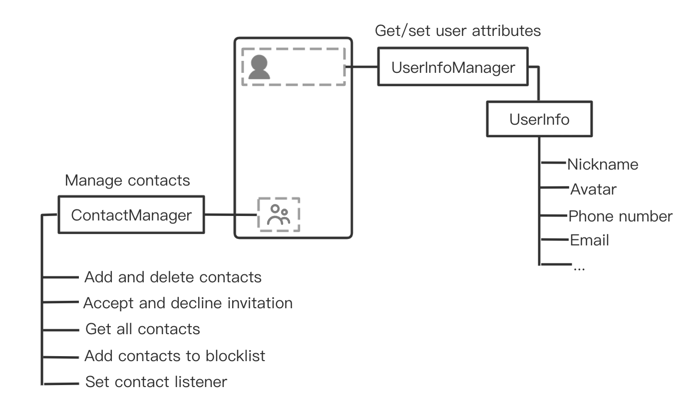

After joining an Agora Chat channel, a user can update information such as the nickname, avatar, age, and mobile phone number as needed. To enjoy real-time chattings with friends, they can also add, delete and manage contacts.

This page shows how to use the Agora Chat SDK to implement managing user attributes and contacts.

> User attributes are stored in the Agora Chat server. If you have concerns in this regard, we recommend you managing user attributes yourself.


## Understand the tech

The following figure shows the workflow to manage user attribtues and contacts in your app:



The Agora Chat SDK provides the following classes:
- [`UserInfoManager`]() sets and retrieves the various user attributes with a `UserInfo` struct.
- [`ContactManager`]() enables users to add or delete contacts, accept or decline contact invitations, and add other users to the blocklist.

## Prerequisites

Before proceeding, ensure that you meet the following requirements:

- Have a project that has implemented [the basic real-time chat functionalities]().
- Have a thorough understanding of the API call frequency limit, the maximum size of all the attributes of a specified user, and the maximum size of all user attribtues in an app. For details, see [Known limitations]().

## Implement managing user attributes and contacts

This section shows how to manage user attributes and contacts with the methods provided by the Agora Chat SDK.

### Set, retrieve and update user attributes

The Agora Chat SDK uses the `UserInfoManager` class to manage user attributes, which enables you to set, retrieve, and update all attributes of a specified user or a particular user attribute of many specified users.

Refer to the code snippets below to see how to set, retrieve, and update user attribtues:

```java
// Instantiate a UserInfo object
AgoraChatUserInfo userInfo = new AgoraChatUserInfo();

// Call the corresponding method to set the user ID, nickname, avatar...
userInfo.setUserId(AgoraChatClient.getInstance().getCurrentUser());
userInfo.setNickName("jian");
userInfo.setAvatarUrl("url");
userInfo.setBirth("2000.10.10");
userInfo.setSignature("Add you signature");
userInfo.setPhoneNumber("1343444");
userInfo.setEmail("9892029@qq.com");
userInfo.setGender(1);

// Call updateOwnInfo to set all user attributes
AgoraChatClient.getInstance().userInfoManager().updateOwnInfo(userInfo, new EMValueCallBack<String>() {
    @Override
    // Occurs when the method call succeeds
    public void onSuccess(String value) {     
    }
    @Override
    // Occurs when the method call fails
    public void onError(int error, String errorMsg) {
    }
});

// Retrieve user attributes by specifying the user ID
String[] userId = new String[1];
userId[0] = username;
// Call fetchUserInfoByUserId to retrieve user attributes
AgoraChatClient.getInstance().userInfoManager().fetchUserInfoByUserId(userId, new AgoraChatValueCallBack<Map<String, AgoraChatUserInfo>>() {}

// Update the avatar by specifying the image URL
String url = "https://download-sdk.oss-cn-beijing.aliyuncs.com/downloads/IMDemo/avatar/Image1.png";
// Call updateOwnInfoByAttribute to update the specified attribute
AgoraChatClient.getInstance().userInfoManager().updateOwnInfoByAttribute(AgoraChatUserInfoType.AVATAR_URL, url, new AgoraChatValueCallBack<String>() {
    @Override
    public void onSuccess(String value) {
                        
    }

    @Override
    public void onError(int error, String errorMsg) {    
    }
});
```

### Manage contacts

In a real-time chat, users can add or remove contacts, accept or decline a contact invitation, and add other users to a blocklist. The Agora Chat SDK uses a `ContactManager` class to enable these functionalities in your app. Refer to the following sample code to see how to implement contact management.

```java
// Call addContact to send a contact invitation
AgoraChatClient.getInstance().contactManager().addContact(toAddUsername, reason);

// Call setContactListener to listen for contact invitation events
AgoraChatClient.getInstance().contactManager().setContactListener(new ContactListener() {
    // Occurs when the contact invitation is accepted
    @Override
    public void onContactAgreed(String username) {}

    // Occurs when the contact invitation is delined
    @Overview
    public void onContactRefused(String username) {}

    // Occurs when you receive a contact invitation
    @Override
    public void onContactInvited(String username, String reason) {
        // Call acceptInvitation to accept the contact invitation. To decline the invitation, call declineInvitation
        ChatClient.getInstance().contactManager().acceptInvitation(username);
    }

    // Occurs when a contact is deleted
    @Override
    public void onContactDeleted(String username) { }
   
    // Occurs when a contact is added
    @Override
    public void onContactAdded(String username) { }
})

// Call deleteContact to delete a contact
ChatClient.getInstance().contactManager().deleteContact(username);
```

You can also add a specified user to your blocklist. Once you do that, you can still send chat messages to that user, but not receive messages from them. The following code shows how to add a user into a blocklist.

```java
// Call addUserToBlacklist to add a user, whehter your contact or not, to your blocklist
ChatClient.getInstance().contactManager().addUserToBlackList(username,true);

// To remove a user from the blocklist, call removeUserFromBlackList
ChatClient.getInstance().contactManager().removeUserFromBlackList(username);
```

## Next steps

This section introduces extra functions you can implement in your app using user attributes and contact management.

### Manage user avatar

The Agora Chat SDK only supports storing the URL address of the avatar file, but not the file itself. To manage user avatar, you need to use a third-party file storage service.

To implement user avatar management in your app, take the following steps:

1. Upload the avator file to the third-party file storage service. Once the file is successfully uploaded, you get a URL address of the avatar file.
2. Set the `avatarUrl` parameter in user attributes as the URL address of the avatar file.
3. To display the avatar, call `fetchUserInfoByUserId` to retrieve the URL of the avatar file and then render the image on the local UI.

### Create and send a namecard using user attributes

Namecard messages are custom messages that include the user ID, nickname, avator, Email address, and phone number of the specified user. To create and send a namecard, take the following steps:

1. Set the messsage type as custom.
2. Set the `event` of the custom message as "user card".
3. Retrieve the values of the `userId`, `nickname`, and `avatarurl` of the user attributes and set them as the the cutom message body.

Followings are the sample code for creating and sending a namecard message:

```java
AgoraChatMessage message = AgoraChatMessage.createSendMessage(AgoraChatMessage.Type.CUSTOM);
    AgoraChatCustomMessageBody body = new AgoraChatCustomMessageBody(DemoConstant.USER_CARD_EVENT);
    Map<String,String> params = new HashMap<>();
    params.put(DemoConstant.USER_CARD_ID,userId);
    params.put(DemoConstant.USER_CARD_NICK,user.getNickName());
    params.put(DemoConstant.USER_CARD_AVATAR,user.getAvatar());
    // Get more information according to your needs

    body.setParams(params);
    message.getBody(body);
    message.setTp(toUser);
AgoraChatClient.getInstance().chatManager().sendMessage(message);
```

### Retrieve contact list and blocklist

To retrieve the contact list or blocklist, call the following methods in the `ContactManager` class:
- `getAllContactsFromServer` and `getAllContactsFromLocal`
- `getBlackListFromServer` and `getBlackListUsernames` 

For both lists, only after retrieving them from the server can you retrieve them from the lcoal device.

## Reference

This section includes reference information that you may need to know during the implementation.

- Agora provides an open source [sample project]() on GitHub for your reference.
- For detailed information on user attributes, refer to the following API Reference:
  - [UserInfo]()
  - [UserInfoManager]()
  - [ContactManager]()