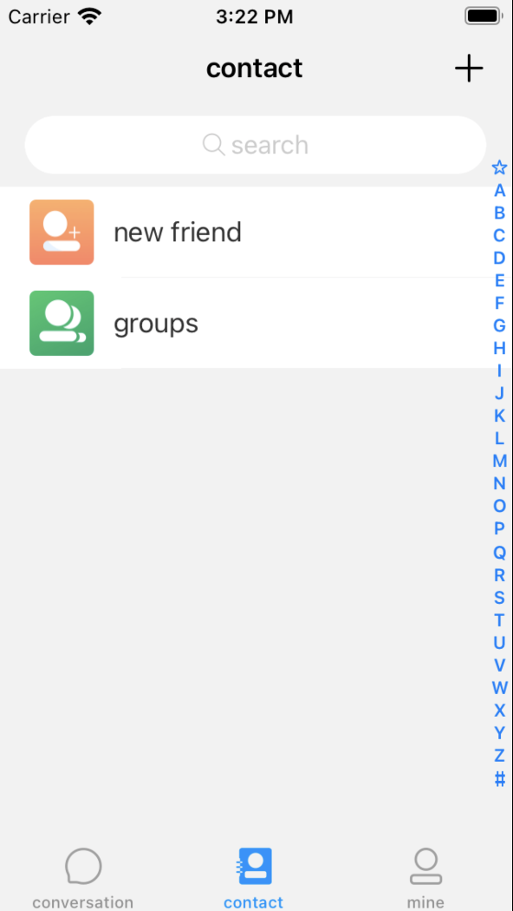
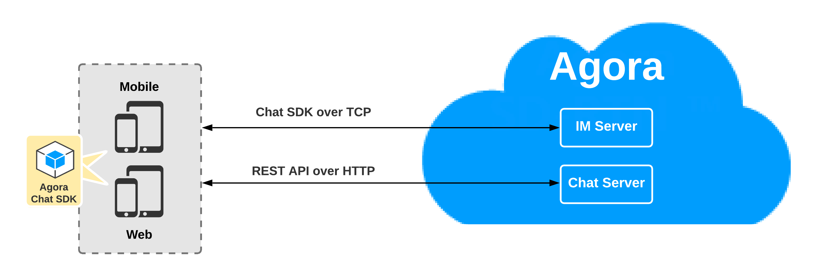
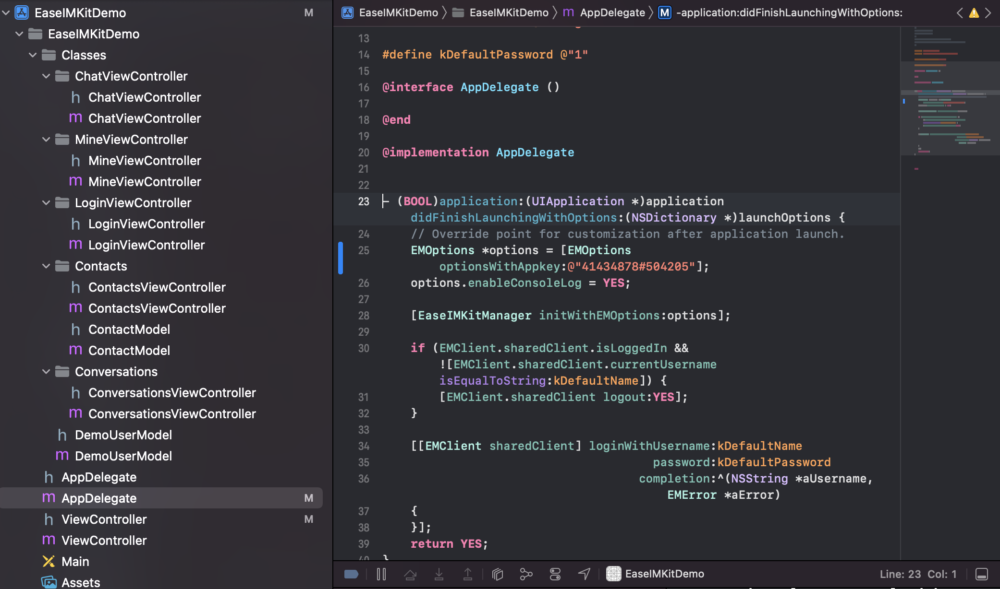

Instant messaging connects people wherever they are and allows them to communicate with others in real time. Agora Chat enables you to embed real-time messaging in any app, on any device, anywhere.

Agora Chat UIKit is a library that combines Agora real-time messaging functionality into a customizable user interface. Have another coffee, we have done all the work for you.

The following figure shows a demo app created with Agora Chat UIKit.



This page shows how to install and run a real-time messaging demo that uses Agora Chat UIKit.

## Understand the tech

The following figure shows the callflow integrate into your app by the Agora Chat UIKit demo.



To start a call using Agora Chat UIKit, you only have to run the demo. This gives you a white-label chat app that  you configure to match your marketing strategy.

## Prerequisites

- Xcode 11.3 or later.
- An iOS device running iOS 13 or later.
- A computer that can access the Internet.

    Ensure that no firewall is deployed in your network environment, otherwise the project fails.

- A valid [Agora account](https://docs.agora.io/en/Agora%20Platform/sign_in_and_sign_up) and an Agora project.
- A user in your Agora Chat space.  


## Project setup

Agora Chat UIKit is a GitHub repository that contains the UIKit source code and a demo app that integrates the UIKIT. 

To create the environment necessary to install Agora Chat UIKit and run the demo in your local environment, do the following:

1. Clone Agora Chat UIKit to your local machine. In the terminal:
   ```terminal
   cd <root-directory>
   git clone https://github.com/easemob/easeui_ios.git
   ```
 
3. Install Agora Chat UIKit dependencies in the demo:
   ```terminal
   cd <root-directory>/easeui_ios/EaseIMKitDemo
   export LANG=en_US.UTF-8
   pod install
   ```
   Your project now has the libraries you need to run an Agora Chat app.


## Run the demo app 

The Agora Chat UIKit demo opens a chat session in an Agora Chat space for a specific user.

To run real-time messaging in a ready-made user interface. In Xcode:

1. Open `<root-directory>/easeui_ios/EaseIMKitDemo`.

   You see the app delegates and UI customization classes:

   

2. Configure the demo app to run in your Agora Chat space as one of your users. in `AppDelegate`:
 
   1. Add the credentials for one of your Agora Chat users:

      ```cplusplus
      #define kDefaultName @"<your username>"
      #define kDefaultPassword @"<the password>"
      ```
      
   2. Add `YOUR APP KEY` so you operate in your Agora Chat space:
      ```cplusplus
       EMOptions *options = [EMOptions optionsWithAppkey:@"YOUR APP KEY"];
       options.enableConsoleLog = YES;
      
       [EaseIMKitManager initWithEMOptions:options];
          
       if (EMClient.sharedClient.isLoggedIn && ![EMClient.sharedClient.currentUsername isEqualToString:kDefaultName]) {
           [EMClient.sharedClient logout:YES];
       }
          
       [[EMClient sharedClient] loginWithUsername:kDefaultName
                                         password:kDefaultPassword
                                       completion:^(NSString *aUsername, EMError *aError)
       {
       }];
      ```

4. Press **Product** > **Run**. 

The demo opens in the Xcode simulator. 

### Next steps

IAIN: I need guidance on how to customize. 
