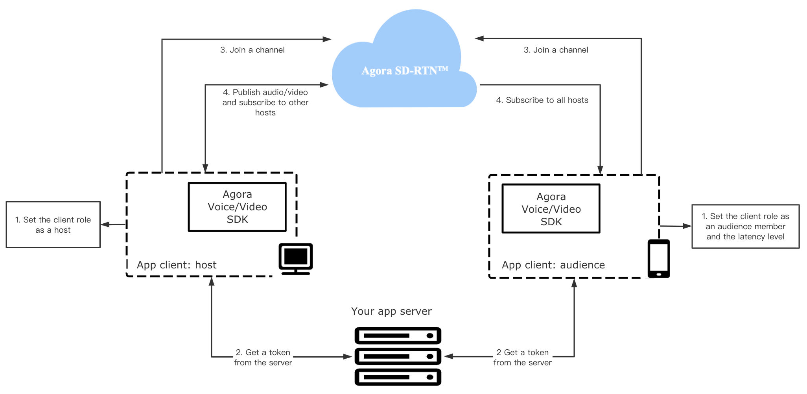
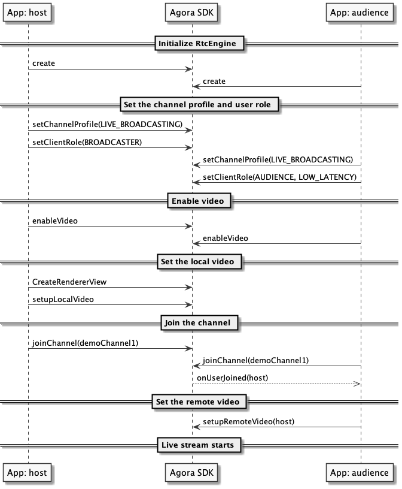

The Agora SDK enabels you to develop rapidly to enhance your social, work, education, and IoT apps with real-time engagements.

This page shows the minimum code you need to add Interactive Live Streaming Standard into your app by using the Agora Video SDK for Android.

## Understand the tech

The following figure shows the workflow to integrate Interactive Live Streaming Standard into your app.



To start Interactive Live Streaming Standard, you implement the following steps in your app:

1. **Set the client role and latency level**
   Users in an Interactive Live Streaming Standard channel are either a host or an audience member. The host publishes streams to the channel, and the audience subscribes to the streams. When the user role is audience, the app client can set the latency level as ultra-low or low. 

2. **Retrieve a token**
   The token is a credential for authenticating the identity of the user when your app client joins a channel. The app client requests a token from your app server. This token authenticates the user when the app client joins a channel.

3. **Join a channel**
   Call `joinChannel` to create and join a channel. App clients that pass the same channel name join the same channel.

4. **Publish and subscribe to audio and video in the channel**
   After joining a channel, app clients with the role of the host can publish audio and video. For an auidence memeber to send audio and video, you can call `setClientRole` to switch the client role. 

For an app client to join a channel, you need the following information:

- The App ID: A randomly generated string provided by Agora for identifying your app. You can get the App ID from [Agora Console](https://console.agora.io).
- The user ID: The unique identifier of a user. You need to specify the user ID yourself, and ensure that it is unique in the channel.
- A token: In a test or production environment, your app client retrieves tokens from your server. For rapid testing, you can use a temporary token with a validity period of 24 hours.
- The channel name: A string that identifies the channel for the live stream.

## Prerequisites

Before proceeding, ensure that you have the following:

- Android Studio 3.0 or later.
- Android SDK API Level 16 or higher.
- A valid [Agora account](https://console.agora.io/).
- A valid Agora project with an App ID and a temporary token. For details, see [Get started with Agora](https://docs.agora.io/en/Agora%20Platform/get_appid_token?platform=All%20Platforms).
- A computer with access to the internet. If your network has a firewall, follow the instructions in [Firewall Requirements](https://docs.agora.io/en/Agora%20Platform/firewall?platform=All%20Platforms).
- A mobile device that runs Android 4.1 or later.

## Project setup

Follow the steps to create the environment necessary to add live streaming into your app.

1. For new projects, in **Android Studio**, create a **Phone and Tablet** [Android project](https://developer.android.com/studio/projects/create-project) with an **Empty Activity**.

2. Integrate the Video SDK into your project.

   a. In `/Grale Scripts/build.gradle(Project: <projectname>)`, add the following lines to add the JitPack dependency.

    ```xml
    all projects {
    repositories {
        ...
        maven { url 'https://www.jitpack.io' }
    }
    }
    ```

    b. In `/Gradle Scripts/build.gradle(Module: <projectname>)`, add the following lines to integrate the Agora Video SDK into your Android project.

    ```xml
    ...
    dependencies {
    ...
    // For x.y.z, fill in a specific SDK version number. For example, 3.4.0
    implementation 'com.github.agorabuilder:native-full-sdk:x.y.z'
    }
    ```

3. Add permissions for network and device access.

   In `/app/Manifests/AndroidManifest.xml`, add the following permissions:

    ```xml
    <manifest xmlns:android="http://schemas.android.com/apk/res/android"
    package="io.agora.helloagora">

    <uses-permission android:name="android.permission.INTERNET" />
    <uses-permission android:name="android.permission.CAMERA" />
    <uses-permission android:name="android.permission.RECORD_AUDIO" />
    <uses-permission android:name="android.permission.MODIFY_AUDIO_SETTINGS" />
    <uses-permission android:name="android.permission.ACCESS_WIFI_STATE" />
    <uses-permission android:name="android.permission.ACCESS_NETWORK_STATE" />
    <uses-permission android:name="android.permission.BLUETOOTH" />
    ...
    </manifest>
    ```

4. Prevent code obfuscation.

   In `/Gradle Scripts/proguard-rules.pro`, add the following line to prevent obfuscating the code of the SDK:

    ```
    -keep class io.agora.**{*;}
    ```

## Implement a client for Interactive Live Streaming Standard

This section shows how to use the Agora Video SDK to implement Interactive Live Streaming Standard into your app step by step.

### Create the UI

In the interface, you have one frame for local video and another for remote video. In `/app/res/layout/activity_main.xml`, replace the content with the following:

```xml
<?xml version="1.0" encoding="UTF-8"?>
<RelativeLayout xmlns:android="http://schemas.android.com/apk/res/android"
    xmlns:tools="http://schemas.android.com/tools"
    android:id="@+id/activity_main"
    android:layout_width="match_parent"
    android:layout_height="match_parent"
    tools:context=".MainActivity">
 
    <FrameLayout
        android:id="@+id/remote_video_view_container"
        android:layout_width="match_parent"
        android:layout_height="match_parent"
        android:background="@android:color/white" />
 
    <FrameLayout
        android:id="@+id/local_video_view_container"
        android:layout_width="160dp"
        android:layout_height="160dp"
        android:layout_alignParentEnd="true"
        android:layout_alignParentRight="true"
        android:layout_alignParentTop="true"
        android:layout_marginEnd="16dp"
        android:layout_marginRight="16dp"
        android:layout_marginTop="16dp"
        android:background="@android:color/darker_gray" />
 
</RelativeLayout>
```
### Handle the Android system logic

In this section, we import the necassary Android classes and handle the Android permissions.

1. Import Android classes

   In `/app/java/com.example.<projectname>/MainActivity`, add the following lines after package `com.example.<projectname>`:

   ```java
   import androidx.core.app.ActivityCompat;
   import androidx.core.content.ContextCompat;

   import android.Manifest;
   import android.content.pm.PackageManager;
   import android.view.SurfaceView;
   import android.widget.FrameLayout;
   ```

2. Handle the Android permissions

   When your app launches, check if the permissions necessary to insert live streaming functionality into the app are granted. If the permissions are not granted, use the built-in Android functionality to request them; if they are, return `true`.

   In `/app/java/com.example.<projectname>/MainActivity`, add the following lines before the `onCreate` function:

    ```java
    private static final int PERMISSION_REQ_ID = 22;

    private static final String[] REQUESTED_PERMISSIONS = {
            Manifest.permission.RECORD_AUDIO,
            Manifest.permission.CAMERA
    };

    private boolean checkSelfPermission(String permission, int requestCode) {
        if (ContextCompat.checkSelfPermission(this, permission) !=
                PackageManager.PERMISSION_GRANTED) {
            ActivityCompat.requestPermissions(this, REQUESTED_PERMISSIONS, requestCode);
            return false;
        }
        return true;
    }
    ```

### Implement the Interactive Live Streaming Standard logic

When your app opens, you create an `RtcEngine` instance, enable the video, join a chjannel, and if the local user is a host, publish the local video to the ower frame layout in the UI. When another host joins the channel, you app catches the join event and adds the remote video to the top frame layout in the UI.

The following figure shows the API call sequence of implementing Interactive Live Streaming Standard.



To implement this logic, take the following steps:

1. Import the Agora classes.

   In `/app/java/com.example.<projectname>/MainActivity`, add the following lines:

    ```java
    import io.agora.rtc.Constants;
    import io.agora.rtc.IRtcEngineEventHandler;
    import io.agora.rtc.RtcEngine;
    import io.agora.rtc.video.VideoCanvas;
    ```
2. Create the variables that you use to create and join an Interactive Live Streaming Premium channel.

   In `/app/java/com.example.<projectname>/MainActivity`, add the following lines after `AppCompatActivity {`:

   ```java
    // Fill the App ID of your project generated on Agora Console.
    private String appId = "";
    // Fill the channel name.
    private String channelName = "";  
    // Fill the temp token generated on Agora Console.
    private String token = "";

    private RtcEngine mRtcEngine;

    private final IRtcEngineEventHandler mRtcEventHandler = new IRtcEngineEventHandler() {
        @Override
        // Listen for the remote host joining the channel to get the uid of the host.
        public void onUserJoined(int uid, int elapsed) {
            runOnUiThread(new Runnable() {
                @Override
                public void run() {
                    // Call setupRemoteVideo to set the remote video view after getting uid from the onUserJoined callback.
                    setupRemoteVideo(uid);
                }
            });
        }
    };
   ```

3. Initialize the app and join the channel.

   Call the core methods for joining a channel to the `MainActivity` class. In the following sample code, we use an `initializeAndJoinChannel` function to encapsulte these core methods.

   In `/app/java/com.example.<projectname>/MainActivity`, add the following lines after the `onCreate` function:

   ```java
    private void initializeAndJoinChannel() {
        try {
            mRtcEngine = RtcEngine.create(getBaseContext(), appId, mRtcEventHandler);
        } catch (Exception e) {
            throw new RuntimeException("Check the error.");
        }

        // For a live streaming scenario, set the channel profile as BROADCASTING.
        mRtcEngine.setChannelProfile(Constants.CHANNEL_PROFILE_LIVE_BROADCASTING);
        // Set the client role as AUDIENCE and the latency level as low latency.
        mRtcEngine.setClientRole(Constants.CLIENT_ROLE_AUDIENCE, Constants.AUDIENCE_LATENCY_LEVEL_LOW_LATECY);

        // By default, video is disabled, and you need to call enableVideo to start a video stream.
        mRtcEngine.enableVideo();

        FrameLayout container = findViewById(R.id.local_video_view_container);
        // Call CreateRendererView to create a SurfaceView object and add it as a child to the FrameLayout.
        SurfaceView surfaceView = RtcEngine.CreateRendererView(getBaseContext());
        container.addView(surfaceView);
        // Pass the SurfaceView object to Agora so that it renders the local video.
        mRtcEngine.setupLocalVideo(new VideoCanvas(surfaceView, VideoCanvas.RENDER_MODE_FIT, 0));

        // Join the channel with a token.
        mRtcEngine.joinChannel(token, channelName, "", 0);
    } 
    ```

4. Add the remote interface when a remote host joins the channel.

   In `/app/java/com.example.<projectname>/MainActivity`, add the following lines after the `initializeAndJoinChannel` function:

   ```java
    private void setupRemoteVideo(int uid) {
        FrameLayout container = findViewById(R.id.remote_video_view_container);
        SurfaceView surfaceView = RtcEngine.CreateRendererView(getBaseContext());
        surfaceView.setZOrderMediaOverlay(true);
        container.addView(surfaceView);
        mRtcEngine.setupRemoteVideo(new VideoCanvas(surfaceView, VideoCanvas.RENDER_MODE_FIT, uid));
    }
   ```
   
### Start and stop your app

Now you have created the Interactive Live Streaming Standard functionality, start and stop the app. In this implementation, a live stream starts when the user opens your app. The live stream ends when the user closes your app.

1. Check that the app has the correct permissions. If permissions are granted, call `initializeAndJoinChannel` to join a live streaming channel.

   In `/app/java/com.example.<projectname>/MainActivity`, replace `onCreate` with the following code in the `MainActivity` class.

   ```java
    @Override
    protected void onCreate(Bundle savedInstanceState) {
        super.onCreate(savedInstanceState);
        setContentView(R.layout.activity_main);

        // If all the permissions are granted, initialize the RtcEngine object and join a channel.
        if (checkSelfPermission(REQUESTED_PERMISSIONS[0], PERMISSION_REQ_ID) &&
                checkSelfPermission(REQUESTED_PERMISSIONS[1], PERMISSION_REQ_ID)) {
            initializeAndJoinChannel();
        }
    }
   ```

2. When the user closes this app, clean up all the resources you created in `initializeAndJoinChannel`.

   In `/app/java/com.example.<projectname>/MainActivity`, add `onDestroy` after the `onCreate` function. 

   ```java
    protected void onDestroy() {
        super.onDestroy();

        mRtcEngine.leaveChannel();
        mRtcEngine.destroy();
    }
   ```

## Test your app

Connect an Android device to your computer, and click `Run 'app'` on your Android Studio. A moment later you will see the project installed on your device. Take the following steps to test the live streaming app:

1. Grant microphone and camera access to your app.
2. When the app launches, you should be able to see yourself on the local view.
3. Ask a friend to join the live streaming with you on the [demo app](https://webdemo.agora.io/agora-websdk-api-example-4.x/basicLive/index.html). Enter the same App ID and channel name.
4. If your friend joins as a host, you should be able to see and hear your friend. Because we set the user role as `AUDIENCE` in the code snippet, your friend will not be able to see or hear you.


## Next steps

Generating a token by hand is not helpful in a production context. [Authenticate Your Users with Tokens](https://docs.agora.io/en/live-streaming/token_server?platform=Android) shows you how to start live streaming with a token that you retrieve from your server.