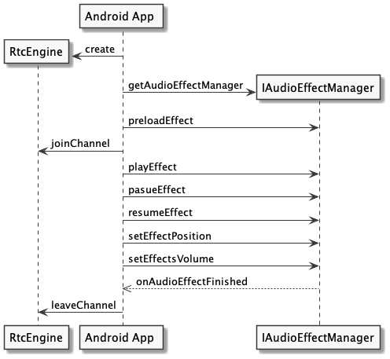

# Play audio effect or music file

In real-time audio and video sessions, playing the audio effect or background music adds more fun and is widely applied in use cases such as online gaming or karaoke. 

This page shows how to implement playing audio effects or music files in your project.

## Understand the tech

Agora provides the following two sets of APIs that help you implement playing audio effects or music files:

- Audio effect APIs: Plays ambient sounds with a short duration, such as applause, cheers, fighting sounds, and gunshots. You can play **multiple audio effect files** at the same time. Supported functions include the following:

- Audio mixing APIs: Plays a relatively long music file, such as the accompaniment and background music. You can play **only one music file** at a time.

Both sets support the following functions:

| Function | Audio effect APIs | Audio mixing APIs |
| -- | -- | -- |
| Play and stop playing the specified audio file | <ul><li>`playEffect`</li><li>`stopEffect`</li><li>`stopAllEffects`</li></ul> | <ul><li>`startAudioMixing`</li><li>`stopAudioMixing`</li></ul> |
| Pause, resume playing the audio file | <ul><li>`pauseEffect`</li><li>`pauseAllEffects`</li><li>`resumeEffect`</li><li>`resumeAllEffects`</li></ul> |<ul><li>`pauseAudioMixing`</li><li>`resumeAudioMixing`</li></ul> | 
| Get and set the playback position and volume | <ul><li>`setEffectPosition`</li><li>`getEffectCurrentPosition`</li><li>`getEffectsVolume`</li><li>`setEffectsVolume`</li><li>`setVolumeOfEffect`</li></ul> | <ul><li>`getAudioMixingCurrentPosition`</li><li>`setAudioMixingPosition`</li><li>`getAudioMixingPublishVolume`</li><li>`adjustAudioMixingPublishVolume`</li><li>`getAudioMixingPlayoutVolume`</li><li>`adjustAudioMixingPlayoutVolume`</li></ul> |
| Report the playback state of the audio file | `onAudioEffectFinished` | `onAudioMixingStateChanged` |

## Prerequsites

Before proceeding, ensure that you have the following:
- A project that has implemented the [basic real-time audio and video engagement functionalities]().
- A working knowledge of the [supported media formats on Android](https://developer.android.com/guide/topics/media/media-formats).
- For the audio mixing APIs to work, you need a device that runs Android 4.2 or later.

## Implement playing audio file

This section explains how to use the audio effect APIs and audio mixing APIs to implment playing audio effect and audio mixing files in your project.

### Implement playing audio effects

The callflow for the audio effect APIs are as follows:



In your Agora project, open the file used to manage audio effect playback and add the following code.

```java
// Import the IAudioEffectManger class.
import io.agora.rtc.IAudioEffectManager;

// Call getAudioEffectManager to get the IAudioEffectManager class.
private IAudioEffectManager audioEffectManager;
audioEffectManager = mRtcEngine.getAudioEffectManager();

// Specified the ID of the audio effect file that you want to play.
int id = 0;
// Preloads the specified audio effect file into the memory.
// You can only preload local audio effect files.
audioEffectManager.preloadEffect(id++, "Your file path");

// Call playEffect to play the specified audio effect file.
// Call playEffect multiples and set different effect IDs to play multiple audio effect files at the same time.
audioEffectManager.playEffect(
    0,   // The ID of the audio effect file/
    "Your file path",   // The path of the audio effect file.
    -1,  // The number of audio effect loops. -1 means an inifinite loops.
    1,   // The pitch of the audio effect. 1 represents the original pitch.
    0.0, // The spatial positition of the audio effect. 0.0 represents that the audio effect plays in the front
    100, // The volume of the audio effect. 100 represents the original volume
    true,// Whether to publish the audio effect to remote users.
    0    // The playback position of the audio effect file. 0 represents that the playback starts ar the 0 ms of the audio effect file.
);

// Pause and resume playing a specified audio file.
audioEffectManager.pauseEffect(id);
audioEffectManager.resumeEffect(id);

// Get the duration of a specified local audio file.
audioEffectManager.getEffectDuration("Your file path");
// Set the playback position of a specified local audio file.
audioEffectManager.setEffectPosition(id, 500);

// Set the playback volume of all audio effect files.
audioEffectManager.setEffectsVolume(50.0);
// Set the playback volume of a specified audio effect file.
audioEffectManager.setVolumeOfEffect(id, 50.0);

// Unload the preloaded audio effect file.
audioEffectManager.unloadEffect(id);
// Stop playing all audio effect files.
audioEffectManager.stopAllEffects;


@Override
// Occurs when the audio effect playback finishes.
public void onAudioEffectFinished(int soundId) {
    super.onAudioEffectFinished(soundId);
}
```

### Implement audio mixing

Call the `startAudioMixing` method to play a music file before or after joining a channel. After a successful method call, the SDK triggers `onAudioMixingStateChanged` callback to report the playback state of the music file.

1. Add app privileges
For Android projects with `targetSdkVersion` >= 20, add the following lines in the AndroidManifest.xml file of your project:

    ```xml
    <application>
       android:usesCleartextTraffic="true"
       android:requestLegacyExternalStorage="true"
    </application>
    ```

2. Implement audio mixing logic
In your Agora project, open the file used to manage audio effect playback and add the following code.

    ```java
    mRtcEngine.startAudioMixing(
        "Your file path",  // Specify the path of the local or online music file.
        false,             // Whether to only play the music file on the local client. False represents that both the local user the remote users can hear the music file.
        false,             // Whether to replace the audio captured by the microphone with the music file. False represents that the user can hear both the music and the audio captured by the microphone.
        -1                 // The number of times to loop the music file. -1 means an infinite loop.
    );

    // Pause and resume playing the audio file.
    rtcEngine.pauseAudioMixing();
    rtcEngine.resumeAudioMixing();

    // Get the total duration of the current music file.
    rtcEngine.getAudioMixingDuration();
    // Set the playback position of the current music file. 500 represents that the playback starts at the 500 ms of the music file.
    rtcEngine.setAudioMixingPosition(500);

    // Adjust the playback volume of the current music file for the remote user.
    rtcEngine.adjustAudioMixingPublishVolume(50);
    // Adjust the playabck volume of the current music file for the local user.
    rtcEngine.adjustAudioMixingPublishVolume(50);

    @Override
    // Occurs when the state of the music file playback changes.
    public void onAudioMixingStateChanged(int state, int reason) {
        super.onAudioMixingStateChanged(state, reason);
    }
    ```

## Reference

- Agora provides an open-source [PlayAudioFiles](https://github.com/AgoraIO/API-Examples/blob/master/Android/APIExample/app/src/main/java/io/agora/api/example/examples/advanced/PlayAudioFiles.java) sample project on Github for your reference. You can download the project to try it or view the source code.
- [playEffect]()
- [onAudioEffectFinished]()
- [startAudioMixing]()
- [onAudioMixingEffectFinished]()