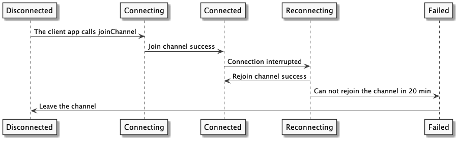
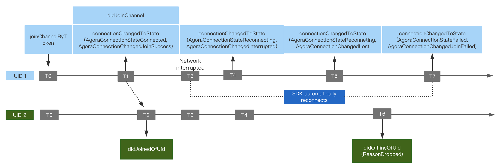

# Channel Connection

During a real-time engagement session, the connection state between an app client and Agora SD-RTN<sup>TM</sup> changes as the client joins and leaves an Agora channel, or goes offline due to network or authentication issues. 

This page explains the connection states, how they change and why they change, to help you better manage users and troubleshoot when network interruption occurs.

## Understand the tech

When the connection state changes, Agora sends the `connectionChangedToState` callback. The following diagram illustrates the various states and how the states change as a client app joins and leaves a channel:



To help you troubleshoot network interruption, `connectionChangedToState` also has the `reason` parameter that explains why the connection state changes.

<a name="connection_state"></a>
### Channel connection states

As shown in the diagram, an app can have the following five connection states before and after the app joins and leaves the channel:

| Connection state | Description |
| --- | --- |
| Disconnected | The initial connection state. It usually occurs under the following circumstances:<ul><li>Before calling `joinChannelByToken`.</li><li>After calling `leaveChannel`.</li></ul> |
| Connecting | This is the instantaneous state after calling the `didJoinChannel` method. |
| Connected | This state occurs after the app successfully joins the channel. The SDK also triggers `didJoinChannel` to report that the local client has joined the channel. Users can now publish or subcribe to audio and video in the channel. |
| Reconnecting | This state occurs when the connection is interrupted. The SDK automatically tries to reconnect after the interruption.<ul><li>If it successfully rejoins the channel, the SDK trigger the `didRejoinChannel` callback.</li><li>If is does not join the channel in 10 seconds, the SDK triggers `connectionChangedToState(Reconnecting, Lost)` while keeping rejoining the channel.</li></ul> |
| Failed | The connection fails. This state occurs when the SDK cannot join the channel in 20 minutes, and the SDK stops reconnecting to the channel. When this state occurs, call `leaveChannel` to leave the current channel, and `joinChannelByToken` to join the channel again. |

<a name="connection_reason"></a>
### Connection state change reasons

The following table lists the mapping relationship between the connection state, reasons for the state change, and how to troubleshoot when network interruption occurs.

| Connection state | Reasons for the state change and how to troubleshoot | 
| --- | --- |
| Disconnected | <ul><li>`LeaveChannel`(5): The user leaves the channel.</li><li>`InvalidToken`(8): Use a valid token to join the channel.</li></ul> |
| Connecting | <ul><li>`Connecting`(0): The app is attempting to join an Agora channel.</li></ul> |
| Connected | <ul><li>`JoinSuccess`(1): The app has successfully joined the channel.</li></ul> |
| Reconnecting | <ul><li>`Interrupted`(2): When the network connection is interrupted, the SDK automatically reconnects to the channel, and the connection state keeps changing. For how automatic reconnection affects the connection state, see [API behavior during SDK reconnection](#reconnection).</li><li>`Lost`(16): Wait till the SDK successfully reconnects the server.</li><li>`SettingProxyServer`(11): Wait till the SDK successfully reconnects the server.</li><li>`ClientIpAddressChanged`(13): Wait till the SDK successfully reconnects the server.</li><li>`KeepAliveTimeout`(14): Wait till the SDK successfully reconnects the server.</li><li>`RenewToken`(12): The token is renewed and the app is attempting to rejoin the channel.</li></ul>| |
| Failed | <ul><li>`InvalidAppId`(6): Use a valid app ID to join the channel.</li><li>`InvalidChannelName`(7): Use a valid channel name to join the channel.</li><li>`TokenExpired`(9): Get a new token from your app server and call `joinChannelByToken` to join the channel.</li><li>`BannedByServer`(3): The user is banned by the server.<li>`JoinFailed`(4): The SDK fails to join the channel for more than 20 minutes and stops reconnecting to the channel. Call `leaveChannel` to leave the current channel and `joinChannelByToken` to join the channel again.</li><li>`RejectedByServer`(10): This reason occurs in the following situations:<ul><li>If the app calls `joinChannelByToken` after the local user has already joined the channel.</li><li>When the app calls `startEchoTestWithInterval` but not `stopEchoTest`.</ul></li></li> |

## Prerequisites

Before proceeding, ensure that you have a project that has implemented the [basic real-time engagement functionality]().

## Implement channel connection management

This section introduces how to use the `connectionChangedToState` callback to monitor channel connection state change.

In your Agora project, open the file used to manage `AgoraRtcEngineDelegate` and copy the following code to the `AgoraRtcEngineDelegate` initialization process.

```swift
func rtcEngine(_engine: AgoraRtcEngineKit, connectionChangedToState 
                 state: AgoraConnectionStateType 
                reason: AgoraConnectionChangedReadon) {
    LogUtils.log(message: "Connection state changed: \(state) \(reason)")
}
```

You can read the current connection state and why the state changes from the log. 
- For detailed descriptions on the various conenction states, refer to [Channel connection states](#connection_state).
- For the reasons for the change and how to troubleshoot, refer to [Connection state change reasons](#connection_reason).

## Reference

This section provides reference information you may need when managing the channel connection state.

<a name="reconnection"></a>
### API behavior during SDK reconnection

When the network connection is interrupted, the SDK automatically tries to reconnect to the server. 

The following diagram shows the callbacks received by the local user (UID1) and the remote user (UID2) when the local user joins the channel, gets a network exception, lises connection, and rejoins the channal. 



In the above diagram:

- T0: The SDK receives the `joinChannel` request from UID1.
- T1: 200 ms after calling `joinChannel`, UID1 joins the channel. In the process, UID also receives the `connectionChangedToState(Connecting, Connecting)` callback. When successfully joining the channel, UID 1 receives the `connectionChangedToState(Connected, JoinSuccess)` and `didJoinSuccess` callbacks.
- T2: 100 ms after UID1 joins the channel, UID2 receives the `didJoinedOfUid` callback.
- T3: The uplink network condition of UID1 deteriorates. The SDK automatically tries rejoining the channel.
- T4: If UID1 fails to receive any data from the server in four seconds, UID1 receives `connectionChangedToState(Reconnecting, Interrupted)`; meanwhile the SDK continues to try rejoining the channel.
- T5: If UID1 fails to receive any data from the server in ten seconds, UID1 receives `connectionChangedToState(Reconnecting, Lost)`; meanwhile the SDK continues to try rejoining the channel.
- T6: If UID2 fails to receive any data from UID1 in 20 seconds, the SDK decides that UID1 is offline. UID2 receives `didOfflineOfUid`.
- T7: If UID1 fails to rejoin the channel in 20 minutes, the SDK stops trying to rejoin the channel. UID1 receives `connectionChangedToState(Failed, JoinFailed)`.

### API Reference

- [getConnectionState]()
- [connectionChangedToState]()

### FAQ

For the SDK reconnection mechanism in the Agora RTC SDK earlier than v2.3.2 and how connection states change with the process is terminated, see [FAQ: Does Agora have reconnection mechanism?]()