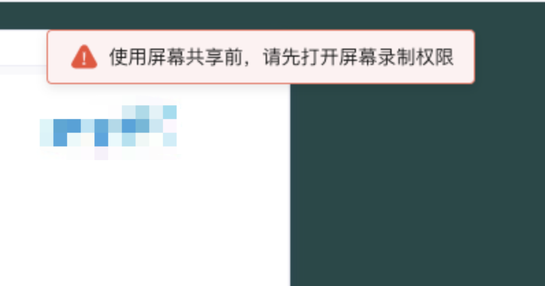
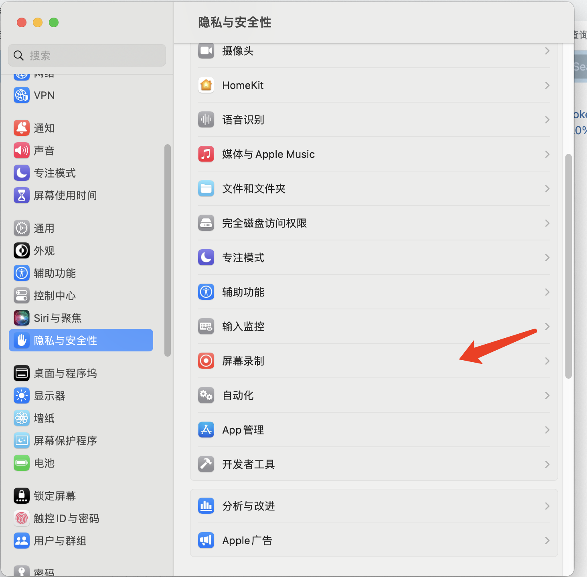
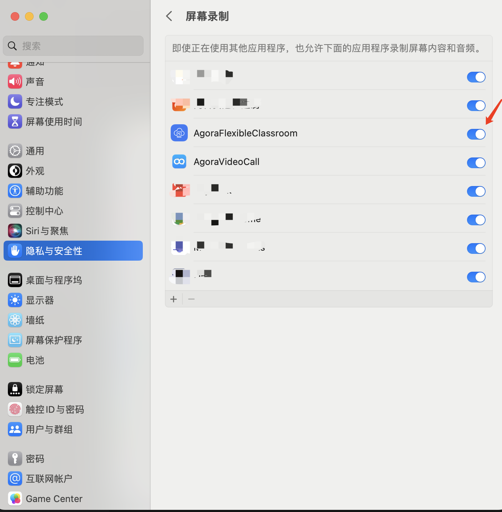

web端打不开摄像头和麦克风怎么办？

1、请确认浏览器摄像头的权限是否打开
（插入几张图片）
如果权限已经开启了，请采用下面几个步骤刷新一下
2、清理一下浏览器的缓存
3、关闭重启一下浏览器
4、升级一下chrome浏览器的版本

2、如何修改课程中视频分辨率？
web端的launch接口可以通过修改launchOption.MediaOptions参数来调整分辨率。
launchOption.MediaOptions.lowStreamCameraEncoderConfiguration 改小流的分辨率
launchOption.mediaOptions.cameraEncoderConfiguration 改大流的分辨率
launchOption.mediaOptions.screenShareEncoderConfiguration修改屏幕共享的分辨率
eg:
    AgoraEduSDK.launch(appRef.current, {
        ...launchOption,
        recordUrl,
        courseWareList,
        uiMode: homeStore.theme,
        virtualBackgroundImages,
        virtualBackgroundVideos,
        mediaOptions: {
        cameraEncoderConfiguration: {
            width: 1280,
            height: 720,
            frameRate: 30,
            bitrate: 1710,
        },
        lowStreamCameraEncoderConfiguration:{
            width: 1280,
            height: 720,
            frameRate: 30,
            bitrate: 1710,
        }
        },
        listener: (evt: AgoraEduClassroomEvent, type) => {
        ,
    });

修改录制的分辨率：
get recordArgs() {
const { recordUrl, rteEngineConfig, recordRetryTimeout } = EduClassroomConfig.shared;
const args = {
    webRecordConfig: {
    rootUrl: `${recordUrl}?language=${rteEngineConfig.language}`,
        videoBitrate: 3000,
        videoWidth：1280,
        videoHeight:720,
        videoFps:15
    },
    mode: RecordMode.Web,
    retryTimeout: recordRetryTimeout,
};

3、使用屏幕共享报错，如何开启屏幕录制功能权限?
屏幕共享开启的时候报如下错误：

需要开启系统屏幕录制权限。系统设置-》隐私与安全性-》屏幕录制开启相关的开关

