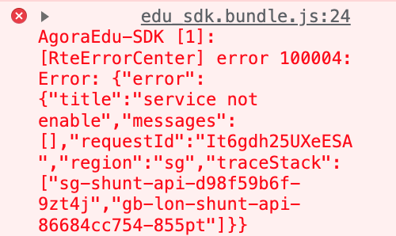
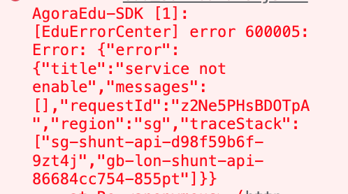
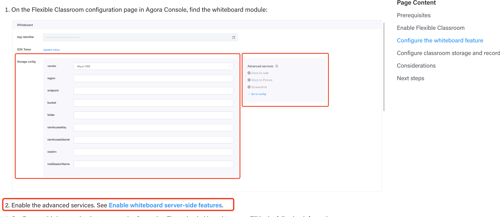
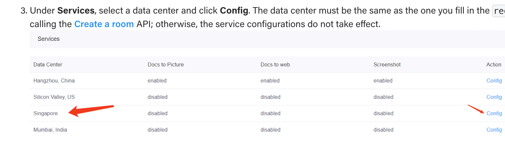
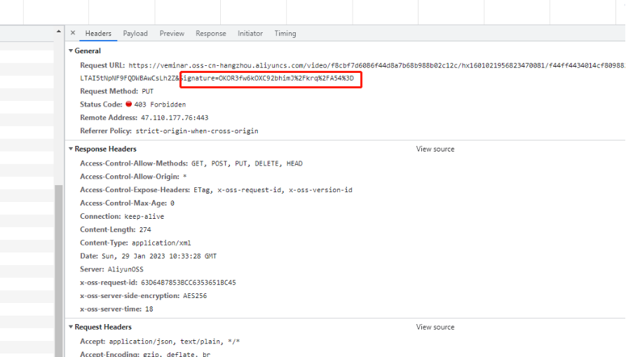
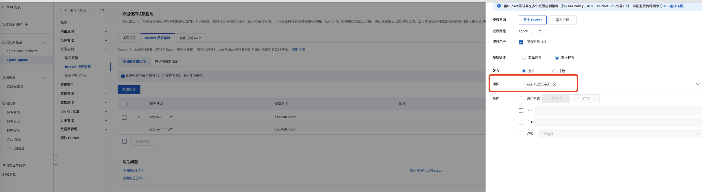

上传课件报错怎么办？
1、检查声网后台的oss配置配置了没有?
https://docs.agora.io/cn/agora-class/agora_class_configure?platform=Web#%E9%85%8D%E7%BD%AE%E7%99%BD%E6%9D%BF%E5%8A%9F%E8%83%BD

同时要确保声网可以访问你的云存储空间
https://docs.agora.io/cn/agora-class/agora_class_configure?platform=Web#%E6%B3%A8%E6%84%8F%E4%BA%8B%E9%A1%B9

2、如果你需要在课堂里使用 PPT、DOC、PDF 等格式的课件，你还需要点击进阶服务下方的前往配置，来为灵动课堂开启并配置文档转网页、文档转图片、截图服务
。https://docs.agora.io/cn/whiteboard/enable_whiteboard#%E5%BC%80%E5%90%AF%E4%BA%92%E5%8A%A8%E7%99%BD%E6%9D%BF%E9%85%8D%E5%A5%97%E6%9C%8D%E5%8A%A1
文档转图片、文档转网页、截图都要开启。

3、如果相关配置都完成了，还录制失败请检查一下oss的公共读权限是否开启了。
https://docs.agora.io/cn/agora-class/agora_class_configure?platform=Web#%E6%B3%A8%E6%84%8F%E4%BA%8B%E9%A1%B9

 3、如果相关配置都配好了还失败，例如：课件上传报错 错误码为600005或者100004
 "service not enable", "messages": "region":"sg",?

这个报错白板服务的课件转换服务sg区域的没有开通。所以去开通相应的服务就可以了。(就是上面第二步骤的配置)
https://docs.agora.io/en/flexible-classroom/get-started/enable-flexible-classroom?platform=android#configure-the-whiteboard-feature

通过下面的这个跳转链接去开通singapore这个区域白板转换的配置
https://docs.agora.io/en/interactive-whiteboard/develop/enable-whiteboard#enable-whiteboard-server-side-features

文档转图片、文档转网页、截图都要开启

4、如果课件上传所有配置都配置好了，上传阿里云报403错误怎么办？

这个403的报错，是阿里云的限制。阿里云不允许上传。
需要开通阿里云的putObject权限

5、课件上传大小有什么限制？
1) 实际转码时长受课件大小、课件尺寸、课件动画多少、课件页数、转码队列等影响。
2）源文件最好在 50 页以内，超过 100 页可能会出现转换超时。
3）源文件内包含的图片分辨率越高，转换速度越慢。
4) 课件要小于100M

6、课件上传不上去的原因有哪些？
1) 支持的文件格式包含：PPT、PPTX、DOC、DOCX、PDF、MP3、MP4、PNG、JPG、GIF。
2)  课件名字里面不要有特殊符号，最好只包含中英文及数字；
3)  使用WPS编辑过的课件可能会出现上传或转码失败，建议另存为PPTX或PDF；
