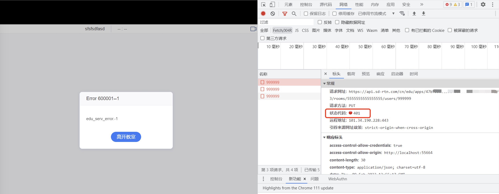

## 如何处理加入课堂相关报错？

### Web 端加入房间时报 `600001-1` 错误，或登录教室时服务端报 401 错误怎么办？

 `600001-1` 和 `401` 错误一般是因为 [`launch`](agora_class_api_ref_web?platform=Web#launch) 方法传入的 RTM Token 错误，或者 RTM Token 和 App ID 不匹配。请检查 RTM Token 是否正确，以及保证 App ID 和 RTM Token 匹配。

声网推荐你在后端生成 RTM Token，前端调用生成的 token，详情参考[使用 AccessToken2 鉴权](https://docs.agora.io/cn/Real-time-Messaging/token_upgrade_rtm)。

如果需要临时生成 token 测试，可以使用这个[工具](https://webdemo.agora.io/token-builder/)。

### 报错 "代码 30409104 详细信息：roomType conflict" 怎么办？

该错误是因为该房间编号（`roomUuid`）已经创建了一个小班课课堂，同一个房间编号被配置为不同的房间类型，从而导致房间类型冲突。
声网建议不要使用同一个房间编号创建多个课堂，并且每个房间都应配置一个不同的房间类型。

其他相关服务端错误码可参考[响应状态码](agora_class_restful_api#响应状态码)

### 进入教室报错 “Error Domain=last launch not finished Code=-1 "(null)" ” 怎么办？

该错误错误一般是因为 [`launch`](agora_class_api_ref_web?platform=Web#launch) 方法传入的 RTM Token 错误或过期，或者 RTM Token 和 App ID 或 User ID 不匹配。请检查 RTM Token 是否正确和有效，以及保证 RTM Token 和 App ID 以及 User ID 匹配。

