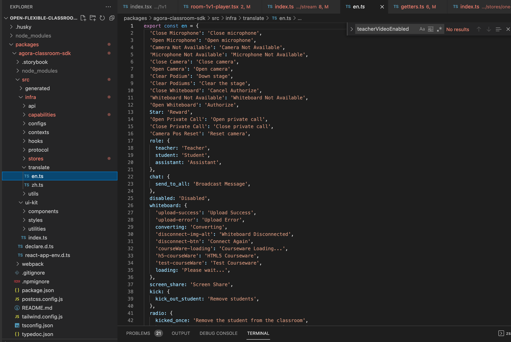
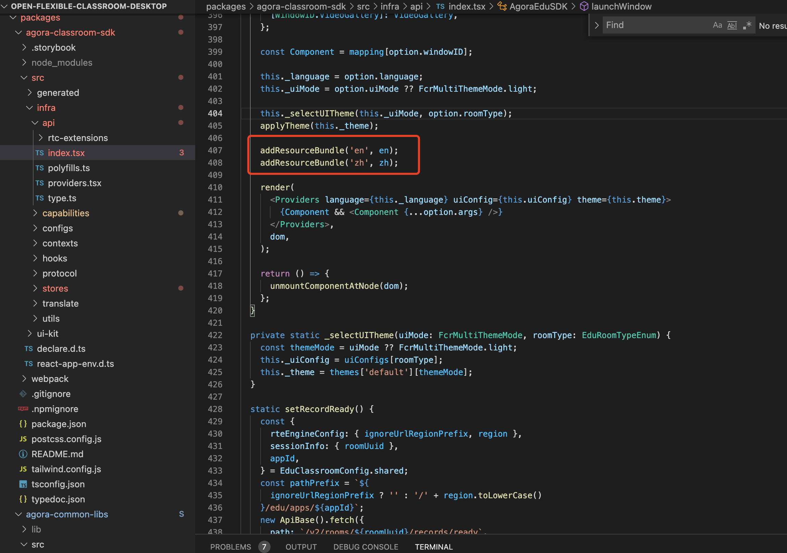
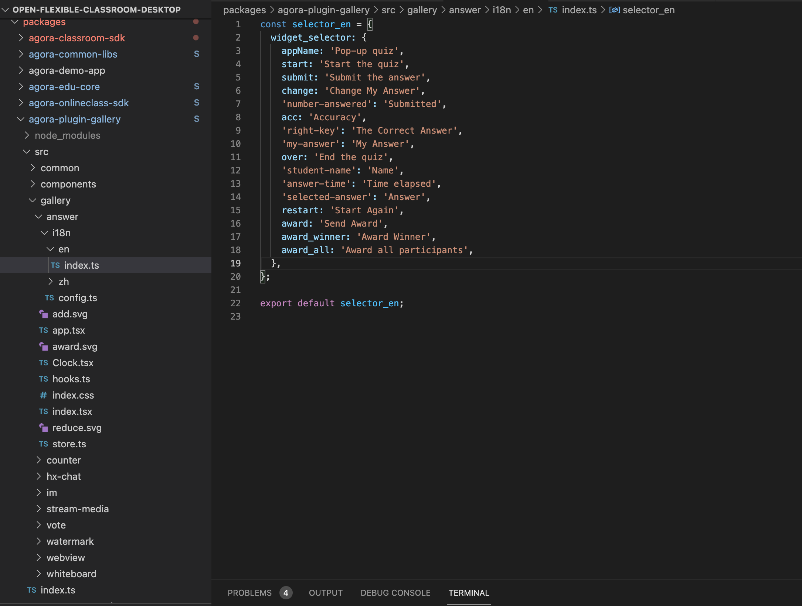
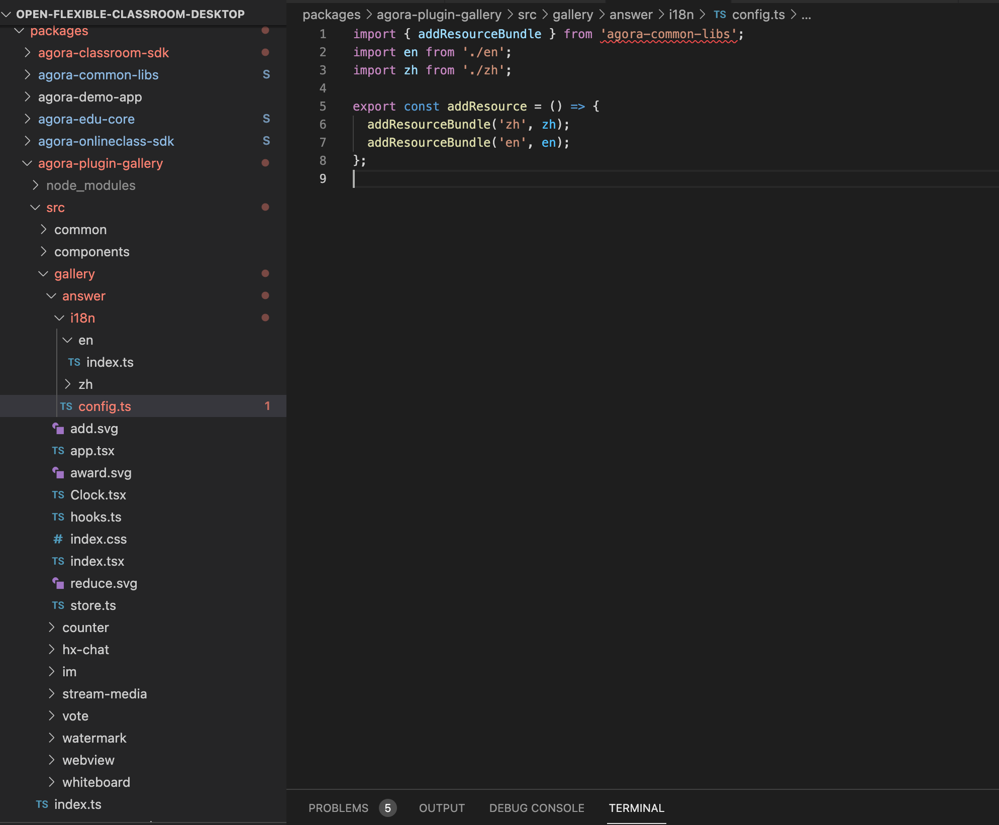
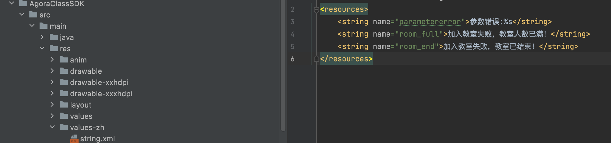
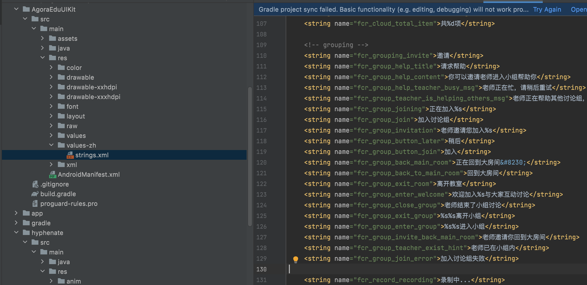
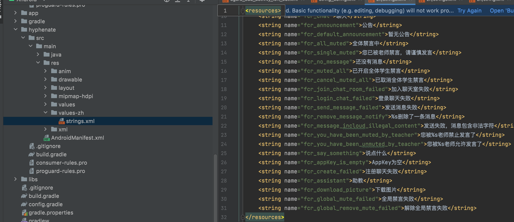
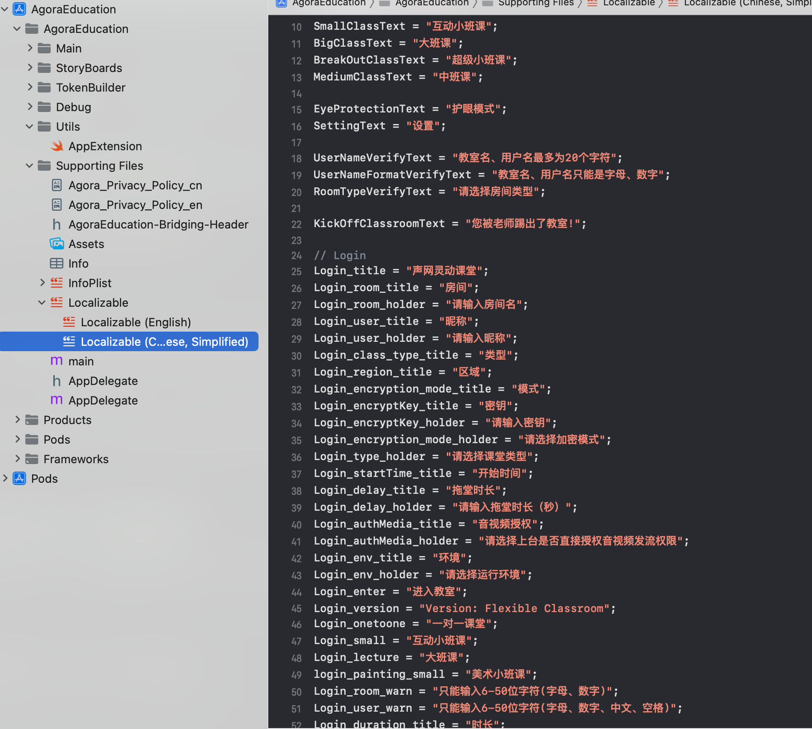

## 灵动课堂多语言
动课堂目前支持中文、英文、西班牙语，也支持用户自己配置多语言的环境，添加自己需要的多语言种类。

灵动课堂中对语音相关的key值进行了归类和梳理。统一放到相应的目录下，用户只要到指定目录下将自己的语音文件按照想通过格式和方式配置就可以了。

目前灵动课堂中的多语言配置分三个端处理：web、iOS、Android。

###一、配置web端多语言
web源码语音文件的设计是主SDK的多语言资源文件和插件的多语言文件分开的。主sdk、答题器、倒计时、投票器、环信IM有单独的多语言资源文件。具体修改方法如下:

####1、主SDK多语言
主SDK中的多语言文件资源增加到这个目录下：

packages/agora-classroom-sdk/src/infra/translate

在这个目录下增加您的语言资源文件

例如jpn.ts

在packages/agora-classroom-sdk/src/infra/api/index.tsx目录下addResourceBundle中增加上面添加的日语类型

2.答题器、定时器、投票器配置多语言
在答题器、定时器、投票器、环信IM中添加自己的语言如下：

插件对应的多语言资源文件目录如下:

packages/agora-plugin-gallery/src/gallery/answer/i18n

如图：

在这个目录下添加自己的资源文件

然后在packages/agora-plugin-gallery/src/gallery/answer/i18n/config.ts下config中配置自己添加的语言文件。

例如：addResourceBundle('zh',zh);

## 二、安卓端多语言配置
安卓端多语言分三个目录

/AgoraClassSDK/src/main/res

/AgoraEduUIKit/src/main/res

/hyphenate/src/main/res

三个文件夹中增加自己的语言文件就可以了。

## 三、iOS端添加多语言资源文件
iOS端多语言在Localizable文件下面添加多语言的扩展
