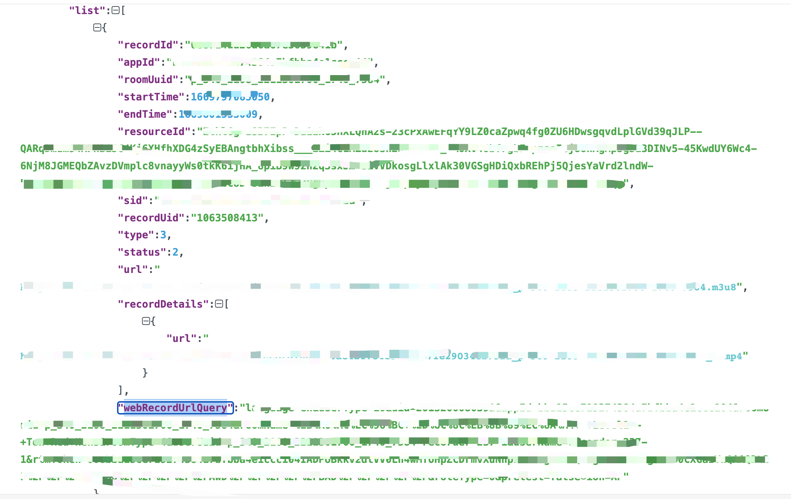
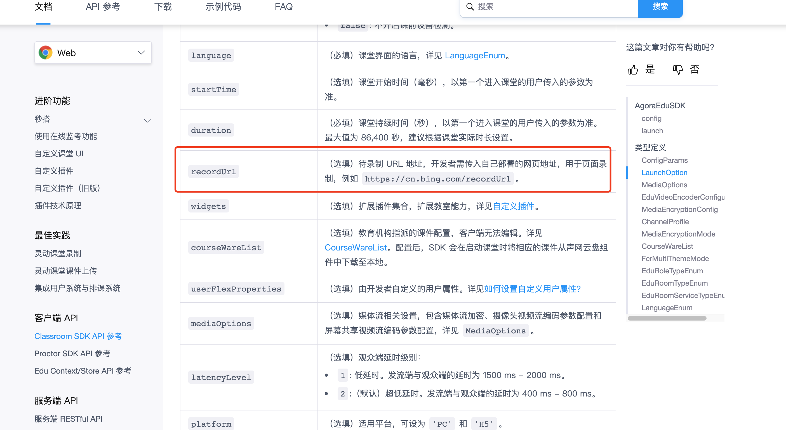
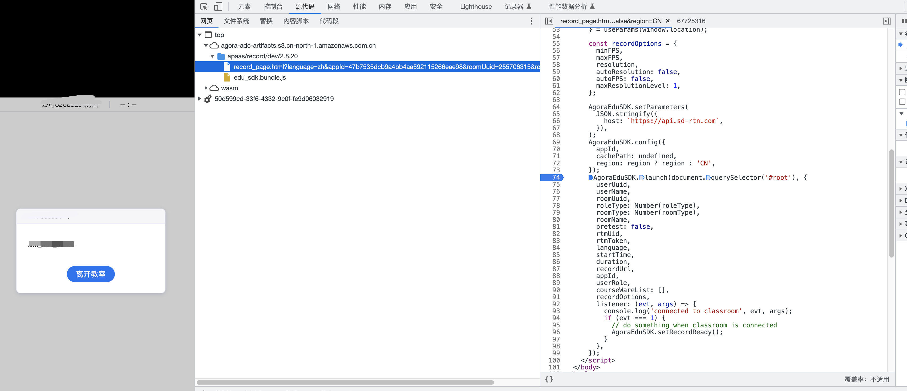

灵动课堂开启录制失败怎么办？

1、请检查自己的录制相关的配置是否配置完成 https://docs.agora.io/cn/agora-class/agora_class_configure?platform=Web#%E9%85%8D%E7%BD%AE%E5%BD%95%E5%88%B6%E5%8A%9F%E8%83%BD
配置录制功能
录制配置可以默认
存储配置必须采用自定义
请确保vendor、region和endpoint 要正确且匹配
例如：
"vendor": 2,
"region": 1,//CN_Shanghai
endpoint:https://agora-recording.oss-cn-shanghai.aliyuncs.com

2、如果相关配置都完成了，还录制失败请检查一下oss的公共读权限是否开启了。
https://docs.agora.io/cn/agora-class/agora_class_configure?platform=Web#%E6%B3%A8%E6%84%8F%E4%BA%8B%E9%A1%B9

3、录制还是失败的话可以拼接页面录制的url，在本地浏览器里面运行一下，调试具体报错的原因。
1) 调用后端获取录制列表restfu接口。
https://docs.agora.io/cn/agora-class/agora_class_restful_api?platform=All%20Platforms#%E8%8E%B7%E5%8F%96%E5%BD%95%E5%88%B6%E5%88%97%E8%A1%A8
从接口中取出webRecordUrlQuery字段。这个字段是录制页面的参数。

2）把自己web端调用launch接口传入的r录制页面的recordUr取出来

3)构造页面录制的完整allURL= recordUr + webRecordUrlQuery

本地访问allURL进行调试

