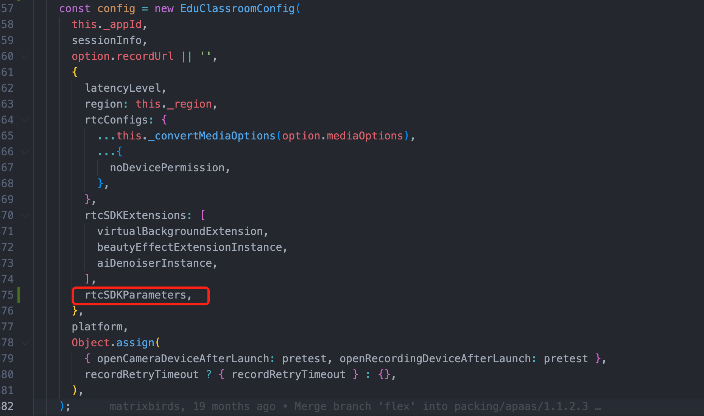
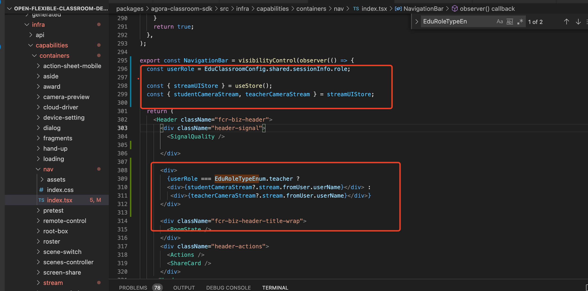

##1.web端如何更新房间背景颜色，例如去掉黑色背景的方法？
背景色的样式如下：
```
<div className="flex bg-black justify-center items-center h-screen w-screen">
```

bg-black去除即可

##2、如何更改白板背景颜色

白板背景色更新用什么方法
```
.netless-whiteboard-wrapper {
height: 100%;
width: 100%;
border: 1px solid;
border-radius: 4px;
@apply bg-foreground border-divider;
}
```


将bg-foreground删除， 增加一个

background-color: #fff;

就可以了

##3.如何更改屏幕共享背景颜色：

在remote-screen-share-container下面增加一下：
```
/* 覆盖屏幕共享背景样式 */
.remote-screen-share-container > div > div {
  background-color: unset!important;
}
```

##4.如何修改白板宽高比例？

调整每个班型里面的board-ui里面的宽高比。
```
protected get uiOverrides() {
    return {
      ...super.uiOverrides,
      heightRatio: 0.78,
      aspectRatio: 0.558,
 };
 ```

 ## 5.web如何关闭3A（降噪、回声消除、增益）的配置?
 ```
 if (AgoraRteRuntimePlatform.Electron === AgoraRteEngineConfig.platform) {
      rtcSDKParameters = [
        { 'rtc.audio.aec.enable': false },
        { 'rtc.audio.agc.enable': false },
        { 'rtc.audio.ans.enable': false },
      ];
    } else {
      rtcSDKParameters = [
        {
          MEDIA_DEVICE_CONSTRAINTS: {
            audio: {
              autoGainControl: false,
              echoCancellation: false,
              noiseSuppression: false,
            },
          },
        },
      ];
    }
```


## 6.如何在UI层根据角色展示相关的内容?
```
export const NavigationBar = visibilityControl(observer(() => {
  const userRole = EduClassroomConfig.shared.sessionInfo.role;
 
 
  const { streamUIStore } = useStore();
  const { studentCameraStream, teacherCameraStream } = streamUIStore;
 
  return (
    <Header className="fcr-biz-header">
      <div className="header-signal">
        <SignalQuality />
 
      </div>
 
      <div>
        {userRole === EduRoleTypeEnum.teacher ?
        <div>{studentCameraStream?.stream.fromUser.userName}</div> :
         <div>{teacherCameraStream?.stream.fromUser.userName}</div>}
      </div>
 
      <div className="fcr-biz-header-title-wrap">
        <RoomState />
      </div>
      <div className="header-actions">
        <Actions />
        <ShareCard />
      </div>
    </Header>
  );
}), headerEnabled);
```



## 7.如果还有其他模块的UI修改怎么处理呢？怎么着手呢?
1、下载灵动课堂官网上的源代码，并运行起来
https://docs.agora.io/cn/agora-class/agora_class_integrate_web?platform=Web
2、找到对应模块，根据各个模块的类名、组件名、模块名找到对应的代码。
然后根据自己的逻辑调整对应的点，具体修改请参照这篇文档。
https://docs.agora.io/cn/agora-class/agora_class_custom_ui_web?platform=Web
