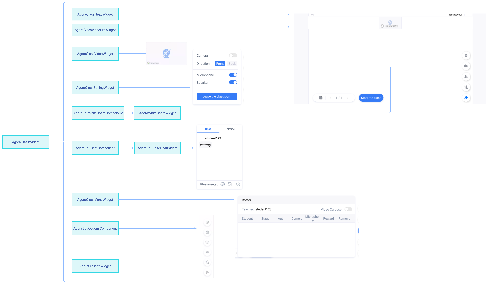

# 教室和 UI 组件介绍

## UI - 数据交互流程

在 Agora Classroom SDK 中，灵动课堂的 UI 层代码和核心业务逻辑相隔离，独立成 **AgoraEduUIKit** 和 **AgoraEduCore** 两个库，两者通过 [Agora Edu Context](/cn/agora-class/API%20Reference/edu_context_kotlin/API/edu_context_api_overview.html) 产生关联。具体逻辑如下：


## UI - 组件结构介绍

教室的类结构示意图如下：


UI 组件的结构示意图如下：



开发者可自由组合 UI 组件搭建自定义版型，也可以自定义 UI 组件或修改灵动课堂的 UI 组件。

UI 组件列表：

| 组件（Component）                  | 插件（Widget）                                               | 描述                          |
| ---------------------------------- | ------------------------------------------------------------ | ----------------------------- |
| AgoraEduChatComponent              | AgoraEduEaseChatWidget                                       | 教室 - IM                     |
| AgoraEduHeadComponent              | /                                                            | 教室 - Header                 |
| AgoraEduSettingComponent           | /                                                            | 教室 - 设置                   |
| AgoraEduVideoComponent             | /                                                            | 教室 - 视频窗口               |
| AgoraEduVideoListComponent         | /                                                            | 教室 - 视频列表（台上）       |
| AgoraEduWhiteBoardComponent        | AgoraWhiteBoardWidget                                        | 教室 - 白板                   |
| AgoraEduWhiteboardOptionsComponent | /                                                            | 教室 - 白板上一页/下一页工具  |
| AgoraEduApplianceComponent         | /                                                            | 教室 - 白板教具               |
| AgoraEduTeachAidContainerComponent | AgoraEduIClickerWidget：答题器<br />AgoraTeachAidCountDownWidget：倒计时<br />AgoraTeachAidVoteWidget：投票器 | 教室 - 答题器、倒计时、投票器 |
| AgoraEduScreenShareComponent       | /                                                            | 教室 - 屏幕共享               |
| AgoraEduRosterComponent            | /                                                            | 教室 - 花名册                 |
| AgoraEduOptionsComponent           | /                                                            | 教室 - 选项按钮               |
| AgoraEduTeachAidContainerComponent | FCRCloudDiskWidget                                           | 教室 - 网盘                   |

其中插件（Widget）是需要组件（Component）容器来创建显示，组件就是指 View。

## UI - 自定义

本节介绍自定义课堂 UI 的具体步骤。

###  1. 下载源码引用

如需修改灵动课堂的默认 UI，你需要通过下载 [GitHub 源码](https://github.com/AgoraIO-Community/CloudClass-Android)的方式集成灵动课堂，步骤如下：

~c7706c40-3fce-11ed-8dae-bf25bf08a626~

可以自定义 UI 的模块，如下：

- `/AgoraClassSDK`：教室页面布局。

- `/AgoraEduUIKit`：教室使用到的所有 UI 组件。

  

如果之前是以 Maven 的方式引入，需要将Maven引用改成 `AgoraEduUIKit` 和 `AgoraClassSDK` 模块的引用方式。

在 `build.gradle` 文件中进行如下修改：

   ```kotlin
   dependencies {
    // ...
    implementation "io.github.agoraio-community:AgoraEduCore:版本号"
    // implementation "io.github.agoraio-community:AgoraEduUIKit:版本号"
    // implementation "io.github.agoraio-community:AgoraClassSDK:版本号"
    implementation project(path: ':AgoraClassSDK')
    implementation project(path: ':AgoraEduUIKit')
   }
   ```


<div class="alert note">注意：GitHub 源码的版本号要和 maven 引用的版本号保持一致。</div>

### 2. 修改 UI 组件

#### 2.1 UI 组件目录

所有 UI 组件都位于`AgoraEduUIKit`模块的 `com.agora.edu.component` 包目录下，找到对应的组件就可以修改 UI。


#### 2.2  示例

本示例以小班课为例，介绍如何修改顶部导航栏的高度、标题以及背景色。具体步骤如下：

1. 打开 `AgoraClassSDK`模块 的 `io.agora.classroom.ui` 包，找到小班课的主页面 `AgoraClassSmallActivity`，`Activity` 与 `.xml` 是通过 `viewbinding` 绑定的。

2. 打开 `AgoraClassSmallActivity` 的布局文件`activity_agora_class_small.xml` ，通过布局文件找到 `AgoraEduHeadComponent` 组件标签。

   

3. 打开 `AgoraEduHeadComponent`组件的 `agora_edu_head_component.xml`。在这个文件中，你可以直接修改导航栏的高度、标题以及背景色。

   

   

### 3. 新增 UI 组件

#### 3.1 UI 组件的基类

如果想要具备`EduCore`的能力，组件都需要继承 `AbsAgoraEduComponent`，并且初始化的时候，需要调用 `initView(agoraUIProvider: IAgoraUIProvider)` 方法初始化 UI 组件。

UI 组件可通过 `IAgoraUIProvider` 接口获取 EduCore 层的数据。

```kotlin
interface IAgoraUIProvider {
    /**
     * 获取 EduCore 数据
     */
    fun getAgoraEduCore(): AgoraEduCore?
 
    /**
     * UI 可以自定义数据
     */
    fun getUIDataProvider(): UIDataProvider?
}
```

#### 3.2 示例

本示例为 1 对 1 班型新增一个 `AgoraEduMyComponent` 组件。具体步骤如下：

1. 定义 `AgoraEduMyComponent`：

   ```kotlin
   class AgoraEduMyComponent : AbsAgoraEduComponent {
       constructor(context: Context) : super(context)
       constructor(context: Context, attr: AttributeSet) : super(context, attr)
       constructor(context: Context, attr: AttributeSet, defStyleAttr: Int) : super(context, attr, defStyleAttr)
    
       // TODO: 替换成你自己定义的 xml
       private var binding: xxxxBinding = xxxBinding.inflate(LayoutInflater.from(context), this, true)
    
       override fun initView(agoraUIProvider: IAgoraUIProvider) {
          super.initView(agoraUIProvider)
          // TODO: 在这里处理 View      
          // TODO: agoraUIProvider 提供教室数据能力和 View 需要的数据，你可自行定义
       }
      
   }
   ```

2. 在 `.xml` 中使用定义好的 `AgoraEduMyComponent`：

   ```xml
   <xxxx.xxx.xxxx.AgoraEduMyComponent
       android:id="@+id/agora_class_head"
       android:layout_width="match_parent"
       android:layout_height="@dimen/agora_head_h_small"
       android:gravity="center"
       app:layout_constraintLeft_toLeftOf="parent"
       app:layout_constraintTop_toTopOf="parent" />
   ```

3. 在 `AgoraClass1V1Activity` 中初始化组件：

   ```kotlin
   class AgoraClass1V1Activity : AgoraEduClassActivity() {
       private val TAG = "AgoraClass1V1Activity"
       lateinit var binding: ActivityAgoraClass1v1Binding
    
       override fun onCreate(savedInstanceState: Bundle?) {
           super.onCreate(savedInstanceState)
           binding = ActivityAgoraClass1v1Binding.inflate(layoutInflater)
           setContentView(binding.root)
    
           // 创建教室对象
           createEduCore(object : EduContextCallback<Unit> {
               override fun onSuccess(target: Unit?) {
                   // 教室资源加载完成后
                   joinClassRoom()
               }
    
               override fun onFailure(error: EduContextError?) {
                   error?.let {
                       ToastManager.showShort(it.msg)
                   }
                   finish()
               }
           })
       }
    
       private fun joinClassRoom() {
           runOnUiThread {
               eduCore()?.eduContextPool()?.let { context ->
                   // 初始化 view
                   binding.agoraEduMyComponent.initView(this)
               }
               join()
           }
       }
   }
   ```

## UI - 组件之间通信

#### 1.1 组件间通信方式

实现 Component 与 Component 之间通信方式，主要有：
- 自定义系统 API - Boardcast 通信
- 自定义接口，通过接口传递，实现组件间通信
- 通过 AgoraTransportManager 通信

#### 1.2 AgoraTransportManager 通信


在灵动课堂，可以通过 AgoraTransportManager 类来实现，UI 组件间通信：

**发送信息**

```
val event = AgoraTransportEvent(AgoraTransportEventId.EVENT_ID_ALL)  
event.arg1 = 123     // custom your id  
event.extra = "data" // your data  
AgoraTransportManager.notify(event)
```

**接收信息**

```
// receive message AgoraTransportManager.addListener(AgoraTransportEventId.EVENT_ID_ALL, object : OnAgoraTransportListener {  
    override fun onTransport(event: AgoraTransportEvent) {  
        if (event.eventId == AgoraTransportEventId.EVENT_ID_ALL) {  
            if (event.arg1 == 123) {  
                val data = event.extra  
            }
        }  
    }  
})
```