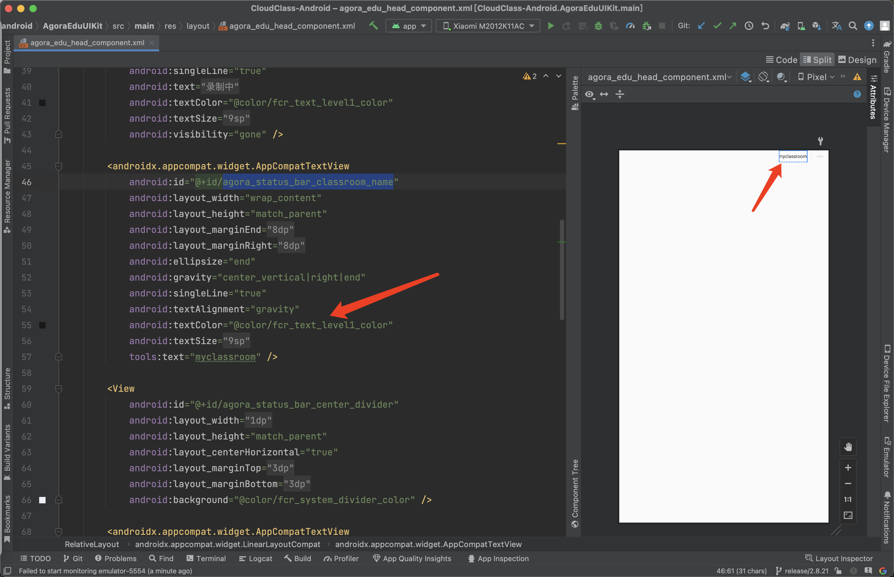

# 教室和 UI 组件介绍

## 数据交互流程

在声网 Classroom SDK 中，灵动课堂的 UI 层代码和核心业务逻辑相隔离，独立成 **AgoraEduUIKit** 和 **AgoraEduCore** 两个库，两者通过 [Agora Edu Context](/cn/agora-class/API%20Reference/edu_context_kotlin/API/edu_context_api_overview.html) 产生关联。具体逻辑如下：


## UI 组件结构介绍

教室的类结构示意图如下：


每种班型的 UI 在对应的 XML 文件中定义，这些文件中包含多个独立的 UI 组件 。UI 组件(Component)的结构示意图如下：


开发者可自由组合 UI 组件搭建自定义界面，也可以修改预定义的 UI 组件或自定义新的 UI 组件。

UI 组件列表：

| 组件（Component）                  | 插件（Widget）                                               | 描述                          |
| ---------------------------------- | ------------------------------------------------------------ | ----------------------------- |
| AgoraEduChatComponent              | AgoraEduEaseChatWidget                                       | IM 聊天                    |
| AgoraEduHeadComponent              | /                                                            | 顶部栏                 |
| AgoraEduSettingComponent           | /                                                            | 设置                   |
| AgoraEduVideoComponent             | /                                                            | 视频窗口               |
| AgoraEduVideoListComponent         | /                                                            | 台上学生的视频列表       |
| AgoraEduWhiteBoardComponent        | AgoraWhiteBoardWidget                                        | 白板                   |
| AgoraEduWhiteboardOptionsComponent | /                                                            | 白板上一页/下一页工具  |
| AgoraEduApplianceComponent         | /                                                            | 白板教具               |
| AgoraEduTeachAidContainerComponent | AgoraEduIClickerWidget<br />AgoraTeachAidCountDownWidget<br />AgoraTeachAidVoteWidget | 答题器、倒计时、投票器 |
| AgoraEduScreenShareComponent       | /                                                            | 屏幕共享               |
| AgoraEduRosterComponent            | /                                                            | 花名册                 |
| AgoraEduOptionsComponent           | /                                                            | 选项按钮               |
| AgoraEduTeachAidContainerComponent | FCRCloudDiskWidget                                           | 网盘                   |

如果要在 UI 上使用插件，需要在相应的 XML 文件中创建对应的组件。

## 自定义 UI 步骤

本节介绍自定义课堂 UI 的具体步骤。

###  下载源码

如需修改灵动课堂的默认 UI，你首先需要通过下载 [GitHub 源码](https://github.com/AgoraIO-Community/CloudClass-Android)的方式集成灵动课堂，步骤如下：

~c7706c40-3fce-11ed-8dae-bf25bf08a626~

如果你[通过 maven 集成灵动课堂](agora_class_integrate_android#%E9%80%9A%E8%BF%87-maven-%E9%9B%86%E6%88%90%E7%81%B5%E5%8A%A8%E8%AF%BE%E5%A0%82)，需要修改 `AgoraEduUIKit` 和 `AgoraClassSDK` 模块的引用方式。 

在 `build.gradle` 文件中进行如下修改：

   ```kotlin
   dependencies {
    // ...
    implementation "io.github.agoraio-community:AgoraEduCore:版本号"
    // implementation "io.github.agoraio-community:AgoraEduUIKit:版本号"
    // implementation "io.github.agoraio-community:AgoraClassSDK:版本号"
    implementation project(path: ':AgoraClassSDK')
    implementation project(path: ':AgoraEduUIKit')
   }
   ```

<div class="alert note">此处填写的 maven 引用的版本号需要和 GitHub 源码的版本号保持一致。</div>


自定义 UI 主要涉及以下目录：

- `/AgoraClassSDK`：教室页面布局。
- `/AgoraEduUIKit`：教室使用到的所有 UI 组件。


### 修改已有 UI 组件

#### UI 组件目录

所有 UI 组件都位于 `AgoraEduUIKit` 模块的 `com.agora.edu.component` 包目录下，找到对应的组件就可以修改 UI。


#### 示例

本示例以小班课为例，介绍如何修改顶部导航栏的高度、标题以及背景色。具体步骤如下：

1. 在 Android Studio 中，打开并构建灵动课堂项目。

2. 打开 `AgoraClassSDK/src/main/java/io.agora.classroom.ui` 包，找到小班课的主页面 `AgoraClassSmallActivity.kt` 文件。

3. 在 `AgoraClassSmallActivity.kt` 文件中，找到 `private lateinit var binding: ActivityAgoraClassSmallBinding` 这行代码，按下 cmd 键的同时选中 `ActivityAgoraClassSmallBinding`，即可打开小班课的布局文件 `activity_agora_class_small.xml` 并跳转到 `AgoraEduHeadComponent` 组件标签。
   <div class="alert info"><code>Activity</code> 与 <code>.xml</code> 文件之间的跳转是通过 <code>viewbinding</code> 实现的。</div>

   

4. 在  `AgoraEduHeadComponent` 组件标签，按下 cmd 键的同时选中 `AgoraEduHeadComponent`,即可打开定义该组件的文件 `AgoraEduHeadComponent.kt`。
   

5. 在 `AgoraEduHeadComponent.kt` 文件中，按下 cmd 键的同时选中 `AgoraEduHeadComponentBinding` ，即可打开该组件的布局文件 `agora_edu_head_component.xml`。
   

   在这个文件中，你可以通过点击预览时图中对应的内容，定位到对应的属性，来修改导航栏的高度，标题，背景色，文字等。例如，你想要修改导航栏的文字，就可以点击预览视图中的 `myclassroom`，定位到 `<androidx.appcompat.widget.AppCompatTextView`，修改 `tools:text="myclassroom"` 即可。

   

### 新增自定义 UI 组件

#### UI 组件的基类

如果想要组件具备 `EduCore` 的能力，需要继承 `AbsAgoraEduComponent`，并且调用 `initView(agoraUIProvider: IAgoraUIProvider)` 方法初始化 UI 组件。

UI 组件可通过 `IAgoraUIProvider` 接口获取 EduCore 层的数据。

```kotlin
interface IAgoraUIProvider {
    /**
     * 获取 EduCore 数据
     */
    fun getAgoraEduCore(): AgoraEduCore?
 
    /**
     * 可以自定义需要使用的数据
     */
    fun getUIDataProvider(): UIDataProvider?
}
```

#### 示例

本示例为 1 对 1 班型新增一个 `AgoraEduMyComponent` 组件。具体步骤如下：

1. 定义 `AgoraEduMyComponent`类：

   ```kotlin
   class AgoraEduMyComponent : AbsAgoraEduComponent {
       constructor(context: Context) : super(context)
       constructor(context: Context, attr: AttributeSet) : super(context, attr)
       constructor(context: Context, attr: AttributeSet, defStyleAttr: Int) : super(context, attr, defStyleAttr)
    
       // 把 `xxxxBinding` 替换成你自己定义的名称
       private var binding: xxxxBinding = xxxxBinding.inflate(LayoutInflater.from(context), this, true)
    
       override fun initView(agoraUIProvider: IAgoraUIProvider) {
          super.initView(agoraUIProvider)
          // 在这里添加处理 View 的逻辑     
          // agoraUIProvider 提供教室数据能力和 View 需要的数据，你可自行定义其他逻辑
       }
      
   }
   ```

2. 在你想要使用该组件的页面对应的布局文件 `.xml` 中使用定义好的组件： 

   ```xml
   <!--  把 `xxxx.xxx.xxxx.AgoraEduMyComponent` 替换为你定义的组件的实际包名 -->
   <xxxx.xxx.xxxx.AgoraEduMyComponent
       android:id="@+id/agora_class_head"
       android:layout_width="match_parent"
       android:layout_height="@dimen/agora_head_h_small"
       android:gravity="center"
       app:layout_constraintLeft_toLeftOf="parent"
       app:layout_constraintTop_toTopOf="parent" />
   ```

3. 在 `AgoraClass1V1Activity` 中初始化组件：

   ```kotlin
   class AgoraClass1V1Activity : AgoraEduClassActivity() {
       private val TAG = "AgoraClass1V1Activity"
       lateinit var binding: ActivityAgoraClass1v1Binding
    
       override fun onCreate(savedInstanceState: Bundle?) {
           super.onCreate(savedInstanceState)
           binding = ActivityAgoraClass1v1Binding.inflate(layoutInflater)
           setContentView(binding.root)
    
           // 创建教室对象
           createEduCore(object : EduContextCallback<Unit> {
               override fun onSuccess(target: Unit?) {
                   // 教室资源加载完成后
                   joinClassRoom()
               }
    
               override fun onFailure(error: EduContextError?) {
                   error?.let {
                       ToastManager.showShort(it.msg)
                   }
                   finish()
               }
           })
       }
    
       private fun joinClassRoom() {
           runOnUiThread {
               eduCore()?.eduContextPool()?.let { context ->
                   // 增加这行代码初始化你定义的组件
                   binding.agoraEduMyComponent.initView(this)
               }
               join()
           }
       }
   }
   ```

## 组件间通信

实现组件之间通信的方式主要有以下几种：
- 自定义系统 API - Boardcast 通信 
- 自定义接口，通过接口传递
- 通过 `AgoraTransportManager` 通信

在灵动课堂，可以通过 AgoraTransportManager 类来实现 UI 组件间通信。你可以在定义组件的代码中加上以下示例代码：

**发送信息**

```
val event = AgoraTransportEvent(AgoraTransportEventId.EVENT_ID_ALL)  
event.arg1 = 123     // 自定义消息事件的 ID 
event.extra = "data" // 消息包含的数据 
AgoraTransportManager.notify(event)
```

**接收信息**

```
AgoraTransportManager.addListener(AgoraTransportEventId.EVENT_ID_ALL, object : OnAgoraTransportListener {  
    override fun onTransport(event: AgoraTransportEvent) {  
        if (event.eventId == AgoraTransportEventId.EVENT_ID_ALL) {  
            if (event.arg1 == 123) {  
                val data = event.extra  
            }
        }  
    }  
})
```