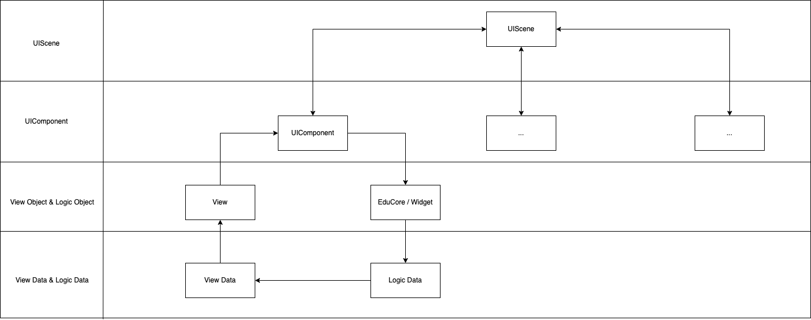

该文档以 AgoraEduUI 为例，AgoraProctorUI 与之相似，不另做介绍

# 文件夹介绍
`AgoraEduUI` 的源码位于 CloudClass-iOS 仓库 `/SDKs/AgoraEduUI/Classes` 目录下，核心项目结构介绍如下

| 文件夹         | 描述                                                         |
| :------------- | :----------------------------------------------------------- |
| `/Scenes`       | 在灵动课堂中提供场景的 `UIScene`，如一对一课堂、小班课等。 |
| `/Components`  | 灵动课堂使用的 UI 组件 	`UIComponent`，如花名册、状态栏等。 |
| `/Configs`      | 灵动课堂的 UI 配置，用于设置颜色，字体，图片等 |
| `/Views` | 灵动课堂使用的 UI 元素，如视频渲染窗口、设置界面等。         |
| `/Models` | 用于在 `AgoraEduUI` 中的数据模型。 |

# 交互层架构
灵动课堂的交互层和逻辑层是相符分离，交互层的架构与设计模式如下图所示



## UIScene
* 业务场景的抽象，例如 FcrOneToOneUIScene
* 管理所有的 UIComponent

## UIComponent
* 业务功能的抽象，例如 FcrOneToOneTachedWindowUIComponent
* 管理视图对象与逻辑对象


## View Object
* 视图对象，负责视图数据的显示与响应用户交互，例如 FcrWindowRenderView

## Logic Object
* 逻辑对象，提供功能 API 给 UIComponent 调用，例如 AgoraEduMediaContext.openLocalDeivce

## Logic Data
* 由 Logic Object 输出的逻辑数据，例如 AgoraEduContextStreamInfo

## View Data
* 由 Logic Data 转换而来，为视图展示所需要的数据，例如 FcrStreamWindowViewData

# UIConfig
UI 配置，用于设置颜色、字体、图片等。源文件位于 `SDKs/AgoraEduUI/Classes/Configs` 下，分为两个文件夹 Scenes 与 Theme。

## Theme
提供与主题相关的设置，例如明亮模式与暗黑模式，前景色，字体样式等

| Theme              | 说明                   |
| :-------------     | :-------------        |
| `FcrUIMode`        | 明亮模式、暗夜模式       | 
| `FcrUIColorGroup ` | 灵动课堂所使用的通用颜色  | 
| `FcrUIFontGroup `  | 灵动课堂所使用的通用字体  |
| `FcrUIFrameGroup ` | 灵动课堂所使用的通用尺寸  |


举例，修改明亮模式下的系统背景色：

```
struct FcrUIColorGroup {
	```
	static var systemBackgroundColor: UIColor {
        switch UIMode {
        case .agoraLight: return .green
        case .agoraDark:  return UIColor(hex: 0x262626)!
        }
    }
	```
}
```


## Scenes
为每个 UIScene、UIComponent、View Obejct 提供具体的配置属性，大部分的属性的值会来自于 Theme 下定义好的通用属性值，例如

```
struct FcrUIComponentStateBar: FcrUIComponentProtocol {
	```
    var backgroundColor: UIColor = FcrUIColorGroup.systemForegroundColor
	```    
}
```

| UICofig          | 交互层级          | 举例|
| :-------------   | :-------------  |:-------------
| `UIConfig`       | `UIScene`       | FcrOneToOneConfig -> FcrOneToOneScene
| `UIComponent`    | `UIComponent`   | FcrUIComponentStateBar -> FcrRoomStateUIComponent |
| `UIItem`         | `View Object`   | FcrUIItemStateBarNetworkState -> AgoraRoomStateBar.netStateView |


举例，修改状态栏的背景颜色：

```
struct FcrUIComponentStateBar: FcrUIComponentProtocol {
	```
    var backgroundColor: UIColor = .blue
	```    
}
```


# 资源文件
灵动课堂所使用的图片、动图、文案等资源文件都位于 `SDKs/AgoraEduUI/Assets/` 下

| 文件夹              | 说明                        |
| :-------------     | :-------------             |
| `images.xcassets`  | 存放所有的 png               | 
| `others `          | 非 png 文件，包括动图、文案等  | 

## 增加新语言
* 在 `others `  文件夹下，复制一个 en.Iproj，然后将它重命名为新语言的 Iproj，再将里面的 Localizable.strings 里的 value 都替换为新语言的值
* 在进入房间前，将 AgoraUIBaseViews 里的全局变量 agora_ui_language 设置为新语言，再进入房间后，即可生效
