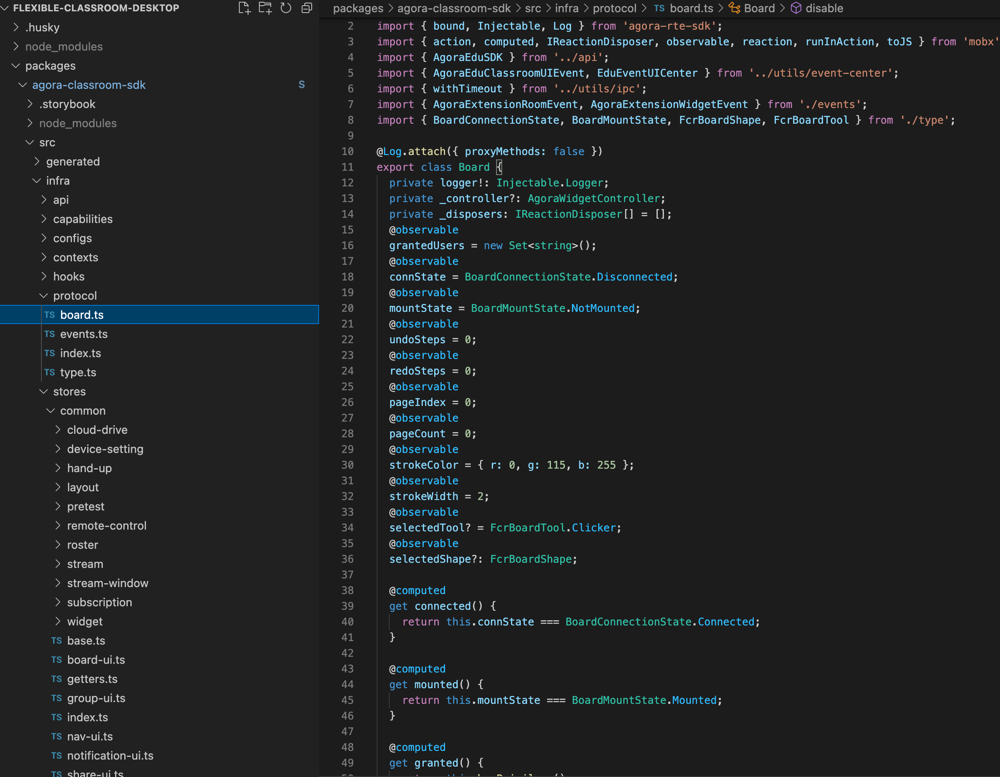

灵动课堂中的白板模块是基于 AgoraWidget 实现的。如果你想在房间内开启或关闭白板功能，可通过设置 Widget 的状态（活跃或非活跃）实现。

## Desktop

我们在2.8中封装了启用和禁用白板的功能，通过调用这些API，用户可以控制是否显示白板。


实现白板模块开关逻辑如下：

1、我们把白板界面打包在这个目录下：packages/agora-classroom-sdk/src/infra/stores/common/base.ts文件夹：

```typescript
/**
  * Board releated APIs
  */
 get boardApi() {
   return EduUIStoreBase._boardApi;
 }
```

2、白板相关的接口在这个文件中
包/agora-classroom-sdk/src/infra/protocol/board.ts:




```typescript
/**
 * whether the board is connected to server
 */
@computed
get connected() {
  return this.connState === BoardConnectionState.Connected;
}
 
/**
 * whether the board is mounted in client
 */
@computed
get mounted() {
  return this.mountState === BoardMountState.Mounted;
}
 
/**
 * whether the current user is granted to operate on the board
 */
@computed
get granted() {
  return this.hasPrivilege();
}
 
/**
 * connect and show the board
 */
enable() {
  this._sendBoardCommandMessage(AgoraExtensionRoomEvent.ToggleBoard, true);
}
 
/**
 * disconnect and hide the board
 */
disable() {
  this._sendBoardCommandMessage(AgoraExtensionRoomEvent.ToggleBoard, false);
}
```


3、所以如果你想隐藏白板

调用这个 api：

```typescript
this.boardApi.disable();
```

如果你想启用白板
调用这个 api：
```typescript
this.boardApi.enable();
```
