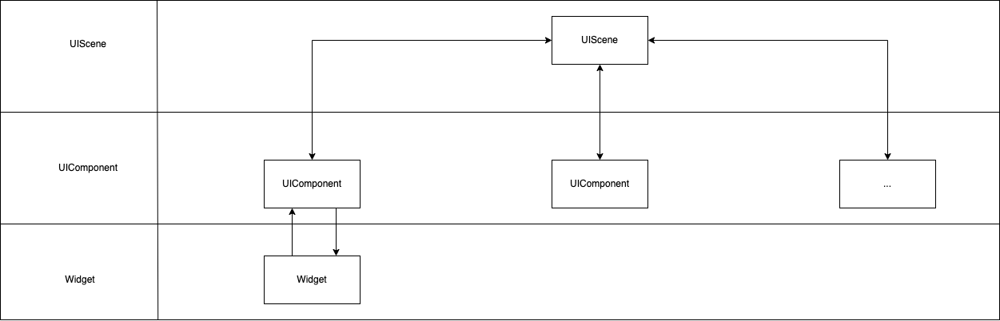

## 概览
灵动课堂提供 Widget 帮助用户根据自身的需求开发插件并内嵌至课堂内。Widget 是包含界面与功能的独立插件。开发者可基于 `AgoraBaseWidget` 自定义实现一个 Widget，在 Classroom SDK 内注册该 Widget，然后在教室使用该 widget。Classroom SDK 支持注册多个 Widget。

在灵动课堂教育场景中，基于 Widget 实现的业务功能包括白板，倒计时，投票器以及答题器等。

<div class="alert info">声网提供了预定义的基于 Widget 实现的插件，包括倒计时、投票器和答题器等。你可在 <a href="https://github.com/AgoraIO-Community/apaas-extapp-ios">apaas-extapp-ios</a> 仓库中查看这些插件的源码。</div>

## 技术原理


* 灵动课堂以 Widget ID 作为 widget 的唯一标识符，在服务端分配独立的数据空间。
* 基于 `AgoraBaseWidget` 的子类与 `AgoraEduWidgetContext` 提供的 API 与回调，可以灵活实现各种业务功能。
* 灵动课堂不会涉及 Widget 的具体业务功能，在 Widget 外部通过通用的 API 与回调进行通讯。

## 功能介绍

### 房间属性与用户属性
* 每个继承于 `AgoraBaseWidget` 的子类，当通过 `AgoraEduWidgetContext.create` 来创建对象后，可通过属性 `info` 来获取到当前的房间信息和用户信息。
* 可以通过 `updateWidgetRoomProperties`，`deleteWidgetRoomProperties`，`updateWidgetUserProperties`，`deleteWidgetUserProperties` 来增加或删除自定义属性，从而实现业务逻辑。
* Widget 对象创建后自定义的属性变化，可以通过 `onWidgetRoomPropertiesUpdated`，`onWidgetRoomPropertiesDeleted`，`onWidgetUserPropertiesUpdated`，`onWidgetUserPropertiesDeleted` 进行监听。


### 消息发送与接收
* Widget 向外发送消息: 调用 Widget 的 `sendMessage` 方法发送消息。同时可以通过 `AgoraEduWidgetContext` 的 `addWidgetMessageObserver` 注册某个对象成为消息的观察者，来监听发出的消息。

* 向 Widget 发送消息: 调用 `AgoraEduWidgetContext` 的 `sendMessageToWidget:message` 方法。

* Widget 接收消息：`onMessageReceived` 回调可以接收到外部发送进来的消息。

### 活跃状态
Widget 中定义了 widget 的状态（`Activity`），开发者可以通过 `AgoraEduWidgetContext` 的 `setWidgetActive` 与 `setWidgetInactive` 来进行状态切换，以及通过 `AgoraEduWidgetContext` 的 `addWidgetActivityObserver` 来注册监听。

开发者可以通过 `Activity` 来控制 Widget 的行为，例如当状态为非活跃时销毁 Widget 对象或者隐藏 Widget 对象的视图。

- 当调用 `setWidgetActive` 方法将一个 `userUuid` 作为 `ownerUuid` 的时候，会将该 Widget 与该 `UserUuid` 绑定，当该用户离开房间时，会触发绑定的 `WidgetId` 的 `onWidgetInactive` 回调。
	
- 当调用 `setWidgetInactive` 方法将 `true` 传入 `isRemove` 参数时，会将 Widget 存在服务端的 `roomProperties` 数据删除。

### 位置与尺寸同步
如果本地 widget 的位置与尺寸发生变化，开发者可以通过 `AgoraEduWidgetContext` 的 `updateWidgetSyncFrame` 来更新远端 Widget 的位置与尺寸，以及通过 `AgoraEduWidgetContext` 的 `addObserverForWidgetSyncFrame` 来注册监听。

## 实现步骤

本节以倒计时插件为例，介绍通过 Widget 实现自定义插件并在灵动课堂内嵌入该插件的基本步骤。

<div class="alert info">可在 <a href="https://github.com/AgoraIO-Community/apaas-extapp-ios">apaas-extapp-ios</a> 仓库中 <code>/AgoraWidgets/CountdownTimer</code> 文件夹查看倒计时插件的完整代码。</div>

### 1. 实现 Widget

参考以下步骤实现自定义 Widget:

1. 在 `AgoraCountdownTimerWidget` 中引入 `AgoraWidget` 库：

   ```swift
   import AgoraWidget
   ```

2. 在 `onLoad` 方法中初始化 Widget 的界面与数据：

   ```swift
   public override func onLoad() {
        super.onLoad()
        initViews() 
        initConstraints()
        updateData()
        updateViewFrame()
   }
   ```

3. 监听 `onWidgetRoomPropertiesUpdated` 与 `onMessageReceived` 回调，进行数据更新：

   ```swift
    public override func onWidgetRoomPropertiesUpdated(_ properties: [String : Any],
                                                       cause: [String : Any]?,
                                                       keyPaths: [String],
                                                       operatorUser: AgoraWidgetUserInfo?) {
        super.onWidgetRoomPropertiesUpdated(properties,
                                            cause: cause,
                                            keyPaths: keyPaths,
                                            operatorUser: operatorUser)
        updateData()
    }
    
    public override func onMessageReceived(_ message: String) {
        super.onMessageReceived(message)
        
        if let serverTime = message.toSyncTimestamp() {
            timeDiff = serverTime - Int64(Date().timeIntervalSince1970) * 1000
        }
    }
   ```

4. 如果需要改动 Widget 尺寸，可以通过 `sendMessage` 向外发出一条消息，由外部监听消息的父容器来更新 Widget 的尺寸：

   ```swift
   func updateViewFrame() {
        let size = ["width": countdownView.neededSize.width,
                    "height": countdownView.neededSize.height]
        
        guard let message = ["size": size].jsonString() else {
            return
        }
        
        sendMessage(message)
    }
   ```

### 2. 在声网 Classroom SDK 中注册 Widget

在 `AgoraEduLaunchConfig.widgets` 中加入倒计时插件的配置 `AgoraWidgetConfig`，通过调用 `launch` 时将实现好的插件注册到声网 Classroom SDK 中。参考以下示例代码：

```swift
   let launchConfig = AgoraEduLaunchConfig(userName: userName,          
                                           userUuid: userUuid,          
                                           userRole: userRole,          
                                           roomName: roomName,          
                                           roomUuid: roomUuid,          
                                           roomType: roomType,          
                                           appId: appId,                
                                           token: token,                
                                           startTime: nil,              
                                           duration: nil,               
                                           region: region,              
                                           mediaOptions: mediaOptions,  
                                           userProperties: nil)         
 
let widgetId = "countdownTimer"
 
launchConfig.widgets[widgetId] = AgoraWidgetConfig(with: AgoraCountdownTimerWidget.self,
                                                   widgetId: widgetId)
 
AgoraClassroomSDK.launch(launchConfig,
                         success: successBlock,
                         failure: failureBlock)
```

### 3. 在教室中使用 Widget


在灵动课堂的交互层设计中，Widget 由对应的 UIComponent 管理，这样可以隐藏 component 与 widget 之间较为复杂的通讯方式，以及在架构上与其它的 UIComponent 保持一致。


参考以下步骤实现在教室中使用倒计时插件的相关逻辑：

1. 通过 `AgoraEduContext.widget` 的 `addWidgetActivityObserver` 方法将 `AgoraClassToolsUIComponent` 添加为 widget activity 的观察者，监听 activity 的回调：

   ```swift
       // 调用 addWidgetActivityObserver 方法

       widgetController.add(self) 
   ```

2. 通过 `AgoraWidgetActivityObserver` 监听 activity 的回调，并相应创建或销毁 widget：

   ```swift
   extension AgoraClassToolsViewController: AgoraWidgetActivityObserver {
       // 收到 onWidgetActive 回调时，创建 Widget

       func onWidgetActive(_ widgetId: String) {
           createWidget(widgetId)
       }
        
       // 收到 onWidgetInactive 回调时，销毁 Widget
       func onWidgetInactive(_ widgetId: String) {
           releaseWidget(widgetId)
       }
   }
   ```

3. 创建 `AgoraCountdownTimer` 的 Widget 对象并实现 Widget 在本地客户端的通讯：

   ```swift
   // 调用 createWidget 方法创建 AgoraCountdownTimer 的 Widget 对象

   func createWidget(_ widgetId: String) {
       let widgetController = contextPool.widget
        
       guard widgetIdList.contains(widgetId),
             // 调用 getWidgetConfig 获取 AgoraCountdownTimer 的 AgoraWidgetConfig

             let config = widgetController.getWidgetConfig(widgetId) else {
           return
       }
        
       if let _ = getWidget(widgetId) {
           return
       }
        
       // 通过 AgoraWidgetContext 的 addObserverForWidgetSyncFrame 将 AgoraClassToolsViewController 添加为 Widget syncFrame 的观察者，监听位置和尺寸变化的回调

       widgetController.addObserver(forWidgetSyncFrame: self,
                                    widgetId: widgetId)
       // 通过 AgoraWidgetContext 的  addWidgetMessageObserver 将 AgoraClassToolsViewController 添加为 widget message 的观察者，监听消息的回调

       widgetController.add(self,
                            widgetId: widgetId)
        
       let widget = widgetController.create(config)
        
       view.addSubview(widget.view)
        
       switch widgetId {
       case PollWidgetId:
           pollWidget = widget
       case CountdownTimerWidgetId:
           countdownTimerWidget = widget
       case PopupQuizWidgetId:
           popupQuizWidget = widget
       default:
           return
       }
        
       sendWidgetCurrentTimestamp(widgetId)
   }
    
   func sendWidgetCurrentTimestamp(_ widgetId: String) {
       let syncTimestamp = contextPool.monitor.getSyncTimestamp()
       let tsDic = ["syncTimestamp": syncTimestamp]
        
       if let string = tsDic.jsonString() {
           // 调用 sendMessage 方法，将当前时间戳发给 Widget 

           contextPool.widget.sendMessage(toWidget: widgetId,
                                          message: string)
       }
   }
   ```

4. 监听 `syncFrame` 的回调方法：

   ```swift
   extension AgoraClassToolsViewController: AgoraWidgetSyncFrameObserver {
       // 当收到 syncFrame 回调时，AgoraClassToolsViewController 作为父容器更新 Widget 的位置与尺寸

       func onWidgetSyncFrameUpdated(_ syncFrame: CGRect,
                                     widgetId: String,
                                     operatorUser: AgoraWidgetUserInfo?) {
           let size = getWidgetSize(widgetId)
           updateWidgetFrame(widgetId,
                             size: size)
       }
   }
   ```

5. 监听 message 的回调方法：

   ```swift
   extension AgoraClassToolsViewController: AgoraWidgetMessageObserver {
       // 当收到 message 回调时，AgoraClassToolsViewController 作为父容器来更新 Widget 的尺寸

       func onMessageReceived(_ message: String,
                              widgetId: String) {
           if let size = parseSizeMessage(widgetId: widgetId,
                                          message: message) {
               updateWidgetFrame(widgetId,
                                 size: size)
           }
       }
   }
   ```

## API 参考

### AgoraBaseWidget

`AgoraBaseWidget` 是 Widget 的基类，实现具体功能的 Widget 需要继承该类。

#### 成员

| 名称   | 类型              | 描述                                               |
| :----- | :---------------- | :------------------------------------------------- |
| `info` | `AgoraWidgetInfo` | Widget 所需的基础信息 |
| `view` | View              | Widget 的容器 view                                 |

#### updateWidgetRoomProperties

```objc
- (void)updateWidgetRoomProperties:(NSDictionary<NSString *, id> *)properties
                             cause:(NSDictionary<NSString *, id> * _Nullable)cause
                           success:(AgoraWidgetCompletion _Nullable)success
                           failure:(AgoraWidgetErrorCompletion _Nullable)failure
```

更新 Widget 的房间属性。更新的房间属性会通过 `onWidgetRoomPropertiesUpdated` 回调传给 Widget。

**参数**

| 名称         | 类型               | 描述                                                      |
| :----------- | :----------------- | :-------------------------------------------------------- |
| `properties` | `NSDictionary<NSString *, id>` | 需要更新的 properties，支持 keyPath，只需要传入待更新的值 |
| `cause`      | `NSDictionary<NSString *, id>` | 更新的原因，可以为空                                      |
| `success`    | `AgoraWidgetCompletion`   | 请求成功                                                  |
| `failure`    | `AgoraWidgetErrorCompletion`  | 请求失败，返回一个 error                                  |

#### deleteWidgetRoomProperties

```objc
- (void)deleteWidgetRoomProperties:(NSArray<NSString *> *)keyPaths
                             cause:(NSDictionary<NSString *, id> * _Nullable)cause
                           success:(AgoraWidgetCompletion _Nullable)success
                           failure:(AgoraWidgetErrorCompletion _Nullable)failure
```

删除 Widget 的房间属性。删除的房间属性会通过 `onWidgetRoomPropertiesDeleted` 回调传给 Widget。

**参数**

| 名称      | 类型               | 描述                                            |
| :-------- | :----------------- | :---------------------------------------------- |
| `keyPaths`    | `NSArray<NSString *>`    | 需要删除的 properties 的 key 数组，支持 keyPath |
| `cause`   | `NSDictionary<NSString *, id>` | 更新的原因，可以为空                            |
| `success` | `AgoraWidgetCompletion`   | 请求成功                                        |
| `failure` | `AgoraWidgetErrorCompletion`  | 请求失败，返回一个 error                        |

#### updateWidgetUserProperties

```objc
- (void)updateWidgetUserProperties:(NSDictionary<NSString *, id> *)properties
                             cause:(NSDictionary<NSString *, id> * _Nullable)cause
                           success:(AgoraWidgetCompletion _Nullable)success
                           failure:(AgoraWidgetErrorCompletion _Nullable)failure
```

更新 Widget 的用户属性。更新的房间属性会通过 `onWidgetUserPropertiesUpdated` 回调传给 Widget。

**参数**

| 名称         | 类型               | 描述                                                      |
| :----------- | :----------------- | :-------------------------------------------------------- |
| `properties` | `NSDictionary<NSString *, id>` | 需要更新的 properties，支持 keyPath，只需要传入待更新的值 |
| `cause`      | `NSDictionary<NSString *, id>` | 更新的原因，可以为空                                      |
| `success`    | `AgoraWidgetCompletion `   | 请求成功                                                  |
| `failure`    | `AgoraWidgetErrorCompletion `  | 请求失败，返回一个 error                                  |

#### deleteWidgetUserProperties

```objc
- (void)deleteWidgetUserProperties:(NSArray<NSString *> *)keyPaths
                             cause:(NSDictionary<NSString *, id> * _Nullable)cause
                           success:(AgoraWidgetCompletion _Nullable)success
                           failure:(AgoraWidgetErrorCompletion _Nullable)failure
```

删除 Widget 的用户属性。删除的房间属性会通过 `onWidgetUserPropertiesDeleted` 回调传给 Widget。

**参数**

| 名称      | 类型               | 描述                                            |
| :-------- | :----------------- | :---------------------------------------------- |
| `keyPaths`    | `NSArray<NSString *>`    | 需要删除的 properties 的 key 数组，支持 keyPath |
| `cause`   | `NSDictionary<NSString *, id>` | 更新的原因，可以为空                            |
| `success` | `AgoraWidgetCompletion`   | 请求成功                                        |
| `failure` | `AgoraWidgetErrorCompletion`  | 请求失败，返回一个 error                        |

#### sendMessage

```objc
- (void)sendMessage:(NSString *)message
```

发送消息给观察者。

**参数**

| 名称      | 类型     | 描述     |
| :-------- | :------- | :------- |
| `message` | `NSString ` | 消息内容 |

#### onLoad

```objc
- (void)onLoad
```

Widget 加载完成。

#### onMessageReceived

```objc
- (void)onMessageReceived:(NSString *)message
```

Widget 收到消息。

调用 WidgetContext 协议中的 `sendMessageToWidget` 后会触发此回调。

**参数**

| 名称      | 类型     | 描述     |
| :-------- | :------- | :------- |
| `message` | `NSString` | 消息内容 |

#### onLocalUserInfoUpdated

```objc
- (void)onLocalUserInfoUpdated:(AgoraWidgetUserInfo *)localUserInfo
```

Widget 收到本地用户信息更新。

**参数**

| 名称            | 类型                  | 描述           |
| :-------------- | :-------------------- | :------------- |
| `localUserInfo` | `AgoraWidgetUserInfo` | 本地的用户信息 |

#### onRoomInfoUpdated

```objc
- (void)onRoomInfoUpdated:(AgoraWidgetRoomInfo *)roomInfo
```

Widget 收到房间信息更新。

**参数**

| 名称       | 类型                  | 描述     |
| :--------- | :-------------------- | :------- |
| `roomInfo` | `AgoraWidgetRoomInfo` | 房间信息 |

#### onWidgetRoomPropertiesUpdated

```objc
- (void)onWidgetRoomPropertiesUpdated:(NSDictionary<NSString *,id> *)properties
                                cause:(NSDictionary<NSString *,id> * _Nullable)cause
                             keyPaths:(NSArray<NSString *> *)keyPaths
                         operatorUser:(AgoraWidgetUserInfo *_Nullable)operatorUser
```

Widget 收到房间属性更新。

**参数**

| 名称         | 类型               | 描述                      |
| :----------- | :----------------- | :------------------------ |
| `properties`   | `NSDictionary<NSString *,id>` | 最终完整的属性            |
| `cause`        | `Map<String: Any>` | 原因，可以为空            |
| `keyPaths`     | `NSArray<NSString *>`    | 发生改变的属性的 key 数组 |
| `operatorUser` | `AgoraWidgetUserInfo` | 操作者，可以为空            |

#### onWidgetRoomPropertiesDeleted

```objc
- (void)onWidgetRoomPropertiesDeleted:(NSDictionary<NSString *,id> * _Nullable)properties
                                cause:(NSDictionary<NSString *,id> * _Nullable)cause
                             keyPaths:(NSArray<NSString *> *)keyPaths
                         operatorUser:(AgoraWidgetUserInfo *_Nullable)operatorUser
```

Widget 收到房间属性删除。

**参数**

| 名称         | 类型               | 描述                  |
| :----------- | :----------------- | :-------------------- |
| `properties`   | `NSDictionary<NSString *,id>` | 最终完整的属性            |
| `cause`        | `Map<String: Any>` | 原因，可以为空            |
| `keyPaths`     | `NSArray<NSString *>`    | 发生改变的属性的 key 数组 |
| `operatorUser` | `AgoraWidgetUserInfo` | 操作者，可以为空            |


#### onWidgetUserPropertiesUpdated

```objc
- (void)onWidgetUserPropertiesUpdated:(NSDictionary<NSString *,id> *)properties
                                cause:(NSDictionary<NSString *,id> * _Nullable)cause
                             keyPaths:(NSArray<NSString *> *)keyPaths
                         operatorUser:(AgoraWidgetUserInfo *_Nullable)operatorUser
```

Widget 收到用户属性更新。

**参数**

| 名称         | 类型               | 描述                  |
| :----------- | :----------------- | :-------------------- |
| `properties`   | `NSDictionary<NSString *,id>` | 最终完整的属性            |
| `cause`        | `Map<String: Any>` | 原因，可以为空            |
| `keyPaths`     | `NSArray<NSString *>`    | 发生改变的属性的 key 数组 |
| `operatorUser` | `AgoraWidgetUserInfo` | 操作者，可以为空            |

#### onWidgetUserPropertiesDeleted

```objc
- (void)onWidgetUserPropertiesDeleted:(NSDictionary<NSString *,id> * _Nullable)properties
                                cause:(NSDictionary<NSString *,id> * _Nullable)cause
                             keyPaths:(NSArray<NSString *> *)keyPaths
                         operatorUser:(AgoraWidgetUserInfo *_Nullable)operatorUser;                                   
```

Widget 收到用户属性删除。

**参数**

| 名称         | 类型               | 描述                  |
| :----------- | :----------------- | :-------------------- |
| `properties`   | `NSDictionary<NSString *,id>` | 最终完整的属性            |
| `cause`        | `Map<String: Any>` | 原因，可以为空            |
| `keyPaths`     | `NSArray<NSString *>`    | 发生改变的属性的 key 数组 |
| `operatorUser` | `AgoraWidgetUserInfo` | 操作者，可以为空            |