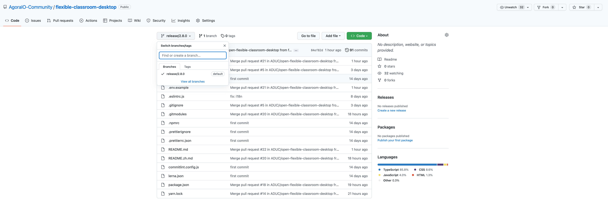

<!-- f38d4cd0-3fce-11ed-8dae-bf25bf08a626 的具体内容如下 -->

1. 打开终端，运行以下命令克隆仓库到本地：

    ```bash
    git clone https://github.com/AgoraIO-Community/flexible-classroom-desktop.git
    ```

2. 运行以下命令进入 `flexible-classroom-desktop` 目录并切换分支至指定版本。将 {VERSION} 替换为要切换的版本号：

    ```bash
    cd flexible-classroom-desktop
    ```

    ```bash
    git checkout release/{VERSION}
    ```

    例如要切换到 2.8.0 版本分支，执行以下命令：

    ```bash
    git checkout release/2.8.0
    ```

    声网建议你切换到最新发版分支。参考下图在 GitHub 仓库中查看最新发版分支：

    

3. 运行以下命令拉取子模块：

   ```bash
    git submodule update --init --recursive packages/agora-classroom-sdk
    git submodule update --init --recursive packages/agora-proctor-sdk
    git submodule update --init --recursive packages/agora-plugin-gallery
   ```
