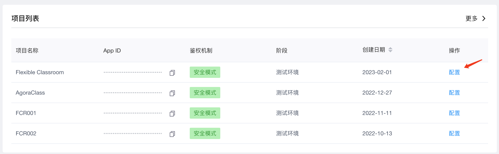
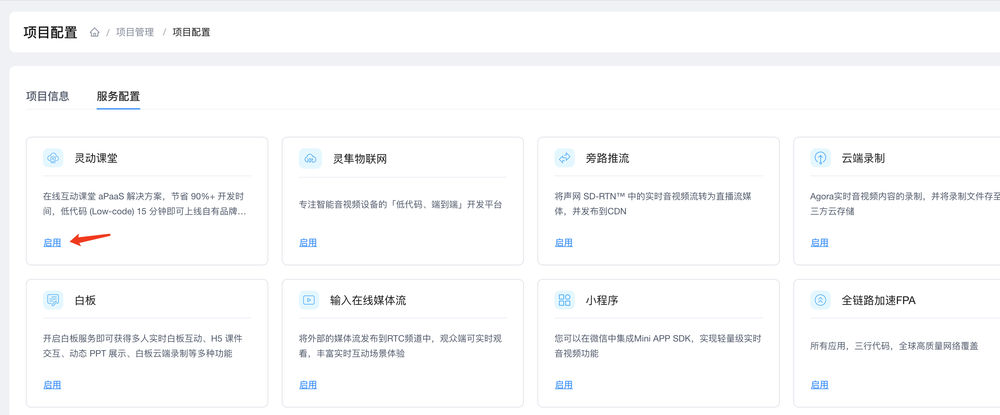
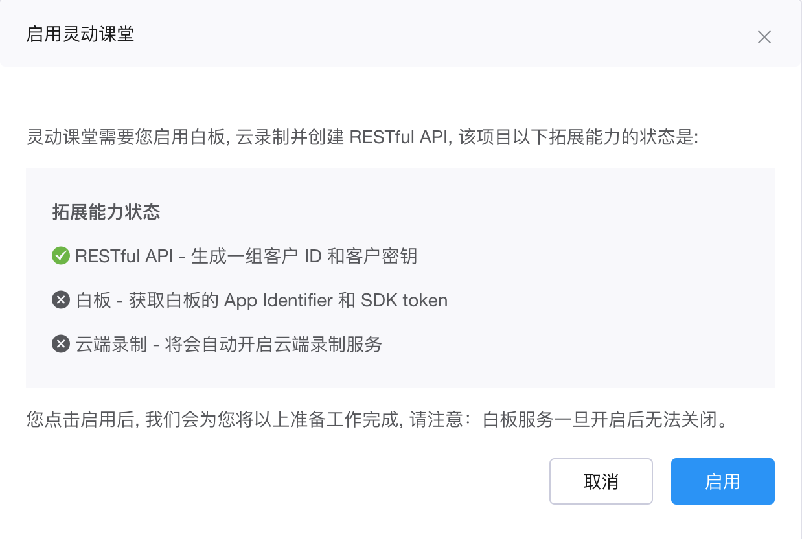
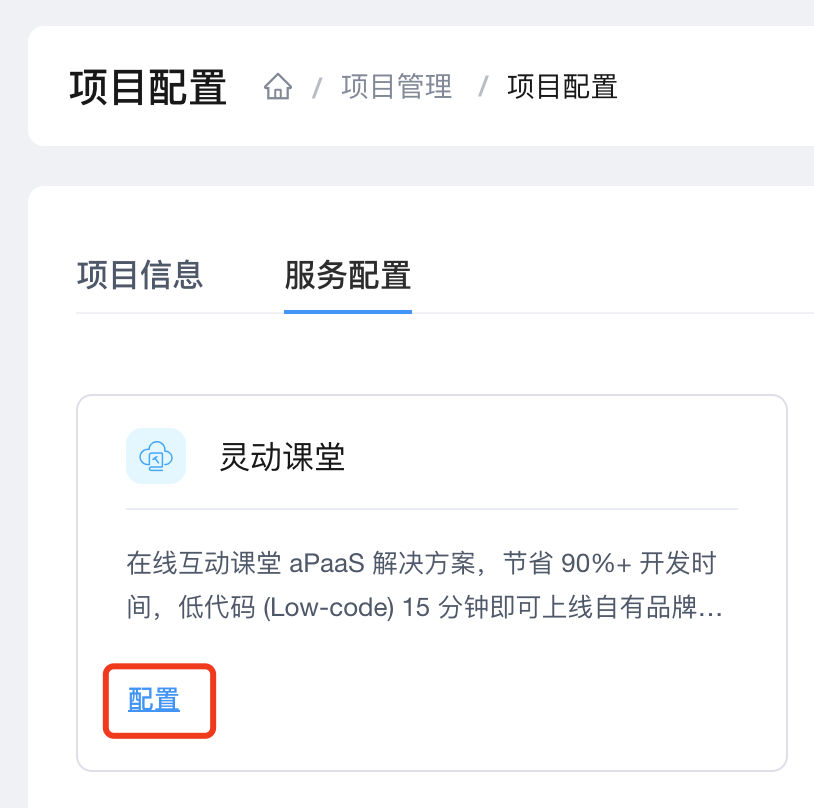

本文介绍如何在 Agora 控制台开通灵动课堂服务。

## 操作步骤

### 1. 创建 Agora 开发者账号

前往 <a href="https://sso.agora.io/cn/signup/" target="_blank">Agora 注册页面</a>，按照屏幕提示完成注册。

### 2. 创建一个 Agora 项目

~4c028930-19e2-11eb-b0e2-eb6c69fefbc6~

参考以下步骤创建一个声网项目：

进入声网控制台的项目管理页面。
在项目管理页面，点击+创建项目按钮。
在弹出的对话框内输入项目名称、使用场景，然后选择安全模式： APP ID + Token。
点击提交按钮。新建的项目会显示在项目管理页中。

### 3. 开通灵动课堂服务

按照以下步骤，在 Agora 控制台开通灵动课堂服务：

1. 进入 Agora 控制台的<a href="https://console.agora.io/projects" target="_blank">项目管理</a>页面，选择需要开通灵动课堂服务的项目，点击**编辑**按钮。

   
   <!--  -->

2. 在**服务配置**下，找到**灵动课堂**，点击**启用**。

   <!--  -->
   

3. 仔细阅读弹窗提示，点击**启用**。

   <!--  -->
   

4. 成功开通灵动课堂服务后，状态会变为"配置"，开启按钮会切换为配置按钮，如下图所示。

   <!--  -->
   

   如果要在灵动课堂中使用互动白板、实时录制和实时消息功能，必须对配置白板、实时消息、实时录制相关模块的存储和权限进行配置，否则无法使用。

## 后续步骤

成功开通灵动课堂服务后，接下来你可根据目标平台、参考以下文档快速跑通灵动课堂 GitHub 项目并体验灵动课堂：

-   [配置灵动课堂 (Web)](/cn/agora-class/agora_class_configure?platform=Web)
-   [配置灵动课堂 (Android)](/cn/agora-class/agora_class_configure?platform=Android)
-   [配置灵动课堂 (iOS)](/cn/agora-class/agora_class_configure?platform=iOS)
-   [配置灵动课堂 (Electron)](/cn/agora-class/agora_class_configure?platform=Electron)

请注意，快速体验暂不支持实时消息功能。如需试用实时消息功能，你还需配置灵动课堂中的环信 IM 模块，参考<a href="/cn/agora-class/agora_class_configure#配置环信-im">配置环信 IM</a>。
