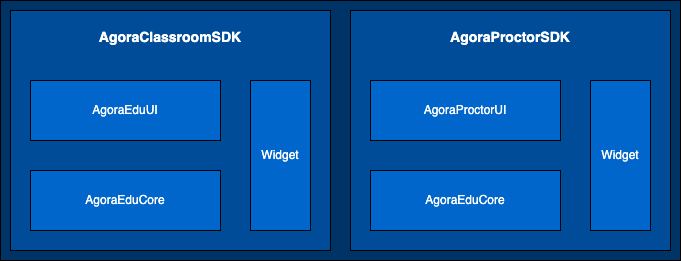

本文详细介绍如何将灵动课堂集成到你自己的 iOS 项目中。

## 技术原理

灵动课堂包含以下库：

-   `AgoraClassroomSDK`: 灵动课堂-教育场景的胶水层，串联起 `AgoraEduUI` 和 `AgoraEduCore`。`AgoraClassroomSDK` 在 GitHub 与 CocoaPods 上开源发布。
-   `AgoraEduUI`: 提供灵动课堂-教育场景交互层的代码，并包含交互层所使用的文案信息和资源文件。`AgoraEduCore` 为该层提供灵动课堂中的能力与数据。`AgoraEduUI` 在 GitHub 与 CocoaPods 上开源发布。
-   `AgoraProctorSDK`: 灵动课堂-监考场景的胶水层，串联起 `AgoraProctorUI ` 和 `AgoraEduCore`。`AgoraProctorSDK ` 在 GitHub 与 CocoaPods 上开源发布。
-   `AgoraProctorUI`: 提供灵动课堂-监考场景交互层的代码，并包含交互层所使用的文案信息和资源文件。`AgoraEduCore` 为该层提供灵动课堂中的能力与数据。`AgoraProctorUI ` 在 GitHub 与 CocoaPods 上开源发布。
-   `AgoraEduCore`: 提供灵动课堂中的能力与数据。`AgoraEduCore` 闭源，以二进制包在 CocoaPods 上发布。
-   `Widget`: 包含界面与功能的独立插件，由 `AgoraClassroomSDK` 或 `AgoraEduCore` 注入灵动课堂内。`Widget` 与 `Widget` 之间，以及与 UI 层中的其他组件都能进行通讯。

下图展示了灵动课堂的架构。

 // TODO

## 通过 CocoaPods 集成灵动课堂-教育场景

如果你使用灵动课堂-教育场景的默认 UI，无需修改灵动课堂-教育场景的代码，则可参考以下步骤通过 CocoaPods 添加远程依赖集成完整的灵动课堂-教育场景：

1. 用 Xcode 打开你的项目，在项目的 `Podfile` 文件中添加以下引用：

   ```
   # third libs
   pod 'Protobuf', '3.17.0'
   pod 'CocoaLumberjack', '3.6.1'
   pod 'AliyunOSSiOS', '2.10.8'
   pod 'Armin', '1.1.0'
   pod 'SSZipArchive', '2.4.2'
   pod 'SwifterSwift', '5.2.0'
   pod 'Masonry', '1.1.0'
   pod 'SDWebImage', '5.12.0'
   
   # agora libs
   pod 'AgoraRtcEngine_iOS/RtcBasic', '3.6.2'
   pod 'AgoraMediaPlayer_iOS', '1.3.0'
   pod 'AgoraRtm_iOS', '1.4.8'
   pod 'Agora_Chat_iOS', '1.0.6'
   pod 'Whiteboard', '2.16.39'

   # open source libs
   pod 'AgoraClassroomSDK_iOS', '2.8.0'
   pod 'AgoraEduUI', '2.8.0'
   pod 'AgoraWidgets', '2.8.0'
   
   # close source libs
   pod 'AgoraUIBaseViews', '2.8.0'
   pod 'AgoraEduCore', '2.8.0'
   pod 'AgoraWidget', '2.8.0'
   ```
2. 在终端中进入到工程目录，执行 `pod install` 命令安装依赖包。安装过程如下图所示：

    // TODO

3. 通过以下代码导入头文件：

   ```swift
   /* Swift */
   import AgoraClassroomSDK_iOS
   ```

   ```objc
   /* Objective-C */
   import <AgoraClassroomSDK_iOS/AgoraClassroomSDK.h>
   ```

4. 调用 [AgoraClassroomSDK.launch](/cn/agora-class/agora_class_api_ref_ios?platform=iOS#launch) 方法启动灵动课堂-教育场景。示例代码如下：

   ```swift
   /* Swift */
   
   let launchConfig = AgoraEduLaunchConfig(userName: userName,          // 用户名 
                                           userUuid: userUuid,          // 用户 ID
                                           userRole: userRole,          // 用户角色
                                           roomName: roomName,          // 房间名
                                           roomUuid: roomUuid,          // 房间 ID
                                           roomType: roomType,          // 房间类型
                                           appId: appId,                // Agora App Id
                                           token: token,                // 测试环境下，你可以使用临时 Token；生产或安全环境下，强烈建议你使用服务器生成的 Token
                                           startTime: nil,              // 课堂开始时间
                                           duration: nil,               // 课堂持续时长
                                           region: region,              // 区域
                                           mediaOptions: mediaOptions,  // 媒体相关配置
                                           userProperties: nil)         // 用户自定义属性

   AgoraClassroomSDK.setDelegate(self)
   
   AgoraClassroomSDK.launch(launchConfig,
                            success: successBlock,
                            failure: failureBlock)
   ```

   ```objc
	/* Objective-C */
   AgoraEduLaunchConfig *launchConfig = [[AgoraEduLaunchConfig alloc] initWithUserName:userName            // 用户名 
                                                                              userUuid:userUuid            // 用户 ID
                                                                              userRole:userRole            // 用户角色
                                                                              roomName:roomName            // 房间名
                                                                              roomUuid:roomUuid            // 房间 ID
                                                                              roomType:roomType            // 房间类型
                                                                              appId:appId                  // Agora App Id
                                                                              token:token                  // 测试环境下，你可以使用临时 Token；生产或安全环境下，强烈建议你使用服务器生成的 Token
                                                                              startTime:nil                // 课堂开始时间
                                                                              duration:nil                 // 课堂持续时长
                                                                              region:region                // 区域
                                                                              mediaOptions:mediaOptions    // 媒体相关配置
                                                                              userProperties:nil];         // 用户自定义属性
                                                                    
   [AgoraClassroomSDK setDelegate:self];

   [AgoraClassroomSDK launch:launchConfig
                     success:successBlock
                     failure:failureBlock];
   ```

   示例代码中需要传入 `token`。你可以参考[TODO 获取 RTM Token](/cn/Agora%20Platform/get_appid_token?platform=All%20Platforms#获取-rtm-token) 了解什么是 RTM Token，如何获取测试用途的临时 RTM Token，如何从服务器生成 RTM Token。

5. （可选）自定义灵动课堂-教育场景界面的显示模式（明亮/暗黑）和语言（中文/英文）。

    ```swift
    /* Swift */
    import AgoraUIBaseViews         /* 导入 AgoraUIBaseViews 库。该库提供自定义显示模式和语言的两个变量：agora_ui_mode 和 agora_ui_language。*/
    agora_ui_mode = .agoraLight     /* 设置界面显示模式，可设为 agoraLight 或 agoraDark，默认为 agoraLight。 */
    agora_ui_language = "zh-Hans"   /* 设置界面语言，可设为 "zh-Hans" 或 "en"。如果不设置，界面语言跟随系统语言。 */
    ```

    ```objc
    /* Objective-C */
    /* 导入 AgoraUIBaseViews 库。该库提供自定义显示模式和语言的两个变量：agora_ui_mode 和 agora_ui_language。*/
    #import <AgoraUIBaseViews/AgoraUIBaseView-Swift.h> 
    agora_ui_mode = AgoraUIModeAgoraLight              /* 设置界面显示模式，可设为 AgoraUIModeAgoraLight 或 AgoraUIModeAgoraDark，默认为 AgoraUIModeAgoraLight。*/
    agora_ui_language = @"zh-Hans"                     /* 设置界面语言，可设为 "zh-Hans" 或 "en"。如果不设置，界面语言跟随系统语言。*/
    ```

## 通过 CocoaPods 集成灵动课堂-监考场景

如果你使用灵动课堂-监考场景的默认 UI，无需修改灵动课堂-监考场景的代码，则可参考以下步骤通过 CocoaPods 添加远程依赖集成完整的灵动课堂-监考场景：

1. 用 Xcode 打开你的项目，在项目的 `Podfile` 文件中添加以下引用：

   ```
   # third libs
   pod 'Protobuf', '3.17.0'
   pod 'CocoaLumberjack', '3.6.1'
   pod 'AliyunOSSiOS', '2.10.8'
   pod 'Armin', '1.1.0'
   pod 'SSZipArchive', '2.4.2'
   pod 'SwifterSwift', '5.2.0'
   pod 'Masonry', '1.1.0'
   pod 'SDWebImage', '5.12.0'
   
   # agora libs
   pod 'AgoraRtcEngine_iOS/RtcBasic', '3.6.2'
   pod 'AgoraMediaPlayer_iOS', '1.3.0'
   pod 'AgoraRtm_iOS', '1.4.8'
   pod 'Agora_Chat_iOS', '1.0.6'

   # open source libs
   pod 'AgoraProctorSDK', '2.8.0'
   pod 'AgoraProctorUI', '2.8.0'
   
   # close source libs
   pod 'AgoraUIBaseViews', '2.8.0'
   pod 'AgoraEduCore', '2.8.0'
   pod 'AgoraWidget', '2.8.0'
   ```
   
2. 在终端中进入到工程目录，执行 `pod install` 命令安装依赖包。安装过程如下图所示：

    // TODO

3. 通过以下代码导入头文件：

   ```swift
   /* Swift */
   import AgoraProctorSDK
   ```

   ```objc
   /* Objective-C */
   import <AgoraProctorSDK/AgoraProctorSDK.h>
   ```

4. 调用 [AgoraProctorSDK.launch](TODO) 方法启动课堂。示例代码如下：

   ```swift
   /* Swift */
   
   let launchConfig = AgoraProctorLaunchConfig(userName: userName,           // 用户名 
                                               userUuid: userUuid,           // 用户 ID
                                               userRole: userRole,           // 用户角色
                                               roomName: roomName,           // 房间名
                                               roomUuid: roomUuid,           // 房间 ID
                                               appId: appId,                 // Agora App Id
                                               token: token,                 // 测试环境下，你可以使用临时 Token；生产或安全环境下，强烈建议你使用服务器生成的 Token
                                               region: region,               // 区域
                                               mediaOptions: mediaOptions,   // 媒体相关配置
                                               userProperties: nil)          // 用户自定义属性

	let proctor = AgoraProctorSDK(launchConfig,
						              delegate: self)

   
   
   proctor.launch(success: successBlock,
                  failure: failureBlock)
   ```

   ```objc
	/* Objective-C */
   AgoraProctorLaunchConfig *launchConfig = [[AgoraProctorLaunchConfig alloc] initWithUserName:userName          // 用户名 
                                                                                      userUuid:userUuid          // 用户 ID
                                                                                      userRole:userRole          // 用户角色
                                                                                      roomName:roomName          // 房间名
                                                                                      roomUuid:roomUuid          // 房间 ID
                                                                                      appId:appId                // Agora App Id
                                                                                      token:token                // 测试环境下，你可以使用临时 Token；生产或安全环境下，强烈建议你使用服务器生成的 Token
                                                                                      region:region              // 区域
                                                                                      mediaOptions:mediaOptions  // 媒体相关配置
                                                                                      userProperties:nil];       // 用户自定义属性
                                                
                                                
   AgoraProctorSDK *proctor = [[AgoraProctorSDK alloc] init:launchConfig 
   												           delegate:self];

   [proctor launch:successBlock
           failure:failureBlock];
   ```

   示例代码中需要传入 `token`。你可以参考[获取 RTM Token](/cn/Agora%20Platform/get_appid_token?platform=All%20Platforms#获取-rtm-token) 了解什么是 RTM Token，如何获取测试用途的临时 RTM Token，如何从服务器生成 RTM Token。

5. （可选）灵动课堂-监考场景界面的显示模式（明亮/暗黑）和语言（中文/英文）。

    ```swift
    /* Swift */
    import AgoraUIBaseViews         /* 导入 AgoraUIBaseViews 库。该库提供自定义显示模式和语言的两个变量：agora_ui_mode 和 agora_ui_language。*/
    agora_ui_mode = .agoraLight     /* 设置界面显示模式，可设为 agoraLight 或 agoraDark，默认为 agoraLight。 */
    agora_ui_language = "zh-Hans"   /* 设置界面语言，可设为 "zh-Hans" 或 "en"。如果不设置，界面语言跟随系统语言。 */
    ```

    ```objc
    /* Objective-C */
    /* 导入 AgoraUIBaseViews 库。该库提供自定义显示模式和语言的两个变量：agora_ui_mode 和 agora_ui_language。*/
    #import <AgoraUIBaseViews/AgoraUIBaseView-Swift.h> 
    agora_ui_mode = AgoraUIModeAgoraLight              /* 设置界面显示模式，可设为 AgoraUIModeAgoraLight 或 AgoraUIModeAgoraDark，默认为 AgoraUIModeAgoraLight。*/
    agora_ui_language = @"zh-Hans"                     /* 设置界面语言，可设为 "zh-Hans" 或 "en"。如果不设置，界面语言跟随系统语言。*/
    ```
## 集成注意事项
- 如果你的工程为 OC 工程，需要在 Build Settings 中 Add User-Defined Setting：
  - Key 设为 SWIFT_VERSION。
  - Value 设为你指定的 Swift 版本。

