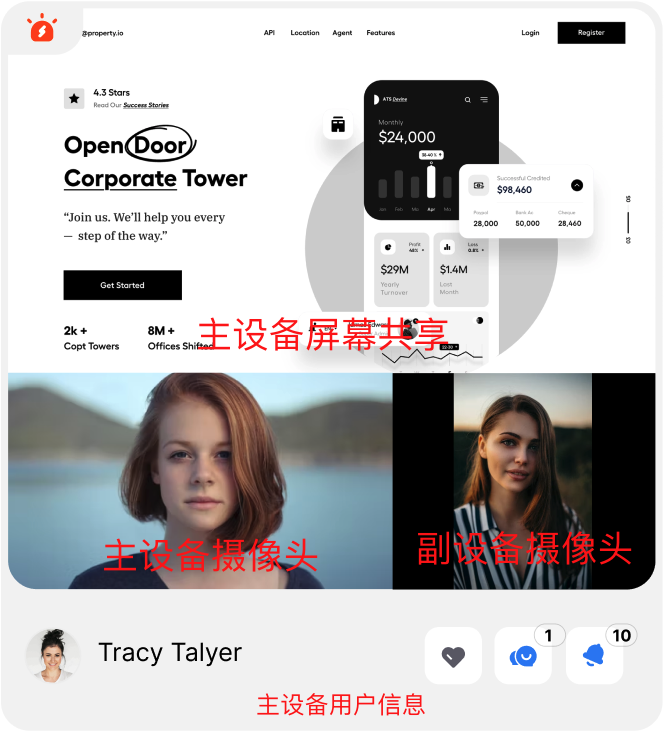

本文详细介绍如何将灵动课堂集成到你自己的 Web 项目中。

## 技术原理

灵动课堂代码包含以下包：

-   `agora-demo-app`: 灵动课堂demo app，支持web，h5，electron客户端等平台，集成在线教育SDK、在线监考SDK等能力，提供在线课堂的课前、课中、课后等场景化代码示例
-   `agora-classroom-sdk`: 在线教育场景SDK，包含以下模块：
    -   `/src/infra/stores`: UI Store 目录。UI Store 负责为 UI 组件提供业务逻辑封装。
    -   `/src/infra/capabilities`:
        -   `/containers`: UI 业务组件目录。UI 功能组件与 UI Store 结合成为 UI 业务组件。
        -   `/scenarios`: 场景目录。场景是由多个业务组件组合而成。
-   `agora-proctor-sdk`: 在线监考场景SDK，包含以下模块：
    -   `/src/infra/stores`: UI Store 目录。UI Store 负责为 UI 组件提供业务逻辑封装。
    -   `/src/infra/capabilities`:
        -   `/containers`: UI 业务组件目录。UI 功能组件与 UI Store 结合成为 UI 业务组件。
        -   `/scenarios`: 场景目录。场景是由多个业务组件组合而成。
-   `agora-common-libs`: 通用工具类库，包含ThemeProvider、I18nProvider等全局通用工具。
-   `agora-edu-core`: 提供灵动课堂中教育和监考场景的上行API调用和下行数据结构封装。
-   `agora-rte-sdk`: 提供跨端RTC适配能力以及教室内事件回调与数据结构封装。
-   `agora-plugin-gallery`: 独立插件库，继承`AgoraWidgetBase`类并实现`AgoraWidgetLifecycle`接口，包含互动白板、IM聊天、答题器、投票器、计时器等插件。


### 集成灵动课堂-教育场景

#### 集成方式

灵动课堂 Web 端支持多种集成方式。根据是否需要修改课堂 UI，你可选择不同的集成方式：

- 如果你直接使用灵动课堂的默认 UI，无需修改灵动课堂的代码，则可选择 [npm](https://www.npmjs.com/package/agora-classroom-sdk) 或 CDN 集成。
- 如果你想要基于灵动课堂的默认 UI 进行修改，则可选择通过 [GitHub 源码](https://github.com/AgoraIO-Community/flexible-classroom-desktop)集成。

<a name="default_ui"></a>

#### 使用默认 UI

如果你直接使用灵动课堂的默认 UI，无需修改灵动课堂的代码，则可选择 npm 或 CDN 集成。

##### 使用 npm 集成

1. 运行安装命令：

    ```
    npm install agora-classroom-sdk
    ```

2. 在项目的 JavaScript 代码中引入 `AgoraEduSDK` 模块：

    ```
    import {AgoraEduSDK} from 'agora-classroom-sdk'
    ```

3. 在项目的 JavaScript 代码中调用 [AgoraEduSDK.config](/cn/agora-class/agora_class_api_ref_web?platform=Web#config) 和 [AgoraEduSDK.launch](/cn/agora-class/agora_class_api_ref_web?platform=Web#launch) 方法启动课堂。

#### 使用 CDN 集成

1. 在项目的 HTML 文件中添加以下代码：

    ```html
    <script src="https://download.agora.io/edu-apaas/release/edu_sdk@2.8.0.bundle.js"></script>
    ```

2. 在项目的 JavaScript 代码中调用 [AgoraEduSDK.config](/cn/agora-class/agora_class_api_ref_web?platform=Web#config) 和 [AgoraEduSDK.launch](/cn/agora-class/agora_class_api_ref_web?platform=Web#launch) 方法启动课堂。


#### 示例代码

```html
<!DOCTYPE html>
<html lang="en">

<head>
    <meta charset="UTF-8" />
    <meta name="viewport" content="width=device-width, initial-scale=1" />
    <script src="https://download.agora.io/edu-apaas/release/edu_sdk@2.8.0.bundle.js"></script>
</head>

<body>
    <style>
        #root {
            width: 100%;
            height: 100%;
        }
    </style>
    <div id="root"></div>
    <script type="text/javascript">
        // 配置 SDK。
        // 填入你的 App ID。
        AgoraEduSDK.config({
                appId: 'Your App ID',
                region: 'NA'
        });
        // 启动课堂。
        AgoraEduSDK.launch(document.querySelector('#root'), {
            userUuid: 'user id',
            userName: 'user name',
            roomUuid: 'room id',
            roleType: 1, // 用户角色：1 为老师，2 为学生。
            roomType: 0, // 房间类型：0 为一对一，2 为大班课（根据 roomSubType 还可分为互动直播大班课，职业教育大班课），4 为小班课。
			roomSubType: 0, // 房间子类型。默认为 0。如需设置职业教育大班课，则需 roomType 为 2 且 roomSubType 为 1。
            roomName: 'room name',
            pretest: true, // 是否开启课前设备检测。
            rtmToken: 'rtm token', // 测试环境下，你可以使用临时 RTM Token；生产或安全环境下，强烈建议你使用服务器生成的 RTM Token。
            language: 'zh', // 课堂界面的语言。如需界面为英文，设为 'en' 即可。
            duration: 60 * 30, // 课程时间，单位为秒。
            recordUrl: 'https://solutions-apaas.agora.io/apaas/record/dev/2.8.0/record_page.html',
            courseWareList: [],
            uiMode: FcrMultiThemeMode.light, // 设置课堂界面为明亮模式。如需界面为暗黑模式，设为 FcrMultiThemeMode.dark 即可。
            listener: (evt, args) => {
            },
        });
    </script>
</body>

</html>
```

示例代码中需要传入 `rtmToken`。你可以参考[获取 RTM Token](/cn/Agora%20Platform/get_appid_token?platform=All%20Platforms#获取-rtm-token) 了解什么是 RTM Token，如何获取测试用途的临时 RTM Token，如何从服务器生成 RTM Token。

### 修改灵动课堂的默认 UI

如果你想要基于灵动课堂的默认 UI 进行修改，则参考以下步骤集成灵动课堂的 GitHub 源码：

<div class="alert info">开始前请确保你的设备上已准备好<a href="/cn/agora-class/agora_class_quickstart_web?platform=Web#dev-env">开发环境</a>。</div>

~f38d4cd0-3fce-11ed-8dae-bf25bf08a626~

1. 成功拉取代码后，根据你的实际需求，参考[自定义课堂 UI 文档](/cn/agora-class/agora_class_custom_ui_web?platform=Web)修改代码。

2. 修改完代码后，按照以下步骤进行调试：

    1. 执行以下命令安装依赖库：

        ```bash
        yarn install
        ```

        ```bash
        yarn bootstrap
        ```

    2. 通过以下命令以开发模式运行项目。

       ```bash
       yarn dev
       ```

3. 完成开发后，通过以下命令打包 SDK JS 文件：

   ```bash
   yarn pack:classroom:sdk
   ```

<div class="alert info">打包完成的 JS 文件会输出至 <code>packages/agora-classroom-sdk/lib/edu_sdk.bundle.js</code>。</div>


#### 集成灵动课堂-监考场景

#### 集成方式

灵动课堂 Web 端支持多种集成方式。根据是否需要修改课堂 UI，你可选择不同的集成方式：

- 如果你直接使用灵动课堂的默认 UI，无需修改灵动课堂的代码，则可选择 [npm](https://www.npmjs.com/package/agora-classroom-sdk) 或 CDN 集成。
- 如果你想要基于灵动课堂的默认 UI 进行修改，则可选择通过 [GitHub 源码](https://github.com/AgoraIO-Community/flexible-classroom-desktop)集成。

<a name="default_ui"></a>

#### 使用默认 UI

如果你直接使用灵动课堂的默认 UI，无需修改灵动课堂的代码，则可选择 npm 或 CDN 集成。
##### 使用 npm 集成

1. 运行安装命令：

    ```
    npm install agora-proctor-sdk
    ```

2. 在项目的 JavaScript 代码中引入 `AgoraProctorSDK` 模块：

    ```
    import { AgoraProctorSDK } from 'agora-proctor-sdk'
    ```

3. 在项目的 JavaScript 代码中调用 [AgoraProctorSDK.config](/cn/agora-class/agora_class_api_ref_web?platform=Web#config) 和 [AgoraProctorSDK.launch](/cn/agora-class/agora_class_api_ref_web?platform=Web#launch) 方法启动课堂。

#### 使用 CDN 集成

1. 在项目的 HTML 文件中添加以下代码：

    ```html
    <script src="https://download.agora.io/edu-apaas/release/proctor_sdk@1.0.0.bundle.js"></script>
    ```

2. 在项目的 JavaScript 代码中调用 [AgoraProctorSDK.config](/cn/agora-class/agora_class_api_ref_web?platform=Web#config) 和 [AgoraProctorSDK.launch](/cn/agora-class/agora_class_api_ref_web?platform=Web#launch) 方法启动课堂。


#### 示例代码

```html
<!DOCTYPE html>
<html lang="en">

<head>
    <meta charset="UTF-8" />
    <meta name="viewport" content="width=device-width, initial-scale=1" />
    <script src="https://download.agora.io/edu-apaas/release/proctor_sdk@1.0.0.bundle.js"></script>
</head>

<body>
    <style>
        #root {
            width: 100%;
            height: 100%;
        }
    </style>
    <div id="root"></div>
    <script type="text/javascript">
        // 配置 SDK。
        // 填入你的 App ID。
        AgoraProctorSDK.config({
                appId: 'Your App ID',
                region: 'NA'
        });
        // 启动云监考。
        AgoraProctorSDK.launch(document.querySelector('#root'), {
            userUuid: 'user id',//用户唯一标识，请在此处传入根据下方规则拼接好的userUuid
            userName: 'user name',
            roomUuid: 'room id',
            roleType: 1, // 用户角色：1 为老师，2 为学生。
            roomType: 6, // 房间类型：监考场景的房间类型固定为6。
            roomSubType: 0, // 房间子类型。默认为 0。
            roomName: 'room name',
            pretest: true, // 是否开启课前设备检测。
            rtmToken: 'rtm token', // 测试环境下，你可以使用临时 RTM Token；生产或安全环境下，强烈建议你使用服务器生成的 RTM Token。
            language: 'zh', // 课堂界面的语言。如需界面为英文，设为 'en' 即可。
            duration: 60 * 30, // 课程时间，单位为秒。
            courseWareList: [],
            listener: (evt, args) => {
            },
        });
    </script>
</body>

</html>
```

示例代码中需要传入 `rtmToken`。你可以参考[获取 RTM Token](/cn/Agora%20Platform/get_appid_token?platform=All%20Platforms#获取-rtm-token) 了解什么是 RTM Token，如何获取测试用途的临时 RTM Token，如何从服务器生成 RTM Token。

### 如何设置用户ID
监考场景下，考试学生会拥有主/副两种设备，主设备用于分享考试屏幕和拍摄人像，副设备用于拍摄周边环境。


在考场中，需要开发者在调用launch时自行拼接用户userUuid，以分辨主副设备是否属于同一个考生。

##### 监考场景下学生用户标识规则：`${用户id}-${设备类型（main/sub）}`
##### 例：
`学生A` 唯一标识为 `studentA`, 学生WEB端为主设备，移动端为副设备
 - `学生A`传入 Proctor WEB SDK 的 userUuid 为 `studentA-main`
 - `学生A`传入 Proctor IOS/Android SDK 的 userUuid 为 `studentA-sub`
在考场中 `studentA-main` 和 `studentA-sub` 会被识别为 `studentA` 的多台设备,并合并展示在老师的监考画面中。
         
           


### 设置考卷链接
在开始考试后，考场内的考生会在本地通过 `Widget` 创建一个Webview窗口，用来加载考卷，考卷的地址被存储在 `房间属性`中的`examinationUrl`字段，通常考卷内容需要在考试前设置。下面是可以参考的设置方法。
##### 创建房间时设置
通过[灵动课堂云服务 RESTful API](./agora_class_restful_api?platform=Android)中的 创建房间 接口创建房间，在请求体的`roomProperties`中设置`examinationUrl`字段，例：
```
{
    "roomName": "jasoncai61734",
    "roomType": 4,
    "roomProperties": {
        "schedule": {
            "startTime": 1655452800000,
            "duration": 600,
            "closeDelay": 0
        },
        //传入本场考试的考卷链接
        "examinationUrl": "your examination url"
    }
}
```
##### 创建房间后设置
通过[灵动课堂云服务 RESTful API](./agora_class_restful_api?platform=Android)中的 更新课堂属性 接口，在请求体的`roomProperties`中修改`examinationUrl`字段，例：
```
{
    "properties": {
         //传入本场考试的考卷链接
        "examinationUrl": "your examination url"
    },
    "cause": {}
}

```
<a name="change_default_ui"></a>

<!-- ### 修改灵动课堂的默认 UI

如果你想要基于灵动课堂的默认 UI 进行修改，则参考以下步骤集成灵动课堂的 GitHub 源码：

<div class="alert info">开始前请确保你的设备上已准备好<a href="/cn/agora-class/agora_class_quickstart_web?platform=Web#dev-env">开发环境</a>。</div>

~f38d4cd0-3fce-11ed-8dae-bf25bf08a626~

1. 成功拉取代码后，根据你的实际需求，参考[自定义课堂 UI 文档](/cn/agora-class/agora_class_custom_ui_web?platform=Web)修改代码。

2. 修改完代码后，按照以下步骤进行调试：

    1. 执行以下命令安装依赖库：

        ```bash
        yarn install
        ```

        ```bash
        yarn bootstrap
        ```

    2. 通过以下命令以开发模式运行项目。

       ```bash
       yarn dev
       ```

3. 完成开发后，通过以下命令打包 SDK JS 文件：

   ```bash
   yarn pack:proctor:sdk
   ```

<div class="alert info">打包完成的 JS 文件会输出至 <code>packages/agora-proctor-sdk/lib/proctor_sdk.bundle.js</code>。</div>
 -->
