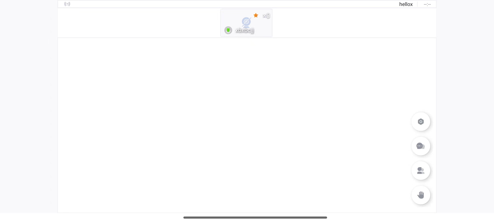

本文介绍如何获取灵动课堂 Android 端 GitHub 源码并运行项目，快速启动并体验灵动课堂。

## 技术原理

~96d9aaf0-eb84-11eb-b768-51ffcd29c763~

## 前提条件

~fcbefc40-5374-11ed-8dae-bf25bf08a626~

## 开发环境

~2c5b8db0-5375-11ed-8dae-bf25bf08a626~

## 获取源码

灵动课堂 Android 端的源码位于 GitHub [CloudClass-Android](https://github.com/AgoraIO-Community/CloudClass-Android) 仓库，你可参考以下步骤获取源码：

~c7706c40-3fce-11ed-8dae-bf25bf08a626~

## 启动灵动课堂

参照以下步骤启动灵动课堂：

1. 在 Android Studio 中导入 CloudClass-Android 项目。
   

  如果获取依赖包失败，可以通过 Android Studio Gradle 同步拉取
![[android_img_sync.png]]

2. 在 Android Studio 中运行 CloudClass-Android 项目。

电脑连接手机，点击 Android Studio 的 Run，运行项目
![[android_run.png]]

运行成功后，你可以在 Android 设备上看到以下画面：

3. 输入房间名、用户名，选择一种班型，然后点击**加入**，即可进入灵动课堂，看到以下画面：

   

## 升级建议

如果通过源码方式集成，并且自己也修改了灵动课堂的源代码，那么后续灵动课堂升级了，如何升级呢？

1、对于需要修改的模块，通过源码引用，不需要修复的模块，通过 Maven 引用，这样可以方便后续版本升级。

2、对于需要修改灵动课堂的源代码，建议将自己的业务封装在自己的类中，再引用到灵动课堂的模块代码，这样后续升级，可以减少代码冲突。

3、如果修改很少的灵动课堂源代码，则可以直接通过【Beyond Compare】工具对比代码合并

4、如果修改很多，假设当初基于灵动课堂的 2.8.0 版本修改的，要升级到灵动课堂 3.0.0 版本，通过 Android Studio 对比代码，你可以这样做：

- 下载灵动课堂源代码【CloudClass-Android】，切换到 release/2.8.0 分支
- 导入项目【CloudClass-Android】 源码到 Android Studio
- 在 Android Studio 中，右击【CloudClass-Android】，选择 Git -> Compare with Branch -> release/3.0.0
- 对比这两个版本修改的差异，合并到自己项目

## 后续步骤

现在你已经初步体验了灵动课堂的功能，接下来可将[灵动课堂集成到你自己的项目中](/cn/agora-class/agora_class_integrate_android?platform=Android)。