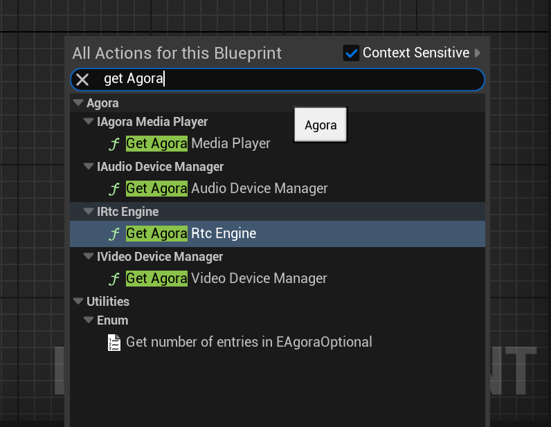
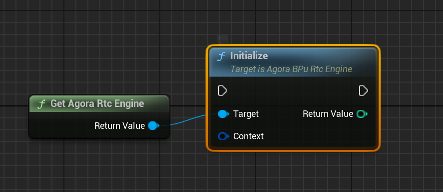
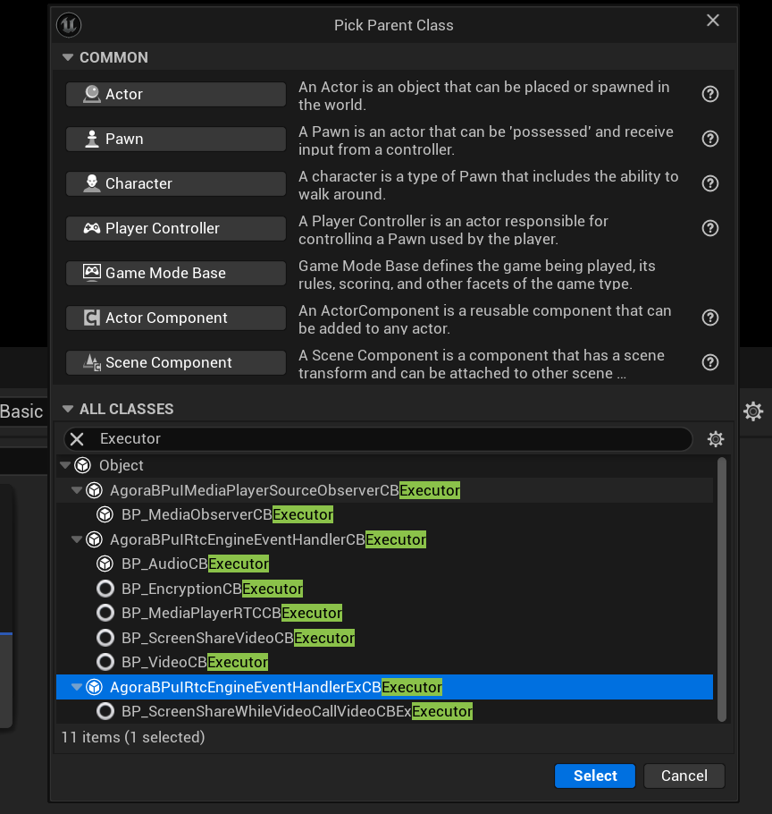
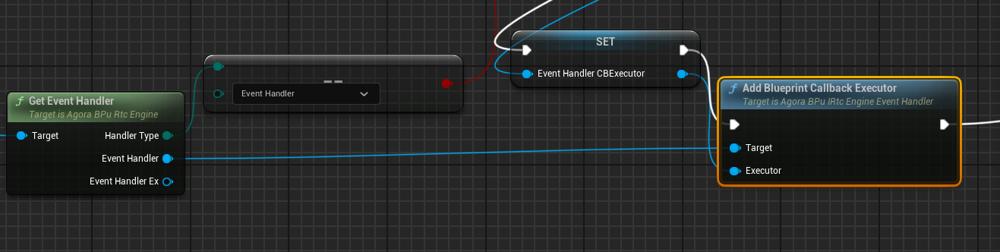
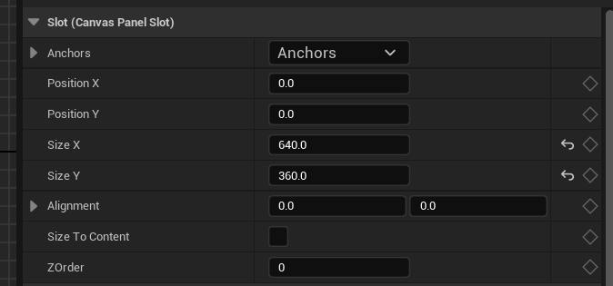

## Known issues

**Audio module incompatibility (iOS)**

The audio module of the Agora Unreal SDK is incompatible with the AudioMixer module in Unreal Engine 5.3 and 5.4. If you use Unreal Engine 5.3 or 5.4, you need to add the following code to the `/Config/IOS/IOSEngine.ini` file in your project to disable Unreal Engine’s AudioMixer module and avoid conflicts.

```ini
[Audio]
AudioMixerModuleName=
```

## v4.5.1

v4.5.1 was released on March 3, 2025.

#### New features

1. **AI conversation scenario**

   This version adds the `AUDIO_SCENARIO_AI_CLIENT` audio scenario specifically designed for interacting with the conversational AI agent created by [Conversational AI Engine](https://docs.agora.io/en/conversational-ai/overview/product-overview). This scenario optimizes the audio transmission algorithm based on the characteristics of AI agent voice generation, ensuring stable voice data transmission in weak network environments (for example, 80% packet loss rate), and ensuring the continuity and reliability of the conversation, adapting to a variety of complex network conditions.

#### Improvements

1. Reduced the time of initializing the SDK on specific device models. (iOS)

#### Issues fixed

This release fixed the following issues:

- Apps that integrated the Agora SDK and set the `targetSdkVersion` to 34 encountered crashes when attempting to enable screen sharing for the first time on an Android 14 system. (Android)
- When joining two or more channels simultaneously, and calling the `TakeSnapshotEx` method to take screenshots of the local video streams in each channel consecutively, the screenshot of the first channel failed.
- When using the `Pause` method to pause playback, then calling `Seek` to move to a specified position, and finally calling `Play` to continue playback, the Media Player resumed from the position where it was paused, not the new specified position.
- When using the Media Player, the file path of the media resource returned by the `GetPlaySrc` did not change after calling the `SwitchSrc` method to switch to a new media resource.
- When using Bluetooth headphones on specific device models for audio and video interactions, adjusting the phone volume would occassionally change the media volume instead of the Bluetooth volume. (Android)
- During audio and video interactions, the local user occasionally experienced a black screen when watching the video streams of remote users. (Android)
- On specific models of device, after calling `SetCameraExposureFactor` to set the exposure coefficient of the current camera at a specific angle of the device, the video screen occasionally became dark when the device was moved to another angle. (Android)
- When playing a CDN live stream, the video occasionally froze for an extended period after recovering from an interruption. (Android)
- When pushing video frames in i420 format to the channel, using CVPixelBuffer to handle these frames caused a crash. (iOS)
- Calling `SetupLocalVideo` to set up two views, then calling `EnableFaceDetection` to start face detection, no face information can be detected in the subsequently passed views. (iOS)
- In a screen sharing scenario, the receiving-end user saw a green line on the shared image. (iOS)
- In the interactive live streaming scenario, after joining a channel to watch live streams using `string` user id, the audience members occasionally saw that the audio was not synchronized with the video.
- Plugins sometimes did not work when using AI noise suppression and AI echo cancellation plugins at the same time.

## v4.5.0
This version was released on November x, 2024.

#### Compatibility changes

This version includes optimizations to some features, including changes to SDK behavior, API renaming and deletion. To ensure normal operation of the project, update the code in the app after upgrading to this release.

**Changes in strong video denoising implementation**
This version adjusts the implementation of strong video denoising. The `EUABT_VIDEO_DENOISER_LEVEL` removes the `VIDEO_DENOISER_LEVEL_STRENGTH` enumeration. Instead, after enabling video denoising by calling `SetVideoDenoiserOptions`, you can call the `SetBeautyEffectOptions` method to enable the beauty skin smoothing feature. Using both together will achieve better video denoising effects. For strong denoising, it is recommended to set the skin smoothing parameters as detailed in `SetVideoDenoiserOptions`.

Additionally, due to this adjustment, to achieve the best low-light enhancement effect with a focus on image quality, you need to enable video denoising first and use specific settings as detailed in `SetLowlightEnhanceOptions`.

**Changes in camera plug and unplug status (macOS, Windows)**

In previous versions, when the camera was unplugged and replugged, the OnVideoDeviceStateChanged callback would report the device status as `MEDIA_DEVICE_STATE_ACTIVE(1)` (device in use). Starting from this version, after the camera is replugged, the device status will change to `MEDIA_DEVICE_STATE_IDLE(0)` (device ready).

**Changes in video encoding preferences**

To enhance the user’s video interaction experience, this version optimizes the default preferences for video encoding:
- In the `ECOMPRESSION_PREFERENCE` enumeration class, a new `PREFER_COMPRESSION_AUTO (-1)` enumeration is added, replacing the original `PREFER_QUALITY (1)` as the default value. In this mode, the SDK will automatically choose between `PREFER_LOW_LATENCY` or `PREFER_QUALITY` based on your video scene settings to achieve the best user experience.
- In the `EUABT_DEGRADATION_PREFERENCE` enumeration class, a new `MAINTAIN_AUTO (-1)` enumeration is added, replacing the original `MAINTAIN_QUALITY (1)` as the default value. In this mode, the SDK will automatically choose between `MAINTAIN_FRAMERATE`, `MAINTAIN_BALANCED`, or `MAINTAIN_RESOLUTION` based on your video scene settings to achieve the optimal overall quality experience (QoE).


**16 KB memory page size (Android)**

Starting from Android 15, the system adds support for 16 KB memory page size, as detailed in [Support 16 KB page sizes](https://developer.android.com/guide/practices/page-sizes). To ensure the stability and performance of the app, starting from this version, the SDK supports 16 KB memory page size, ensuring seamless operation on devices with both 4 KB and 16 KB memory page sizes, enhancing compatibility and preventing crashes.


#### New features

**Live show scenario**

This version adds the `APPLICATION_SCENARIO_LIVESHOW(3)` (Live Show) enumeration to the `EVIDEO_APPLICATION_SCENARIO_TYPE`. You can call `SetVideoScenario` to set the video business scenario to show room. In this scenario, fast video rendering and high image quality are crucial. The SDK implements several performance optimizations, such as enabling accelerated audio and video frame rendering to minimize first-frame latency (no need to call `EnableInstantMediaRendering`) to achieve better image quality and bandwidth efficiency.

**Maximum frame rate for video rendering**

This version adds the `SetLocalRenderTargetFps` and `SetRemoteRenderTargetFps` methods, which support setting the maximum frame rate for video rendering locally and remotely. The actual frame rate for video rendering by the SDK will be as close to this value as possible.

In scenarios where the frame rate requirement for video rendering is not high (e.g., screen sharing, online education) or when the remote end uses mid-to-low-end devices, you can use this set of methods to limit the video rendering frame rate, thereby reducing CPU consumption and improving system performance.

**Filter effects**

This version introduces the `SetFilterEffectOptions` method. You can pass a cube map file (.cube) in the `config` parameter to achieve custom filter effects such as whitening, vivid, cool, black and white, etc. Additionally, the SDK provides a built-in `built_in_whiten_filter.cube` file for quickly achieving a whitening filter effect.

**Others**

- The `OnLocalVideoStateChanged` callback adds the `LOCAL_VIDEO_STREAM_REASON_DEVICE_DISCONNECTED` enumeration, indicating that the currently used video capture device has been disconnected (e.g., unplugged). (Windows)
- The `EMEDIA_DEVICE_STATE_TYPE` adds the `MEDIA_DEVICE_STATE_PLUGGED_IN` enumeration, indicating that the device has been plugged in. (Windows)

#### Improvements

**Virtual background algorithm optimization**

This version upgrades the virtual background algorithm, making the segmentation between the portrait and the background more accurate. There is no background exposure, the body contour of the portrait is complete, and the detail recognition of fingers is significantly improved. Additionally, the edges between the portrait and the background are more stable, reducing edge jumping and flickering in continuous video frames.

**Snapshot at specified video observation points**

This version introduces the `TakeSnapshotWithConfig` and `TakeSnapshotWithConfigEx` methods. You can use the `config` parameter when calling these methods to take snapshots at specified video observation points, such as before encoding, after encoding, or before rendering, to achieve more flexible snapshot effects.

**Others**

- In scenarios where Alpha transparency effects are achieved by stitching video frames and Alpha data, the rendering performance on the receiving end has been improved, effectively reducing stuttering and latency. (Android, iOS)
- Optimizes the logic for calling `QueryDeviceScore` to obtain device score levels, improving the accuracy of the score results.
- Supports using virtual cameras in YV12 format as video capture devices. (Windows)
- When calling `SwitchSrc` to switch between live streams or on-demand streams of different resolutions, smooth and seamless switching can be achieved. An automatic retry mechanism has been added in case of switching failures. The SDK will automatically retry 3 times after a failure. If it still fails, the `OnPlayerEvent` callback will report the `PLAYER_EVENT_SWITCH_ERROR` event, indicating an error occurred during media resource switching.
- When calling `SetPlaybackSpeed` to set the playback speed of an audio file, the minimum supported speed is 0.3x.

#### Issues fixed

This version fixes the following issues:

- When calling `StartScreenCaptureByWindowId` to share the screen, the window capture area specified by `regionRect` was inaccurate, resulting in incorrect width and height of the screen sharing window seen by the receiving end. (Windows)
- When the video source type of the sender is in JPEG format, the frame rate on the receiving end occasionally falls below expectations. (Android, iOS)
- During audio and video interaction, after being interrupted by a system call, the user volume reported by the `OnAudioVolumeIndication` callback was incorrect. (Android)
- When the receiving end subscribes to the video small stream by default and does not automatically subscribe to any video stream when joining the channel, calling `MuteRemoteVideoStream(uid, false)` after joining the channel to resume receiving the video stream results in receiving the video large stream, which is not as expected. (Android)
- Occasional errors of not finding system files during audio and video interaction on Windows 7 systems. (Windows)
- When calling `FollowSystemRecordingDevice` or `FollowSystemPlaybackDevice` to set the audio capture or playback device used by the SDK to not follow the system default audio playback device, the local audio state callback `OnLocalAudioStateChanged` is not triggered when the audio device is removed, which is not as expected. (Windows)
- Occasional instances where the receiving end cannot hear the sender during audio and video interaction. (iOS)
- During audio and video interaction, if the sender's device system version is iOS 17, the receiving end occasionally cannot hear the sender. (iOS)
- In live streaming scenarios, the time taken to reconnect to the live room after the audience end disconnects due to network switching is longer than expected. (iOS)
- No sound when playing online media resources using the media player after the app starts. (iOS)
- Occasional instances of no sound in audio capture after resuming from being interrupted by other system apps during audio and video interaction. (iOS)
- Calling `StartAudioMixing` and then immediately calling `PauseAudioMixing` to pause the music file playback does not take effect.
- Occasional crashes during audio and video interaction. (Android)

## v4.4.0

This version releases on August xx, 2024.

#### Compatibility changes

This version simplifies the way methods are called and callbacks are implemented in Blueprints.

**1. Method calls**

In this version, there is no need to manually maintain instance variables. You can directly retrieve the desired class at any point in your Blueprint using the `Get` node, and connect the appropriate function nodes to complete the call. This improvement makes calling methods in Blueprints more convenient and streamlines the development process.



The image below demonstrates how to obtain the [`IRtcEngine`](/api-ref/rtc/unreal-blueprint/API/rtc_interface_class#class_irtcengine) instance through the [`GetAgoraRtcEngine`](/api-ref/rtc/unreal-blueprint/API/toc_initialize#api_createagorartcengine) node and connect it to the [`Initialize`](/api-ref/rtc/unreal-blueprint/API/toc_initialize#api_irtcengine_initialize) node to perform the initialization.




**2. Callback implementation**

This version introduces the concept of `CallbackExecutor`. You can bind the corresponding `CallbackExecutor` in Blueprints using the `EventHandler`, allowing for the execution of callbacks. This improvement offers the following advantages:

- Callback implementation is more convenient.
- Enhanced security, with bound callbacks executing without causing crashes when destroyed.
- Easier reuse and code management.



The image below demonstrates how to obtain the `EventHandler` through the [`GetEventHandler`](/api-ref/rtc/unreal-blueprint/API/toc_initialize#api_irtcengine_geteventhandler) node and connect it to the [`AddBlueprintCallbackExecutor`](/api-ref/rtc/${frontMatter.ag_platform}/API/toc_initialize#api_irtcengine_addblueprintcallbackexecutor) node to bind the specified `CallbackExecutor`, thereby executing the related callbacks under the [`IRtcEngineEventHandler`](/api-ref/rtc/unreal-blueprint/API/rtc_interface_class#class_irtcengineeventhandler) interface class.




#### New features

1. **Voice AI tuner**

   This version introduces the voice AI tuner feature, which can enhance the sound quality and tone, similar to a physical sound card. You can enable the voice AI tuner feature by calling the `EnableVoiceAITuner` method and passing in the sound effect types supported in the `EVOICE_AI_TUNER_TYPE` enum to achieve effects like deep voice, cute voice, husky singing voice, etc.

2. **Privacy manifest file (iOS)**

   To meet Apple's safety compliance requirements for app publication, the SDK now includes a privacy manifest file, `PrivacyInfo.xcprivacy`, detailing the SDK's API calls that access or use user data, along with a description of the types of data collected.

   **Note:** If you need to publish an app with SDK versions prior to v4.4.0 to the Apple App Store, you must manually add the `PrivacyInfo.xcprivacy` file to your Xcode project.

3. **Multi-camera capture (Android)**

   This release introduces additional functionalities for Android camera capture:

   1. Support for capturing and publishing video streams from the third and fourth cameras:

      - `VIDEO_SOURCE_CAMERA_THIRD` (11) and `VIDEO_SOURCE_CAMERA_FOURTH` (12) in `EVIDEO_SOURCE_TYPE` add support for Android, specifically for the third and fourth camera sources. This change allows you to specify up to four camera streams when initiating camera capture by calling `StartCameraCapture`.
      - `publishThirdCameraTrack` and `publishFourthCameraTrack` in `FChannelMediaOptions` add support for Android. Set these parameters to `true` when joining a channel with `JoinChannelWithOptions` to publish video streams captured from the third and fourth cameras.

   2. Support for specifying cameras by camera ID:

      A new parameter `cameraId` is added to `FCameraCapturerConfiguration`. For devices with multiple cameras, where `cameraDirection` cannot identify or access all available cameras, you can obtain the camera ID through Android's native system APIs and specify the desired camera by calling `StartCameraCapture` with the specific `cameraId`.

4. **Select different audio tracks for local playback and streaming**

   This release introduces the `SelectMultiAudioTrack` method that allows you to select different audio tracks for local playback and streaming to remote users. For example, in scenarios like online karaoke, the host can choose to play the original sound locally and publish the accompaniment in the channel. Before using this function, you need to open the media file through the `OpenWithMediaSource` method and enable this function by setting the `EnableMultiAudioTrack` parameter in `FAgoraMediaSource`.

5. **Update video screenshot and upload**

   To facilitate the integration of third-party video moderation services from Agora Extensions Marketplace, this version has the following changes:

   - The `CONTENT_INSPECT_IMAGE_MODERATION` enumeration is added in `ECONTENT_INSPECT_TYPE` which means using video moderation extensions from Agora Extensions Marketplace to take video screenshots and upload them.
   - An optional parameter `serverConfig` is added in `FContentInspectConfig`, which is for server-side configuration related to video screenshot and upload via extensions from Agora Extensions Marketplace. By configuring this parameter, you can integrate multiple third-party moderation extensions and achieve flexible control over extension switches and other features. For more details, please contact [technical support](mailto:support@agora.io).

   Additionally, this version introduces the `EnableContentInspectEx` method, which supports simultaneous screenshot and upload of multiple video streams.

6. **Wildcard token**

   This release introduces wildcard tokens. Agora supports setting the channel name used for generating a token as a wildcard character. The token generated can be used to join any channel if you use the same user id. In scenarios involving multiple channels, such as switching between different channels, using a wildcard token can avoid repeated application of tokens every time users joining a new channel, which reduces the pressure on your token server. See [Wildcard tokens](https://docportal.shengwang.cn/cn/live-streaming-premium-4.x/wildcard_token?platform=All%20Platforms).

   <div class="alert note">All 4.x SDKs support using wildcard tokens.</div>

7. **Preloading channels**

   This release adds `PreloadChannel` and `PreloadChannelWithUserAccount` methods, which allows a user whose role is set as audience to preload channels before joining one. Calling the method can help shortening the time of joining a channel, thus reducing the time it takes for audience members to hear and see the host.

   When preloading more than one channels, Agora recommends that you use a wildcard token for preloading to avoid repeated application of tokens every time you joining a new channel, thus saving the time for switching between channels. See [Wildcard tokens](https://docportal.shengwang.cn/cn/live-streaming-premium-4.x/wildcard_token?platform=All%20Platforms).

8. **Publishing video streams from different sources** (Windows, macOS)

   This release adds the following members in `FChannelMediaOptions` to allow you publish video streams captured from the third and fourth camera or screen:

   - `publishThirdCameraTrack`: Publishing the video stream captured from the third camera.
   - `publishFourthCameraTrack`: Publishing the video stream captured from the fourth camera.
   - `publishThirdScreenTrack`: Publishing the video stream captured from the third screen.
   - `publishFourthScreenTrack`: Publishing the video stream captured from the fourth screen.

   <div class="alert note">For one <code>RtcConnection</code>, Agora supports publishing multiple audio streams and one video stream at the same time.</div>

#### Improvements

1. **Improved rendering usability**

    When using the UImage widget, you can control the size of the displayed image by setting the properties of the Brush. Starting from this version, the **Size To Content** option is supported, allowing UImage to automatically adjust to the size of the incoming video frames from the remote end. This improvement enhances the usability of image rendering.

    

2. **Channel media relay**

   The number of target channels for media relay has been increased to 6. When calling `StartOrUpdateChannelMediaRelay` and `StartOrUpdateChannelMediaRelayEx`, you can specify up to 6 target channels.

#### Issues fixed

In Unreal Engine 5.3 and 5.4, adding the following code to the `/Source/xxx.Target.cs` file in your project to solve iOS memory allocation issues may lead to missing iOS compilation symbols. To address this issue, this version adds three function definitions (`StdMalloc`, `StdRealloc`, and `StdFree`) related to the standard library in the `UnrealMemory.cpp` file, ensuring proper handling of memory management needs when using the standard memory allocator. (iOS)

```csharp
if (Target.Platform == UnrealTargetPlatform.IOS)
{
    bOverrideBuildEnvironment = true;
    GlobalDefinitions.Add("FORCE_ANSI_ALLOCATOR=1");
}
```


## v4.2.1

This version was released on October xx, 2023.

This is the first release of Video SDK for Unreal Blueprint.

**Features**


Video SDK for Unreal Blueprint provides a simple and user-friendly real-time interactive solution for Unreal Engine users.

Video SDK for Unreal Blueprint offers a visual interface and a set of intuitive and easy-to-use nodes. This enables developers to effortlessly implement real-time interactive features in games or apps within the Unreal project. You don't need to know C++, just drag, connect and configure nodes.

**Reference**

To integrate real-time engagement functionality into your app using Video SDK for Unreal Engine, see:

- [Get Started with Voice Calling]()
- [Get Started with Video Calling]()
- [Get Started with Interactive Live Streaming Premium]()
- [Get Started with Interactive Live Streaming Standard]()
- [API Reference]()

Agora provides the open source [example project](https://github.com/AgoraIO-Extensions/Agora-Unreal-RTC-SDK/tree/main/Agora-Unreal-SDK-Blueprint-Example) on GitHub for your reference.
